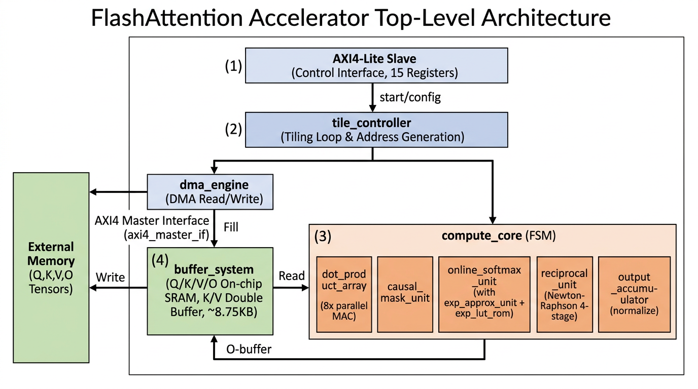

# 第 0 章：项目总览

## 0.1 项目背景与目标

本项目是一个 **可综合的 FlashAttention-style 注意力算子硬件加速器 IP**，用 SystemVerilog 实现，完成 Scaled Dot-Product Attention (SDPA) 计算：

$$
\text{Attention}(Q, K, V) = \text{softmax}\left(\frac{Q K^\top}{\sqrt{d}}\right) V
$$

它的核心思想来自 **FlashAttention** (Dao 等, 2022)：把 $Q, K, V$ 切成小块 (tile) 在片上 SRAM 内逐块计算，**永不显式构造完整的 $s \times s$ 注意力矩阵**，从而把片外内存带宽从 $O(s^2)$ 降到 $O(s d)$。所谓的 *online softmax* 是把 softmax 的两次扫描（先求 max，再算 exp 与归一化）改写成 **一次单遍 + 增量更新** 的形式，使得 tile 与 tile 之间只需要在每行维护两个滚动量 $m_i$（行 max）和 $\ell_i$（行 exp 和），就能正确累加。

| 设计目标参数 | 值 |
|------|-----|
| 序列长度 $s$ | 256 |
| Head 维度 $d$ | 64 |
| 数据格式 | Q8.8 (16-bit 有符号定点) |
| 累加器位宽 | 40-bit |
| Tiling: $B_r \times B_c$ | 4 × 16 |
| AXI 数据宽度 | 128-bit (8 个 Q8.8 / beat) |
| 片上存储 | ~8.75 KB |
| 目标频率 | 500 MHz (TSMC 12 nm) |

整个项目分为：

- **baseline/**：必选项 — 14 个 RTL 模块 + 完整 UVM 验证环境 + SDC 约束。
- **bonus/**：9 项加分功能 — BF16/FP16、多头、变长、Padding mask、Q6.10/Q4.12、Dropout、INT8 量化、AXI4-Stream、DMA Task Queue。
- **scripts/**：仿真、综合、后仿真脚本。
- **vcs_fopen_fix.c / vc_hdrs.h**：VCS 在新内核 / Docker 上的兼容性修复。

## 0.2 顶层架构图

下图展示了 baseline 顶层 `flash_attention_top` 的 5 大子模块以及它们与外部 DDR、CPU 的连接关系。



**数据通路 (Data path)** — 蓝色框是控制 / AXI 接口，绿色框是片上存储，橙色框是计算单元：

1. CPU 通过 **AXI4-Lite Slave** 写 15 个寄存器（Q/K/V/O 基址、stride、scale、causal_en、CTRL.START …）。
2. **tile_controller** 是一个 12 状态 FSM，按 $\lceil s/B_r \rceil = 64$ 个外层循环 × $\lceil s/B_c \rceil = 16$ 个内层循环顺序遍历所有 (Q-tile, KV-tile) 对，给 dma_engine 发读写请求、给 compute_core 发 start。
3. **dma_engine** 把外部 DDR 中的 $B_r \times d$ 的 Q tile 与 $B_c \times d$ 的 K/V tile 通过 AXI4 Master 突发搬到片上 SRAM，**K/V buffer 双缓冲（ping-pong）** —— 当前 tile 计算时下一 tile 已经在加载。
4. **compute_core** 是 6 状态主 FSM (`IDLE → DOT_PRODUCT → MASK → SOFTMAX → ACCUMULATE → DONE`)，每个 KV tile 走完一遍流水。其中 `dot_product_array` 用 8 路并行 MAC 跑 $B_r \times B_c$ 个点积；`online_softmax_unit` 调用 1024-entry exp LUT 做 softmax；`output_accumulator` 用 $\ell_{\text{old}}$ / $\ell_{\text{new}}$ 完成在线归一化。
5. KV 内层循环结束后，`output_accumulator` 用 `reciprocal_unit`（Newton-Raphson 4 级流水）做 $O = O / \ell$，结果写回 buffer_system 的 O-buffer，再由 dma_engine 通过 AXI4 Master 写回 DDR。

## 0.3 目录结构与讲义章节安排

```
submission/
├── README.md                       项目总说明
├── docker_run_all.sh               一键 Docker 仿真
├── docker_run_all_bonus.sh         Bonus 一键 Docker 仿真
├── vcs_fopen_fix.c                 VCS LD_PRELOAD 修复
├── vc_hdrs.h                       VCS DPI 头
│
├── baseline/                       ===== 必选 =====
│   ├── rtl/        14 个 RTL + fa_params.svh + exp_lut.hex
│   ├── tb/         UVM 验证环境 (24 测试)
│   ├── constraints/flash_attention.sdc
│   └── docs/       design_report.md, verification_report.md
│
├── bonus/                          ===== 9 项加分 =====
│   ├── rtl/        11 个增强 RTL + fa_params_bonus.svh
│   ├── tb/         Bonus UVM 环境 (24 测试)
│   └── constraints/flash_attention.sdc
│
└── scripts/                        ===== 7 个脚本 =====
    ├── run_baseline.sh, run_uvm_all.sh
    ├── run_bonus.sh,    run_bonus_uvm.sh
    ├── run_synthesis.sh, run_postsim.sh
    └── run_gate_rerun.sh
```

本讲义将 .v / .sv / .svh 文件分为 5 章讲解：

| 章节 | 内容 | 文件数 |
|------|------|--------|
| 第 1 章：Baseline RTL — 计算通路 | flash_attention_top, tile_controller, compute_core, dot_product_array, online_softmax_unit, exp_approx_unit, exp_lut_rom, reciprocal_unit, output_accumulator, causal_mask_unit, fa_params.svh | 11 |
| 第 2 章：Baseline RTL — 存储与总线 | buffer_system, dma_engine, axi4_lite_slave, axi4_master_if | 4 |
| 第 3 章：Baseline UVM 验证环境 | 20 个 .sv (agents + env + sequences + tests + tb_top) | 20 |
| 第 4 章：Bonus RTL | flash_attention_bonus_top + 10 个增强模块 + fa_params_bonus.svh | 12 |
| 第 5 章：Bonus UVM 验证 + scripts/seqgen_stub | 9 个 .sv + 1 个 .v | 10 |

每个文件都按 **"整体架构图 → 代码块切片 → 每块源代码 + 解释 + (必要时) 图示"** 的顺序呈现。

## 0.4 验证与性能结果摘要

| 版本 | 测试总数 | 通过 | 失败 | 执行周期 | mean_abs_err | max_abs_err |
|------|---------|------|------|---------|--------------|-------------|
| Baseline | 24 | 24 | 0 | 276,100 | 0.013350 | 0.238281 |
| Bonus    | 24 | 24 | 0 | 276,165 | 0.013350 | 0.238281 |
| **合计** | **48** | **48** | **0** | — | — | — |

7 大验证领域：(1) 6 个验证点 VP01-VP06，(2) 7 个寄存器测试 REG01-REG07，(3) 3 个 DMA 测试 DMA01-DMA03，(4) 3 个 AXI 协议测试 AXI01-AXI03，(5) 2 个性能测试 PERF01-PERF02，(6) 3 个覆盖率测试 COV01-COV02 + COMP，(7) 39 条 SVA 协议断言（21 条 AXI4 + 18 条 AXI4-Lite）。

