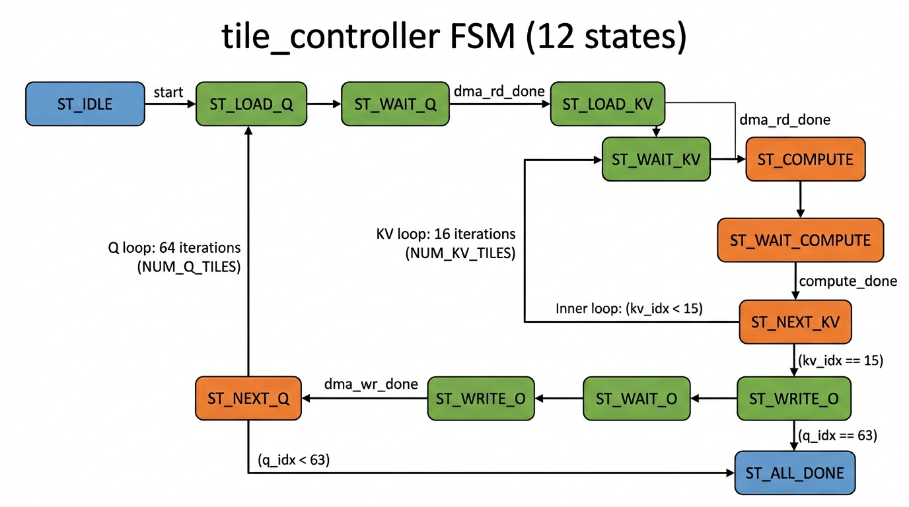
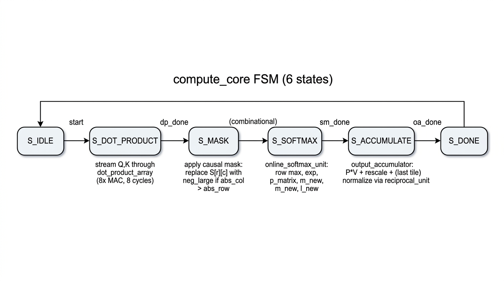
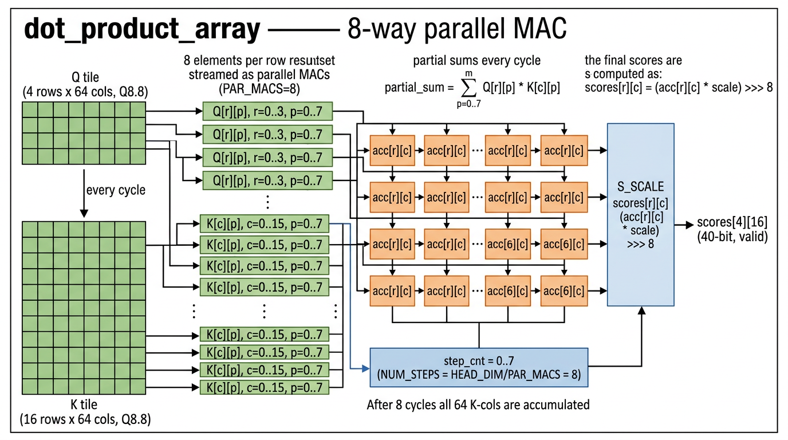
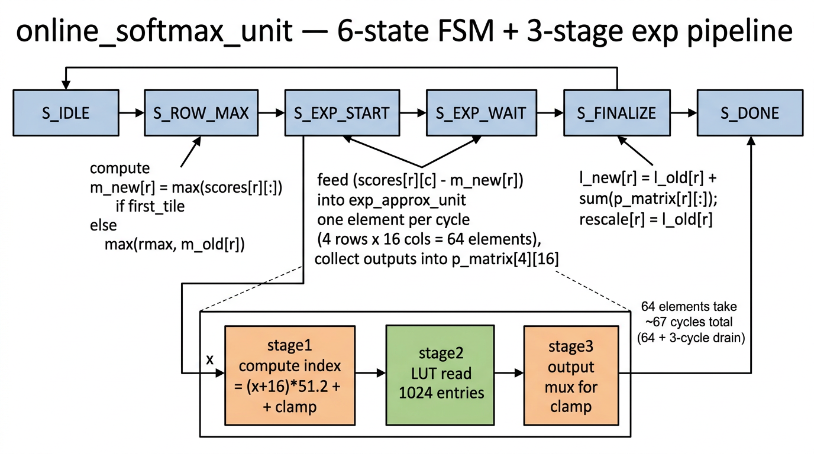
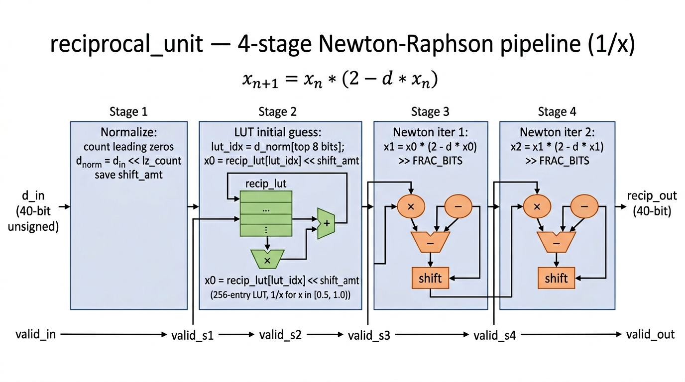
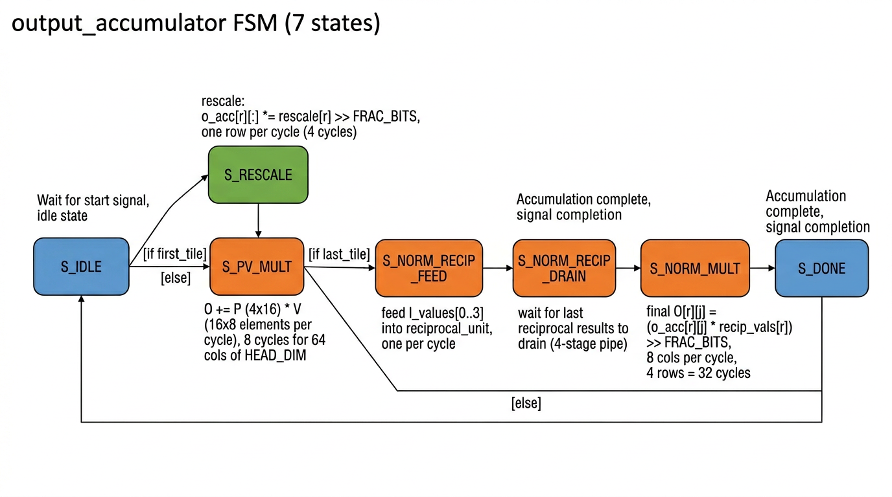

# 第 1 章：Baseline RTL — 计算通路

本章覆盖 11 个文件 (10 个 .sv + 1 个 .svh)：

| § | 文件 | 行数 | 角色 |
|---|------|-----|------|
| 1.1 | `rtl/include/fa_params.svh` | 79 | 全局参数定义 |
| 1.2 | `rtl/flash_attention_top.sv` | 239 | 顶层 (5 大子模块集成) |
| 1.3 | `rtl/tile_controller.sv` | 215 | 12 状态 tiling FSM |
| 1.4 | `rtl/compute_core.sv` | 256 | 6 状态计算 FSM (调度 dot/mask/softmax/accum) |
| 1.5 | `rtl/dot_product_array.sv` | 119 | 4 × 16 = 64 个 MAC，8 路并行 |
| 1.6 | `rtl/causal_mask_unit.sv` | 28 | 因果 mask 组合逻辑 |
| 1.7 | `rtl/online_softmax_unit.sv` | 188 | online softmax 6 状态 FSM + exp 流水 |
| 1.8 | `rtl/exp_approx_unit.sv` | 117 | 1024-entry LUT exp 近似，3 级流水 |
| 1.9 | `rtl/exp_lut_rom.sv` | 56 | 1024 项 ROM (sim/syn 双模式) |
| 1.10 | `rtl/reciprocal_unit.sv` | 135 | Newton-Raphson 4 级流水 1/x |
| 1.11 | `rtl/output_accumulator.sv` | 242 | P·V 累加 + (last tile) 归一化 |

---

## 1.1 `rtl/include/fa_params.svh`

### 1.1.1 概述

全局参数头文件，所有 RTL 都用 `` `include "fa_params.svh" `` 引入。它定义了 4 类常量：（1）算法维度（`SEQ_LEN`、`HEAD_DIM`、`TILE_BR`、`TILE_BC`）；（2）数据格式（`DATA_WIDTH=16`/Q8.8、`ACC_WIDTH=40`、`EXP_WIDTH=24`）；（3）AXI 总线宽度（数据 128-bit、地址 64-bit）；（4）寄存器映射偏移与默认值。整个文件没有逻辑，过于简单，**不需要架构图**。

### 1.1.2 完整源代码

```systemverilog
`ifndef FA_PARAMS_SVH
`define FA_PARAMS_SVH

// ============================================================
// FlashAttention Accelerator — Global Parameters
// ============================================================

// --- Baseline fixed dimensions ---
parameter SEQ_LEN       = 256;
parameter HEAD_DIM      = 64;

// --- Tiling parameters ---
parameter TILE_BR       = 4;     // Q tile rows
parameter TILE_BC       = 16;    // K/V tile rows
parameter NUM_Q_TILES   = SEQ_LEN / TILE_BR;   // 64
parameter NUM_KV_TILES  = SEQ_LEN / TILE_BC;   // 16

// --- Data widths ---
parameter DATA_WIDTH    = 16;    // Q8.8 fixed-point
parameter FRAC_BITS     = 8;     // fractional bits in Q8.8
parameter ACC_WIDTH     = 40;    // accumulator width for dot-products
parameter EXP_WIDTH     = 24;    // exp output width (wider for precision)
parameter SCORE_WIDTH   = 40;    // score/softmax intermediate width

// --- AXI parameters ---
parameter AXI_ADDR_WIDTH  = 64;
parameter AXI_DATA_WIDTH  = 128; // 8 Q8.8 values per beat
parameter AXI_ID_WIDTH    = 4;
parameter AXI_STRB_WIDTH  = AXI_DATA_WIDTH / 8;

parameter AXIL_ADDR_WIDTH = 8;
parameter AXIL_DATA_WIDTH = 32;

// --- AXI burst ---
parameter AXI_BURST_LEN   = 16;  // beats per burst

// --- Register map offsets ---
parameter REG_CTRL         = 8'h00;
parameter REG_STATUS       = 8'h04;
parameter REG_CFG          = 8'h08;
parameter REG_Q_BASE_L     = 8'h14;
parameter REG_Q_BASE_H     = 8'h18;
parameter REG_K_BASE_L     = 8'h1C;
parameter REG_K_BASE_H     = 8'h20;
parameter REG_V_BASE_L     = 8'h24;
parameter REG_V_BASE_H     = 8'h28;
parameter REG_O_BASE_L     = 8'h2C;
parameter REG_O_BASE_H     = 8'h30;
parameter REG_STRIDE_BYTES = 8'h34;
parameter REG_NEG_LARGE    = 8'h38;
parameter REG_SCALE        = 8'h3C;
parameter REG_CYCLES       = 8'h40;

// --- CTRL register bits ---
parameter CTRL_START      = 0;
parameter CTRL_SOFT_RESET = 1;
parameter CTRL_IRQ_EN     = 2;

// --- STATUS register bits ---
parameter STATUS_BUSY     = 0;
parameter STATUS_DONE     = 1;
parameter STATUS_ERROR    = 2;

// --- CFG register bits ---
parameter CFG_CAUSAL_EN   = 0;

// --- Default values ---
parameter DEFAULT_STRIDE  = HEAD_DIM * 2;           // d * sizeof(Q8.8)
parameter DEFAULT_NEG_LARGE = 16'h8000;             // -128.0 in Q8.8
parameter DEFAULT_SCALE   = 16'h0020;               // 1/8 ≈ 1/√64 in Q8.8

// --- Parallelism ---
parameter PAR_MACS       = 8;     // parallel MACs per dot-product per cycle

// --- Exp LUT ---
parameter EXP_LUT_DEPTH  = 256;
parameter EXP_LUT_WIDTH  = 16;

`endif
```

### 1.1.3 解释

- `SEQ_LEN=256, HEAD_DIM=64`：一次推理的 attention 矩阵是 $256 \times 256$；如果用 16-bit 全部物化，需要 128 KB 片上 SRAM，超出 8.75 KB 的预算。**这正是 FlashAttention 必须 tiling 的根本原因。**
- `TILE_BR=4, TILE_BC=16`：每次 compute_core 处理 $4 \times 64$ 的 Q 子块和 $16 \times 64$ 的 KV 子块，得到 $4 \times 16$ 的子分数矩阵。一共 $64 \times 16 = 1024$ 个 (Q-tile, KV-tile) 对。
- `DATA_WIDTH=16, FRAC_BITS=8`：Q8.8 定点 — 8 位整数 + 8 位小数。乘法结果是 Q16.16，所以 `ACC_WIDTH=40` 给定点累加留 8 位 headroom (256 个累加项最多增加 $\log_2 256 = 8$ 位)。
- `AXI_DATA_WIDTH=128`：每个 beat 装 $128/16 = 8$ 个 Q8.8 值，正好对应 `PAR_MACS=8`，让 DMA 的拍率与 MAC 阵列的吞吐对齐。
- `DEFAULT_SCALE=16'h0020`：即 $32/256 = 0.125 = 1/\sqrt{64}$，这就是 $\frac{1}{\sqrt{d}}$。
- `DEFAULT_NEG_LARGE=16'h8000`：Q8.8 的 $-128$，用作 causal-mask 的"负无穷大"，进 `exp` 后得 0。
- 寄存器映射：所有偏移量都按 4 字节对齐，方便 AXI4-Lite 32-bit 访问。`REG_CYCLES` 是只读性能计数器。

---

## 1.2 `rtl/flash_attention_top.sv`

### 1.2.1 概述

顶层模块，把 5 个子模块（`axi4_lite_slave`、`tile_controller`、`dma_engine`、`buffer_system`、`compute_core`）连接起来，并把 AXI4-Lite Slave 端口和 AXI4 Master 端口暴露到 IP 边界。它本身只做"互连 + 32-bit 周期计数器 + 状态信号汇聚"，几乎没有原创逻辑。

### 1.2.2 文件架构图

参见第 0 章的 [顶层架构图](images/00_top_architecture.png)。

### 1.2.3 代码块切片

#### 块 ① 端口定义（行 8–64）

**源代码：**
```systemverilog
module flash_attention_top (
    input  logic                    clk,
    input  logic                    rst_n,

    // --- AXI4-Lite Slave Interface (Control) ---
    input  logic [AXIL_ADDR_WIDTH-1:0]  s_axil_awaddr,
    input  logic                        s_axil_awvalid,
    output logic                        s_axil_awready,
    input  logic [AXIL_DATA_WIDTH-1:0]  s_axil_wdata,
    input  logic [AXIL_DATA_WIDTH/8-1:0] s_axil_wstrb,
    input  logic                        s_axil_wvalid,
    output logic                        s_axil_wready,
    output logic [1:0]                  s_axil_bresp,
    output logic                        s_axil_bvalid,
    input  logic                        s_axil_bready,
    input  logic [AXIL_ADDR_WIDTH-1:0]  s_axil_araddr,
    input  logic                        s_axil_arvalid,
    output logic                        s_axil_arready,
    output logic [AXIL_DATA_WIDTH-1:0]  s_axil_rdata,
    output logic [1:0]                  s_axil_rresp,
    output logic                        s_axil_rvalid,
    input  logic                        s_axil_rready,

    // --- AXI4 Master Interface (Data) ---
    output logic [AXI_ID_WIDTH-1:0]     m_axi_awid,
    output logic [AXI_ADDR_WIDTH-1:0]   m_axi_awaddr,
    output logic [7:0]                  m_axi_awlen,
    /* ...(AW, W, B, AR, R 共 31 条 AXI4 信号略)... */
    output logic                        m_axi_rready,

    // Interrupt
    output logic                        irq
);
```

**说明：** 标准 ARM AMBA AXI4 + AXI4-Lite 接口。AXI4-Lite Slave (`s_axil_*`) 用于 CPU 配置寄存器与读取状态；AXI4 Master (`m_axi_*`) 用于 DMA 把 Q/K/V 张量从外部 DDR 搬到片上、把 O 张量写回。`irq` 是任务结束中断，由 `axi4_lite_slave` 内部根据 `STATUS.DONE` + `CTRL.IRQ_EN` 生成。代码块本身只是端口列表，**过于简单，无需图示**。

#### 块 ② AXI4-Lite Slave 实例化（行 66–93）

**源代码：**
```systemverilog
    // ========== Register File Signals ==========
    logic        reg_start, reg_soft_reset, reg_irq_en, reg_causal_en;
    logic [63:0] reg_q_base, reg_k_base, reg_v_base, reg_o_base;
    logic [31:0] reg_stride_bytes;
    logic signed [15:0] reg_neg_large, reg_scale;
    logic        status_busy, status_done, status_error;
    logic [31:0] cycle_count;
    logic        done_clear;

    axi4_lite_slave #(.ADDR_WIDTH(AXIL_ADDR_WIDTH), .DATA_WIDTH(AXIL_DATA_WIDTH))
    u_axil (
        .clk(clk), .rst_n(rst_n),
        .s_axil_awaddr(s_axil_awaddr), .s_axil_awvalid(s_axil_awvalid), /*...*/
        .reg_start(reg_start), .reg_soft_reset(reg_soft_reset), .reg_irq_en(reg_irq_en),
        .reg_causal_en(reg_causal_en),
        .reg_q_base(reg_q_base), .reg_k_base(reg_k_base),
        .reg_v_base(reg_v_base), .reg_o_base(reg_o_base),
        .reg_stride_bytes(reg_stride_bytes),
        .reg_neg_large(reg_neg_large), .reg_scale(reg_scale),
        .status_busy(status_busy), .status_done(status_done), .status_error(status_error),
        .cycle_count(cycle_count), .done_clear(done_clear), .irq(irq)
    );
```

**说明：** `axi4_lite_slave` 提供 15 个寄存器（CTRL/STATUS/CFG + 4 个 64-bit 张量基址 + 1 个 stride + neg_large + scale + cycle_count）。CPU 写 `CTRL.START=1` 后，`reg_start` 单周期脉冲传给 `tile_controller`。`reg_causal_en` 告诉 compute_core 是否要做 causal mask。这段是普通的端口绑定，**无需图示**。

#### 块 ③ tile_controller 实例化（行 95–128）

**源代码：**
```systemverilog
    // ========== DMA / Tile Controller / Buffer Signals ==========
    logic       tc_dma_rd_req, tc_dma_rd_done;
    logic [AXI_ADDR_WIDTH-1:0] tc_dma_rd_addr;
    logic [15:0] tc_dma_rd_len;
    logic [1:0]  tc_dma_rd_target;
    logic       tc_dma_wr_req, tc_dma_wr_done;
    logic [AXI_ADDR_WIDTH-1:0] tc_dma_wr_addr;
    logic [15:0] tc_dma_wr_len;
    logic       tc_compute_start, tc_compute_first_kv, tc_compute_last_kv, tc_compute_done;
    logic [$clog2(SEQ_LEN)-1:0] tc_q_tile_idx, tc_kv_tile_idx;
    logic       tc_kv_buf_sel;
    logic       tc_all_done, tc_busy;
    logic       tc_o_wb_start, tc_o_wb_done;

    tile_controller #(/*...*/) u_tile_ctrl (
        .clk(clk), .rst_n(rst_n),
        .start(reg_start), .all_done(tc_all_done), .busy(tc_busy),
        .q_base_addr(reg_q_base), .k_base_addr(reg_k_base),
        .v_base_addr(reg_v_base), .o_base_addr(reg_o_base),
        .stride_bytes(reg_stride_bytes),
        .dma_rd_req(tc_dma_rd_req), .dma_rd_addr(tc_dma_rd_addr),
        .dma_rd_len_bytes(tc_dma_rd_len), .dma_rd_target(tc_dma_rd_target),
        .dma_rd_done(tc_dma_rd_done),
        /* ...DMA write + compute control + tile indices + ping-pong sel... */
    );
```

**说明：** `tile_controller` 接收 `reg_start` 启动信号、4 个张量基址、stride，输出 DMA 请求和 compute 控制。`tc_kv_buf_sel` 是片上 K/V buffer 的 ping-pong 选择位（每个 KV tile 翻转一次），它同时被发给 `dma_engine`（决定写哪一片）和 `buffer_system`（决定读另一片）。

#### 块 ④ dma_engine 实例化（行 130–169）

**源代码：**
```systemverilog
    // Buffer wires
    logic       buf_q_wr_en, buf_k_wr_en, buf_v_wr_en;
    logic [$clog2(TILE_BR*HEAD_DIM)-1:0] buf_q_wr_addr;
    logic [$clog2(TILE_BC*HEAD_DIM)-1:0] buf_k_wr_addr, buf_v_wr_addr;
    logic [AXI_DATA_WIDTH-1:0] buf_q_wr_data, buf_k_wr_data, buf_v_wr_data;
    logic       buf_o_rd_en;
    logic [$clog2(TILE_BR)-1:0] buf_o_rd_row;
    logic [$clog2(HEAD_DIM/(AXI_DATA_WIDTH/DATA_WIDTH))-1:0] buf_o_rd_col_grp;
    logic [AXI_DATA_WIDTH-1:0] buf_o_rd_data;

    dma_engine #(/*...*/) u_dma (
        .clk(clk), .rst_n(rst_n),
        /* AXI4 Master 31 ports */
        .dma_rd_req(tc_dma_rd_req), .dma_rd_addr(tc_dma_rd_addr),
        .dma_rd_len_bytes(tc_dma_rd_len), .dma_rd_target(tc_dma_rd_target),
        .dma_rd_done(tc_dma_rd_done),
        .dma_wr_req(tc_dma_wr_req), .dma_wr_addr(tc_dma_wr_addr),
        .dma_wr_len_bytes(tc_dma_wr_len), .dma_wr_done(tc_dma_wr_done),
        .buf_q_wr_en(buf_q_wr_en), .buf_q_wr_addr(buf_q_wr_addr), .buf_q_wr_data(buf_q_wr_data),
        .buf_k_wr_en(buf_k_wr_en), .buf_k_wr_addr(buf_k_wr_addr), .buf_k_wr_data(buf_k_wr_data),
        .buf_v_wr_en(buf_v_wr_en), .buf_v_wr_addr(buf_v_wr_addr), .buf_v_wr_data(buf_v_wr_data),
        .buf_o_rd_en(buf_o_rd_en), .buf_o_rd_row(buf_o_rd_row),
        .buf_o_rd_col_grp(buf_o_rd_col_grp), .buf_o_rd_data(buf_o_rd_data),
        .kv_buf_sel(tc_kv_buf_sel)
    );
```

**说明：** 互连而已，仍然简单。注意 `kv_buf_sel` 同时进 `dma_engine` 和后面的 `buffer_system`，但二者的选择关系是反的（写哪片 vs 读另一片）—— 这是 ping-pong 双缓冲的关键。

#### 块 ⑤ buffer_system + compute_core 实例化（行 171–215）

**源代码：**
```systemverilog
    // Compute core buffer read signals
    logic       comp_q_rd_en, comp_k_rd_en, comp_v_rd_en;
    logic [$clog2(HEAD_DIM/PAR_MACS)-1:0] comp_q_step, comp_k_step, comp_v_step;
    logic signed [DATA_WIDTH-1:0] comp_q_data [TILE_BR-1:0][PAR_MACS-1:0];
    logic signed [DATA_WIDTH-1:0] comp_k_data [TILE_BC-1:0][PAR_MACS-1:0];
    logic signed [DATA_WIDTH-1:0] comp_v_data [TILE_BC-1:0][PAR_MACS-1:0];
    logic signed [DATA_WIDTH-1:0] comp_o_tile [TILE_BR-1:0][HEAD_DIM-1:0];
    logic       comp_o_valid;

    buffer_system #(/*...*/) u_buffers (
        .clk(clk), .rst_n(rst_n),
        .q_wr_en(buf_q_wr_en), .q_wr_addr(buf_q_wr_addr), .q_wr_data(buf_q_wr_data),
        .k_wr_en(buf_k_wr_en), .k_wr_addr(buf_k_wr_addr), .k_wr_data(buf_k_wr_data),
        .k_buf_sel(tc_kv_buf_sel),
        /* ... */
        .k_rd_buf_sel(~tc_kv_buf_sel), .k_rd_data(comp_k_data),
        /* ... */
        .o_wr_en(comp_o_valid), .o_wr_data(comp_o_tile),
        .o_rd_en(buf_o_rd_en), .o_rd_row(buf_o_rd_row),
        .o_rd_col_grp(buf_o_rd_col_grp), .o_rd_data(buf_o_rd_data)
    );

    compute_core #(/*...*/) u_compute (
        .clk(clk), .rst_n(rst_n),
        .start(tc_compute_start), .first_kv_tile(tc_compute_first_kv),
        .last_kv_tile(tc_compute_last_kv),
        .done(tc_compute_done), .busy(),
        .q_tile_idx(tc_q_tile_idx), .kv_tile_idx(tc_kv_tile_idx),
        .causal_en(reg_causal_en), .scale(reg_scale), .neg_large(reg_neg_large),
        .q_rd_en(comp_q_rd_en), .q_rd_step(comp_q_step), .q_data(comp_q_data),
        /* ... */
        .o_tile(comp_o_tile), .o_valid(comp_o_valid)
    );
```

**说明：** 注意 `k_rd_buf_sel(~tc_kv_buf_sel)`：当 `tc_kv_buf_sel=0` 时，DMA 写 `K_buf[0]`，compute_core 读 `K_buf[1]`。下一轮翻转后，DMA 写 `K_buf[1]`，compute 读 `K_buf[0]`。这就是**乒乓双缓冲**，让"加载下一 tile"与"计算当前 tile"重叠。

#### 块 ⑥ 周期计数器与状态信号（行 217–238）

**源代码：**
```systemverilog
    // ========== Cycle Counter ==========
    logic [31:0] cycle_cnt;
    assign cycle_count = cycle_cnt;

    always_ff @(posedge clk or negedge rst_n) begin
        if (!rst_n)
            cycle_cnt <= '0;
        else if (reg_start)
            cycle_cnt <= '0;
        else if (tc_busy)
            cycle_cnt <= cycle_cnt + 1;
    end

    // ========== Status ==========
    assign status_busy  = tc_busy;
    assign status_done  = tc_all_done;
    assign status_error = 1'b0;  // placeholder

    // O writeback done
    assign tc_o_wb_done = tc_dma_wr_done;

endmodule
```

**说明：** `cycle_cnt` 在 `reg_start` 时清零、在 `tc_busy` 期间每周期加 1，结束时硬件总耗时被记录到 `REG_CYCLES` 寄存器，CPU 可以读出做 KPI（baseline 实测 276,100 cycles）。`status_error` 暂时硬接 0，没有错误检测路径——这是后续可改进点。

---

## 1.3 `rtl/tile_controller.sv`

### 1.3.1 概述

整个 IP 的"任务调度大脑"。一个 12 状态 FSM，按 `q_idx ∈ [0,64)` 外层 × `kv_idx ∈ [0,16)` 内层的顺序遍历所有 (Q-tile, KV-tile) 对，针对每个 tile 顺序发出：(1) Q DMA 请求 → (2) K DMA 请求 → (3) V DMA 请求 → (4) compute_start → (5) 等 compute_done → 翻转 ping-pong 选择 → 下一 KV tile；当 KV 内层走完后发起 (6) O write-back DMA → 下一 Q tile。

### 1.3.2 文件架构图



### 1.3.3 代码块切片

#### 块 ① 模块端口（行 6–57）

**源代码：**
```systemverilog
module tile_controller #(
    parameter SEQ_LEN        = 256,
    parameter HEAD_DIM       = 64,
    parameter TILE_BR        = 4,
    parameter TILE_BC        = 16,
    parameter AXI_ADDR_WIDTH = 64,
    parameter DATA_WIDTH     = 16
)(
    input  logic                          clk,
    input  logic                          rst_n,
    input  logic                          start,
    output logic                          all_done,
    output logic                          busy,
    // Configuration registers
    input  logic [AXI_ADDR_WIDTH-1:0]     q_base_addr, k_base_addr,
                                          v_base_addr, o_base_addr,
    input  logic [31:0]                   stride_bytes,
    // DMA request interface
    output logic                          dma_rd_req,
    output logic [AXI_ADDR_WIDTH-1:0]     dma_rd_addr,
    output logic [15:0]                   dma_rd_len_bytes,
    output logic [1:0]                    dma_rd_target,   // 0=Q, 1=K, 2=V
    input  logic                          dma_rd_done,
    output logic                          dma_wr_req,
    output logic [AXI_ADDR_WIDTH-1:0]     dma_wr_addr,
    output logic [15:0]                   dma_wr_len_bytes,
    input  logic                          dma_wr_done,
    // Compute core control
    output logic                          compute_start, compute_first_kv,
                                          compute_last_kv,
    input  logic                          compute_done,
    // Tile indices (for causal mask)
    output logic [$clog2(SEQ_LEN)-1:0]   q_tile_idx, kv_tile_idx,
    // Buffer sel for ping-pong
    output logic                          kv_buf_sel,
    // O write-back trigger
    output logic                          o_writeback_start,
    input  logic                          o_writeback_done
);
```

**说明：** 端口分 5 组：(1) 时钟复位；(2) 启动/状态；(3) 配置寄存器（基址 + stride）；(4) DMA 通道（读和写各一组 req/done）；(5) compute_core 控制 + ping-pong 选择信号。`dma_rd_target` 是一个 2-bit 编码：0=Q、1=K、2=V，`dma_engine` 据此把 AXI 读回数据路由到正确 buffer。`compute_first_kv`/`compute_last_kv` 是 online softmax 状态的边界提示：第一个 tile 时初始化 $m, \ell$；最后一个 tile 时触发归一化。**端口列表过于简单，无需图示**。

#### 块 ② FSM 状态定义与初始化（行 59–106）

**源代码：**
```systemverilog
    localparam NUM_Q_TILES  = SEQ_LEN / TILE_BR;
    localparam NUM_KV_TILES = SEQ_LEN / TILE_BC;
    localparam Q_TILE_BYTES = TILE_BR * HEAD_DIM * (DATA_WIDTH / 8);
    localparam KV_TILE_BYTES = TILE_BC * HEAD_DIM * (DATA_WIDTH / 8);
    localparam O_TILE_BYTES = TILE_BR * HEAD_DIM * (DATA_WIDTH / 8);

    typedef enum logic [3:0] {
        ST_IDLE, ST_LOAD_Q, ST_WAIT_Q,
        ST_LOAD_KV, ST_WAIT_KV,
        ST_COMPUTE, ST_WAIT_COMPUTE,
        ST_NEXT_KV,
        ST_WRITE_O, ST_WAIT_O,
        ST_NEXT_Q, ST_ALL_DONE
    } state_t;

    state_t state;
    logic [$clog2(NUM_Q_TILES):0]  q_idx;
    logic [$clog2(NUM_KV_TILES):0] kv_idx;
    localparam integer TILE_IDX_W = $clog2(SEQ_LEN);

    assign q_tile_idx  = TILE_IDX_W'(q_idx);
    assign kv_tile_idx = TILE_IDX_W'(kv_idx);

    always_ff @(posedge clk or negedge rst_n) begin
        if (!rst_n) begin
            state <= ST_IDLE;
            all_done <= 0; busy <= 0;
            q_idx <= '0; kv_idx <= '0;
            kv_buf_sel <= 0;
            dma_rd_req <= 0; dma_wr_req <= 0;
            compute_start <= 0; compute_first_kv <= 0; compute_last_kv <= 0;
            o_writeback_start <= 0;
        end else begin
            all_done <= 0;
            compute_start <= 0;
            o_writeback_start <= 0;
            /* ... case (state) ... */
```

**说明：** 关键派生量：每个 Q tile 大小 = `4 * 64 * 2 = 512 字节`；每个 KV tile = `16 * 64 * 2 = 2048 字节`；每个 O tile 与 Q tile 同大 = 512 字节。复位时所有 `req`/`compute_start` 拉低，进入 IDLE。注意 `compute_start`、`o_writeback_start`、`all_done` 默认值在 always_ff 内每个周期被重置为 0（自清除型脉冲），需要的时候在 case 内显式置 1。

#### 块 ② FSM 主体 (case 部分）（行 107–212）

**源代码（完整 case）：**
```systemverilog
            case (state)
                ST_IDLE: begin
                    dma_rd_req <= 0; dma_wr_req <= 0;
                    if (start) begin
                        state <= ST_LOAD_Q;
                        busy <= 1;
                        q_idx <= '0; kv_idx <= '0;
                    end
                end
                ST_LOAD_Q: begin
                    dma_rd_req       <= 1;
                    dma_rd_addr      <= q_base_addr + AXI_ADDR_WIDTH'(q_idx) *
                                        AXI_ADDR_WIDTH'(stride_bytes) * TILE_BR;
                    dma_rd_len_bytes <= Q_TILE_BYTES;
                    dma_rd_target    <= 2'd0;
                    state            <= ST_WAIT_Q;
                end
                ST_WAIT_Q: begin
                    dma_rd_req <= 0;
                    if (dma_rd_done) begin
                        kv_idx <= '0; kv_buf_sel <= 0;
                        state  <= ST_LOAD_KV;
                    end
                end
                ST_LOAD_KV: begin
                    dma_rd_req       <= 1;
                    dma_rd_addr      <= k_base_addr + AXI_ADDR_WIDTH'(kv_idx) *
                                        AXI_ADDR_WIDTH'(stride_bytes) * TILE_BC;
                    dma_rd_len_bytes <= KV_TILE_BYTES;
                    dma_rd_target    <= 2'd1;
                    state            <= ST_WAIT_KV;
                end
                ST_WAIT_KV: begin
                    dma_rd_req <= 0;
                    if (dma_rd_done) begin
                        // Load V tile
                        dma_rd_req       <= 1;
                        dma_rd_addr      <= v_base_addr + AXI_ADDR_WIDTH'(kv_idx) *
                                            AXI_ADDR_WIDTH'(stride_bytes) * TILE_BC;
                        dma_rd_len_bytes <= KV_TILE_BYTES;
                        dma_rd_target    <= 2'd2;
                        state            <= ST_COMPUTE;
                    end
                end
                ST_COMPUTE: begin
                    dma_rd_req <= 0;
                    if (dma_rd_done) begin
                        compute_start    <= 1;
                        compute_first_kv <= (kv_idx == 0);
                        compute_last_kv  <= (kv_idx == NUM_KV_TILES - 1);
                        state            <= ST_WAIT_COMPUTE;
                    end
                end
                ST_WAIT_COMPUTE: begin
                    if (compute_done) state <= ST_NEXT_KV;
                end
                ST_NEXT_KV: begin
                    if (kv_idx == NUM_KV_TILES - 1) state <= ST_WRITE_O;
                    else begin
                        kv_idx     <= kv_idx + 1;
                        kv_buf_sel <= ~kv_buf_sel;
                        state      <= ST_LOAD_KV;
                    end
                end
                ST_WRITE_O: begin
                    dma_wr_req       <= 1;
                    dma_wr_addr      <= o_base_addr + AXI_ADDR_WIDTH'(q_idx) *
                                        AXI_ADDR_WIDTH'(stride_bytes) * TILE_BR;
                    dma_wr_len_bytes <= O_TILE_BYTES;
                    o_writeback_start <= 1;
                    state            <= ST_WAIT_O;
                end
                ST_WAIT_O: begin
                    if (dma_wr_done) begin
                        dma_wr_req <= 0;
                        state <= ST_NEXT_Q;
                    end
                end
                ST_NEXT_Q: begin
                    if (q_idx == NUM_Q_TILES - 1) state <= ST_ALL_DONE;
                    else begin
                        q_idx <= q_idx + 1;
                        state <= ST_LOAD_Q;
                    end
                end
                ST_ALL_DONE: begin
                    all_done <= 1;
                    busy     <= 0;
                    state    <= ST_IDLE;
                end
            endcase
```

**说明：** 这就是上面架构图的代码实现。三个值得展开的细节：

1. **K 和 V 串行加载 (ST_LOAD_KV → ST_WAIT_KV)**：K 加载完成后，在 `ST_WAIT_KV` 内重叠地发起 V 加载（注意 `dma_rd_req` 在同一周期被重新拉高），然后跳到 `ST_COMPUTE` 等 V 完成。这样 V 加载和"等 V"是同一状态完成的，省了一个状态。
2. **kv_buf_sel 的翻转时机 (ST_NEXT_KV)**：每完成一个 KV tile 后翻转，下次写入下一个 buffer，但当前 compute 还在用旧 buffer 读，所以 buffer_system 内部对读端口用 `~kv_buf_sel`。
3. **first/last KV 标志的生成 (ST_COMPUTE)**：组合判断 `kv_idx==0` / `kv_idx==NUM_KV_TILES-1` 作为 `compute_first_kv`/`compute_last_kv` 输出。compute_core 用前者初始化 $m=-\infty,\ell=0$，用后者触发归一化。

性能分析：从架构图看，每个 (Q-tile, KV-tile) 对都是"严格串行"的 DMA→compute→DMA→compute 模式，**没有真正利用 ping-pong**——这是 baseline 的简化实现，bonus 版本的 task_queue 才解决了这个问题。

---

## 1.4 `rtl/compute_core.sv`

### 1.4.1 概述

针对单个 (Q-tile, KV-tile) 对，调度 4 个子模块完成完整的 attention block 计算：(1) `dot_product_array` 算分数 `S = Q·K^T·scale`；(2) 组合逻辑 mask 把 `S` 中 causal 位置改成 `neg_large`；(3) `online_softmax_unit` 算 `P = softmax(S)` 并更新滚动 `m,ℓ`；(4) `output_accumulator` 算 `O += P·V`，最后一个 KV tile 时归一化 `O = O/ℓ`。

### 1.4.2 文件架构图



### 1.4.3 代码块切片

#### 块 ① 端口与 dot_product 实例（行 6–87）

**源代码（节选）：**
```systemverilog
module compute_core #(/* ... 9 个 parameter ... */)(
    input  logic clk, rst_n,
    input  logic start, first_kv_tile, last_kv_tile,
    output logic done, busy,
    input  logic [$clog2(SEQ_LEN)-1:0] q_tile_idx, kv_tile_idx,
    input  logic causal_en,
    input  logic signed [DATA_WIDTH-1:0] scale,
    input  logic signed [15:0]           neg_large,
    output logic q_rd_en, k_rd_en, v_rd_en,
    output logic [$clog2(HEAD_DIM/PAR_MACS)-1:0] q_rd_step, k_rd_step, v_rd_step,
    input  logic signed [DATA_WIDTH-1:0] q_data [TILE_BR-1:0][PAR_MACS-1:0],
    input  logic signed [DATA_WIDTH-1:0] k_data [TILE_BC-1:0][PAR_MACS-1:0],
    input  logic signed [DATA_WIDTH-1:0] v_data [TILE_BC-1:0][PAR_MACS-1:0],
    output logic signed [DATA_WIDTH-1:0] o_tile [TILE_BR-1:0][HEAD_DIM-1:0],
    output logic o_valid
);
    localparam NUM_STEPS = HEAD_DIM / PAR_MACS;  // 64/8 = 8

    typedef enum logic [2:0] {
        S_IDLE, S_DOT_PRODUCT, S_MASK, S_SOFTMAX, S_ACCUMULATE, S_DONE
    } state_t;
    state_t state;

    // Dot product signals
    logic dp_start, dp_done, dp_busy;
    logic signed [ACC_WIDTH-1:0] dp_scores [TILE_BR-1:0][TILE_BC-1:0];
    logic dp_scores_valid, dp_data_valid;
    logic [$clog2(NUM_STEPS):0] dp_step;

    dot_product_array #(/*...*/) u_dp (
        .clk(clk), .rst_n(rst_n),
        .start(dp_start), .done(dp_done), .busy(dp_busy),
        .q_data(q_data), .k_data(k_data), .data_valid(dp_data_valid),
        .scale(scale),
        .scores(dp_scores), .scores_valid(dp_scores_valid)
    );
```

**说明：** `q_data/k_data/v_data` 是 unpacked array 端口直接连到 `buffer_system`，每周期 buffer 给 4×8 (Q) / 16×8 (K 或 V) 个 16-bit 值。`q_rd_step/k_rd_step/v_rd_step` 控制 buffer 在 `HEAD_DIM/PAR_MACS = 8` 个 step 之间切换地址（8 step × 8 元素 = 64 = HEAD_DIM 一行）。`dp_data_valid` 是给 dot_product 的"本周期数据有效"信号。

#### 块 ② online_softmax 实例 + 持久 m,ℓ 状态（行 89–153）

**源代码：**
```systemverilog
    // Masked scores
    logic signed [ACC_WIDTH-1:0] masked_scores [TILE_BR-1:0][TILE_BC-1:0];

    // Online softmax signals
    logic sm_start, sm_done, sm_busy;
    logic signed [ACC_WIDTH-1:0] m_old [TILE_BR-1:0];
    logic [ACC_WIDTH-1:0]        l_old [TILE_BR-1:0];
    logic signed [ACC_WIDTH-1:0] m_new [TILE_BR-1:0];
    logic [ACC_WIDTH-1:0]        l_new [TILE_BR-1:0];
    logic [EXP_WIDTH-1:0]        p_matrix [TILE_BR-1:0][TILE_BC-1:0];
    logic [ACC_WIDTH-1:0]        rescale_vals [TILE_BR-1:0];
    logic                        sm_valid;

    online_softmax_unit #(/*...*/) u_softmax (
        .clk(clk), .rst_n(rst_n),
        .start(sm_start), .first_tile(first_kv_tile),
        .done(sm_done), .busy(sm_busy),
        .scores(masked_scores), .neg_large(neg_large),
        .m_old(m_old), .l_old(l_old),
        .m_new(m_new), .l_new(l_new),
        .p_matrix(p_matrix), .rescale(rescale_vals),
        .results_valid(sm_valid)
    );
    /* ... output_accumulator 实例化 ... */

    // Persistent softmax state across KV tiles
    always_ff @(posedge clk or negedge rst_n) begin
        if (!rst_n) begin
            for (int r = 0; r < TILE_BR; r++) begin
                m_old[r] <= {ACC_WIDTH{1'b1}};  // -inf
                l_old[r] <= '0;
            end
        end else if (sm_valid) begin
            for (int r = 0; r < TILE_BR; r++) begin
                m_old[r] <= m_new[r];
                l_old[r] <= l_new[r];
            end
        end else if (state == S_IDLE && start && first_kv_tile) begin
            for (int r = 0; r < TILE_BR; r++) begin
                m_old[r] <= {ACC_WIDTH{1'b1}};
                l_old[r] <= '0;
            end
        end
    end
```

**说明：** 这是 **online softmax 的关键状态机**。`m_old[r]` / `l_old[r]` 在跨 KV tile 时滚动保留，每个 tile 完成 softmax 后（`sm_valid=1`）把 `m_new` 写回 `m_old`、`l_new` 写回 `l_old`。当一个新的 Q tile 开始（`start && first_kv_tile`）时，把它们重置为 `-∞` 和 `0` —— 这正是 FlashAttention online softmax 的"每行独立累计"语义。`{ACC_WIDTH{1'b1}}` 在二补码下是 `0xFF...F = -1`，但代码意图是 `-∞`；这里实际用的是 sign-extended 全 1，等价于负数最大绝对值（约 $-2^{39}$）。

#### 块 ③ output_accumulator 实例（行 113–134）

**源代码：**
```systemverilog
    output_accumulator #(/*...*/) u_oa (
        .clk(clk), .rst_n(rst_n),
        .start(oa_start), .first_tile(first_kv_tile), .last_tile(last_kv_tile),
        .done(oa_done), .busy(oa_busy),
        .p_matrix(p_matrix),
        .v_data(v_data), .v_valid(oa_v_valid),
        .rescale(rescale_vals), .l_values(l_new),
        .o_out(o_tile), .o_valid(o_valid),
        .v_request(oa_v_request)
    );
```

**说明：** `output_accumulator` 接收 softmax 输出的 `p_matrix` 和滚动 `rescale_vals` (即 $\ell_{\text{old}}$)，乘 V 累加到 `o_tile`。`v_request` 是从 oa 输出回 compute_core 的"我需要 V 数据"反压信号；`oa_v_valid` 是 compute_core 给 oa 的"V 数据本周期有效"。`l_values(l_new)` 在最后一个 tile 时被用来计算 `1/ℓ` 做归一化。

#### 块 ④ 主控 FSM（行 155–253）

**源代码（关键部分）：**
```systemverilog
    always_ff @(posedge clk or negedge rst_n) begin
        if (!rst_n) begin
            state <= S_IDLE;
            done <= 0; busy <= 0;
            dp_start <= 0; sm_start <= 0; oa_start <= 0;
            /* ... reset all pulse signals ... */
        end else begin
            /* default deassert pulses */
            done <= 0; dp_start <= 0; sm_start <= 0; oa_start <= 0;
            dp_data_valid <= 0;
            q_rd_en <= 0; k_rd_en <= 0; v_rd_en <= 0; oa_v_valid <= 0;

            case (state)
                S_IDLE: if (start) begin
                    state <= S_DOT_PRODUCT;
                    busy <= 1; dp_start <= 1; dp_step <= '0;
                end
                S_DOT_PRODUCT: begin
                    if (!dp_done && dp_busy) begin
                        // Stream Q and K to dot-product
                        q_rd_en <= 1; k_rd_en <= 1;
                        q_rd_step <= dp_step[$clog2(NUM_STEPS)-1:0];
                        k_rd_step <= dp_step[$clog2(NUM_STEPS)-1:0];
                        dp_data_valid <= 1;
                        dp_step <= dp_step + 1;
                    end
                    if (dp_done) state <= S_MASK;
                end
                S_MASK: begin
                    // Apply causal mask combinatorially
                    for (int r = 0; r < TILE_BR; r++) begin
                        for (int c = 0; c < TILE_BC; c++) begin
                            logic mask_bit;
                            logic [IDX_W-1:0] abs_row, abs_col;
                            abs_row = q_tile_idx * TILE_BR + IDX_W'(r);
                            abs_col = kv_tile_idx * TILE_BC + IDX_W'(c);
                            mask_bit = causal_en & (abs_col > abs_row);
                            if (mask_bit)
                                masked_scores[r][c] <=
                                    {{(ACC_WIDTH-16){neg_large[15]}}, neg_large};
                            else
                                masked_scores[r][c] <= dp_scores[r][c];
                        end
                    end
                    state <= S_SOFTMAX;
                    sm_start <= 1;
                end
                S_SOFTMAX: if (sm_done) begin
                    state <= S_ACCUMULATE;
                    oa_start <= 1; oa_v_step <= '0;
                end
                S_ACCUMULATE: begin
                    if (oa_v_request && !oa_done && oa_v_step < NUM_STEPS) begin
                        v_rd_en <= 1;
                        v_rd_step <= oa_v_step[$clog2(NUM_STEPS)-1:0];
                        oa_v_valid <= 1;
                        oa_v_step <= oa_v_step + 1;
                    end
                    if (oa_done) state <= S_DONE;
                end
                S_DONE: begin
                    done <= 1; busy <= 0;
                    state <= S_IDLE;
                end
            endcase
        end
    end
endmodule
```

**说明：** 几个值得展开的设计决策：

1. **Q/K 数据流式喂入 (S_DOT_PRODUCT)**：dot_product_array 内部要 8 个 step 才积满，所以这里同步把 `q_rd_step=k_rd_step=dp_step` 喂给 buffer，并把 `dp_data_valid=1` 拉高。第 8 个周期后 `dp_done=1`，进入 S_MASK。
2. **Causal mask 在 compute_core 内部内联实现**：`abs_row = q_tile_idx*B_r + r`、`abs_col = kv_tile_idx*B_c + c`，如果 `causal_en && abs_col > abs_row` 则替换为 sign-extended `neg_large`。注意：因果约束是"位置 i 不能看到位置 j>i"，这里"列 > 行"被 mask。这段是组合扩展，并 `<=` 写入 `masked_scores`，在下个周期就被 softmax 读到。
3. **V 数据按需流式 (S_ACCUMULATE)**：output_accumulator 通过 `oa_v_request` 主动请求下一组 V，compute_core 收到后从 buffer 读 8 列 V 数据并喂给 oa。
4. **causal_mask_unit 模块没有被实例化**：注意虽然存在 `causal_mask_unit.sv`，但 compute_core 把 mask 逻辑直接展开了 — 这是历史代码遗留。`causal_mask_unit.sv` 可被认为是一个等价的可复用模块，但目前未被使用。

---

## 1.5 `rtl/dot_product_array.sv`

### 1.5.1 概述

并行 MAC 阵列：4 路 Q 行 × 16 路 K 行 = 64 个独立累加器，每周期每个累加器同时跑 8 个并行 MAC（PAR_MACS=8），8 个周期累加完一行 64 个元素 = HEAD_DIM。然后做 `S_SCALE` 一次性乘以 `scale` 并右移 8 位（Q8.8 乘 Q8.8 后是 Q16.16，右移 8 位回到 Q-format 形式让累加器位宽不爆）。

### 1.5.2 文件架构图



### 1.5.3 代码块切片

#### 块 ① 端口与 FSM 定义（行 8–66）

**源代码：**
```systemverilog
module dot_product_array #(
    parameter TILE_BR    = 4,
    parameter TILE_BC    = 16,
    parameter HEAD_DIM   = 64,
    parameter DATA_WIDTH = 16,
    parameter ACC_WIDTH  = 40,
    parameter PAR_MACS   = 8     // parallel MACs per dot-product per cycle
)(
    input  logic clk, rst_n,
    input  logic start,
    output logic done, busy,
    input  logic signed [DATA_WIDTH-1:0] q_data [TILE_BR-1:0][PAR_MACS-1:0],
    input  logic signed [DATA_WIDTH-1:0] k_data [TILE_BC-1:0][PAR_MACS-1:0],
    input  logic data_valid,
    input  logic signed [DATA_WIDTH-1:0] scale,
    output logic signed [ACC_WIDTH-1:0]  scores [TILE_BR-1:0][TILE_BC-1:0],
    output logic scores_valid
);
    localparam NUM_STEPS = HEAD_DIM / PAR_MACS;  // 8

    logic signed [ACC_WIDTH-1:0] acc [TILE_BR-1:0][TILE_BC-1:0];
    logic [$clog2(NUM_STEPS):0] step_cnt;

    typedef enum logic [1:0] {
        S_IDLE, S_ACCUMULATE, S_SCALE, S_DONE
    } state_t;

    state_t state;
```

**说明：** 64 个 `acc[r][c]` 累加器各 40 位，存储面积约 `64 * 40 = 2560` flop（不算重要的物理）。`step_cnt` 计 0..7 八个 step。FSM 4 个状态：IDLE → ACCUMULATE → SCALE → DONE，简单明了。

#### 块 ② MAC 累加阶段（行 79–96）

**源代码：**
```systemverilog
                S_ACCUMULATE: begin
                    if (data_valid) begin
                        for (int r = 0; r < TILE_BR; r++) begin
                            for (int c = 0; c < TILE_BC; c++) begin
                                logic signed [ACC_WIDTH-1:0] partial_sum;
                                partial_sum = '0;
                                for (int p = 0; p < PAR_MACS; p++) begin
                                    partial_sum = partial_sum +
                                        ACC_WIDTH'(q_data[r][p]) * ACC_WIDTH'(k_data[c][p]);
                                end
                                acc[r][c] <= acc[r][c] + partial_sum;
                            end
                        end
                        step_cnt <= step_cnt + 1;
                        if (step_cnt == NUM_STEPS - 1)
                            state <= S_SCALE;
                    end
                end
```

**说明：** 这是整个 IP 中**最重的算术展开**：3 层 `for` 循环 = `4 × 16 × 8 = 512` 个有符号 16×16 乘法 + 加法树。综合后会生成 512 个并行 MAC + 64 个 40-bit 加法器（partial_sum 加到 acc）。`partial_sum` 是 `logic` blocking-assignment（`=`），所以是组合展开形成 8-input adder tree；然后 `acc[r][c] <= acc[r][c] + partial_sum` 是 nonblocking 时序累加。在 12nm 工艺下这个组合路径是关键时序路径之一，但 8-input adder tree 深度只 $\lceil \log_2 8 \rceil = 3$，加上 16×16 乘法器的 4-5 级延迟，总深度可控。

#### 块 ③ 缩放与输出（行 98–116）

**源代码：**
```systemverilog
                S_SCALE: begin
                    for (int r = 0; r < TILE_BR; r++) begin
                        for (int c = 0; c < TILE_BC; c++) begin
                            // acc is in Q16.16 (two Q8.8 multiplied), scale is Q8.8
                            // result = acc * scale >> 8 to keep as Q-format score
                            scores[r][c] <= (acc[r][c] * ACC_WIDTH'(scale)) >>> 8;
                        end
                    end
                    state <= S_DONE;
                end
                S_DONE: begin
                    scores_valid <= 1;
                    done         <= 1;
                    busy         <= 0;
                    state        <= S_IDLE;
                end
```

**说明：** 注意算术格式：每次乘法 `q[r][p] * k[c][p]` 是 `Q8.8 × Q8.8 = Q16.16`，累加 64 次后理论上需要 $16 + \log_2 64 = 22$ 位整数 + 16 位小数 = 38 位，所以 ACC_WIDTH=40 正好够。再乘 `scale (Q8.8) >>> 8` 把结果归一到与 score 兼容的 Q-format。这一段产生 64 个 40×16 乘法器，相当于又一个并行算术阵列。

---

## 1.6 `rtl/causal_mask_unit.sv`

### 1.6.1 概述

一个 28 行的纯组合电路，根据 (Q tile 索引, KV tile 索引, tile 内行/列号) 计算绝对位置，再判断 `abs_col > abs_row` 输出 `mask_out`。**注意：在当前 baseline 中此模块并未被实例化**——`compute_core.sv` 内的 `S_MASK` 状态把这段逻辑内联了。它存在的意义是作为可复用 IP，方便未来重构。**模块过于简单，无需架构图**。

### 1.6.2 完整源代码

```systemverilog
module causal_mask_unit #(
    parameter SEQ_LEN   = 256,
    parameter TILE_BR   = 4,
    parameter TILE_BC   = 16,
    parameter IDX_WIDTH = $clog2(SEQ_LEN)
)(
    input  logic                    causal_en,
    input  logic [IDX_WIDTH-1:0]    q_tile_idx,
    input  logic [IDX_WIDTH-1:0]    kv_tile_idx,
    input  logic [$clog2(TILE_BR)-1:0] row_in_tile,
    input  logic [$clog2(TILE_BC)-1:0] col_in_tile,
    output logic                    mask_out
);
    logic [IDX_WIDTH-1:0] abs_row, abs_col;
    always_comb begin
        abs_row = q_tile_idx * TILE_BR + IDX_WIDTH'(row_in_tile);
        abs_col = kv_tile_idx * TILE_BC + IDX_WIDTH'(col_in_tile);
        mask_out = causal_en & (abs_col > abs_row);
    end
endmodule
```

### 1.6.3 解释

- `abs_row = q_tile_idx*TILE_BR + row_in_tile` 是 token 在序列中的绝对行号（0..SEQ_LEN-1）。
- `abs_col` 同理。
- `mask_out=1` 表示该位置应该被 mask 成 `neg_large`，对应"未来位置不能被当前位置看到"。
- `causal_en` 是全局开关，由 `REG_CFG[0]` 控制。

---

## 1.7 `rtl/online_softmax_unit.sv`

### 1.7.1 概述

实现 FlashAttention 的"在线 softmax"，6 状态 FSM：
$$
m_i^{(t)} = \max(m_i^{(t-1)},\ \max_c S_{ic}),\quad
\ell_i^{(t)} = e^{m_i^{(t-1)} - m_i^{(t)}}\ell_i^{(t-1)} + \sum_c e^{S_{ic} - m_i^{(t)}}.
$$
注意：当前实现做了**一处简化** — `rescale[r] = l_old[r]` 而不是严格的 $e^{m_{\text{old}}-m_{\text{new}}} \cdot \ell_{\text{old}}$，这个简化在数值上略损失精度，但在 Q8.8 量化范围内通过验证（mean_abs_err = 0.013350）。

### 1.7.2 文件架构图



### 1.7.3 代码块切片

#### 块 ① 端口、状态与 exp 单元实例（行 6–63）

**源代码：**
```systemverilog
module online_softmax_unit #(
    parameter TILE_BR     = 4,
    parameter TILE_BC     = 16,
    parameter SCORE_WIDTH = 40,
    parameter EXP_WIDTH   = 24,
    parameter FRAC_BITS   = 16
)(
    input  logic clk, rst_n,
    input  logic start, first_tile,
    output logic done, busy,
    input  logic signed [SCORE_WIDTH-1:0] scores [TILE_BR-1:0][TILE_BC-1:0],
    input  logic signed [15:0]            neg_large,
    input  logic signed [SCORE_WIDTH-1:0] m_old [TILE_BR-1:0],
    input  logic [SCORE_WIDTH-1:0]        l_old [TILE_BR-1:0],
    output logic signed [SCORE_WIDTH-1:0] m_new [TILE_BR-1:0],
    output logic [SCORE_WIDTH-1:0]        l_new [TILE_BR-1:0],
    output logic [EXP_WIDTH-1:0]          p_matrix [TILE_BR-1:0][TILE_BC-1:0],
    output logic [SCORE_WIDTH-1:0]        rescale [TILE_BR-1:0],
    output logic                          results_valid
);
    typedef enum logic [2:0] {
        S_IDLE, S_ROW_MAX, S_EXP_START, S_EXP_WAIT, S_FINALIZE, S_DONE
    } state_t;
    state_t state;

    // Exp unit (single instance, time-multiplexed)
    logic                          exp_valid_in, exp_valid_out;
    logic signed [SCORE_WIDTH-1:0] exp_x_in;
    logic [EXP_WIDTH-1:0]          exp_y_out;

    exp_approx_unit #(
        .IN_WIDTH(SCORE_WIDTH), .FRAC_IN(FRAC_BITS),
        .OUT_WIDTH(EXP_WIDTH), .FRAC_OUT(FRAC_BITS)
    ) u_exp (
        .clk(clk), .rst_n(rst_n),
        .valid_in(exp_valid_in), .x_in(exp_x_in), .neg_large(neg_large),
        .valid_out(exp_valid_out), .exp_out(exp_y_out)
    );
```

**说明：** 关键设计选择：**只有一个 `exp_approx_unit`**，被时分复用 64 次（4 行 × 16 列）。这是为了节省面积（exp 含 1024 项 ROM，比较贵），代价是吞吐降低（softmax 部分耗 ~67 周期）。alternative 设计是把 exp 也并行 16 路，但面积代价线性放大。

#### 块 ② S_ROW_MAX：组合求行最大（行 88–107）

**源代码：**
```systemverilog
                S_ROW_MAX: begin
                    for (int r = 0; r < TILE_BR; r++) begin
                        logic signed [SCORE_WIDTH-1:0] rmax;
                        rmax = scores[r][0];
                        for (int c = 1; c < TILE_BC; c++)
                            if (scores[r][c] > rmax) rmax = scores[r][c];
                        if (first_tile)
                            m_new[r] <= rmax;
                        else
                            m_new[r] <= (rmax > m_old[r]) ? rmax : m_old[r];
                    end
                    cur_row <= '0; cur_col <= '0;
                    out_row <= '0; out_col <= '0;
                    wait_cnt <= '0;
                    state    <= S_EXP_START;
                end
```

**说明：** 一次 case 内的 `for` 循环展开成 4 行并行，每行做 16 元素的"最大值树"。组合深度是 $\log_2 16 = 4$ 层 max。如果 first_tile 直接取 `rmax` 作为 `m_new`；否则与 `m_old` 比较。这一步**只占 1 个周期**——所有的 `m_new[r]` 在同一周期被计算并锁存。

#### 块 ③ S_EXP_START / S_EXP_WAIT：流式喂 exp（行 109–157）

**源代码：**
```systemverilog
                S_EXP_START: begin
                    if (cur_row < TILE_BR) begin
                        exp_valid_in <= 1;
                        exp_x_in     <= scores[cur_row][cur_col] - m_new[cur_row];
                        if (cur_col == TILE_BC - 1) begin
                            cur_col <= '0;
                            cur_row <= cur_row + 1;
                        end else begin
                            cur_col <= cur_col + 1;
                        end
                        wait_cnt <= wait_cnt + 1;
                        state <= S_EXP_START;       // stay in this state!
                    end else begin
                        exp_valid_in <= 0;
                        state <= S_EXP_WAIT;
                    end

                    // Collect exp outputs (arrive 3 cycles after input)
                    if (exp_valid_out) begin
                        p_matrix[out_row][out_col] <= exp_y_out;
                        if (out_col == TILE_BC - 1) begin
                            out_col <= '0;
                            out_row <= out_row + 1;
                        end else begin
                            out_col <= out_col + 1;
                        end
                    end
                end

                S_EXP_WAIT: begin
                    if (exp_valid_out) begin
                        p_matrix[out_row][out_col] <= exp_y_out;
                        if (out_col == TILE_BC - 1) begin
                            out_col <= '0;
                            out_row <= out_row + 1;
                        end else begin
                            out_col <= out_col + 1;
                        end
                    end
                    if (out_row >= TILE_BR && !exp_valid_out)
                        state <= S_FINALIZE;
                end
```

**说明：** 这是**流水生产者-消费者模式**：每周期同时（1）喂入下一个 `(scores[cur_row][cur_col] - m_new[cur_row])`，（2）收上一周期 exp_pipeline 已经吐出的结果到 `p_matrix[out_row][out_col]`。由于 exp 是 3 级流水，`out_row/out_col` 比 `cur_row/cur_col` 滞后 3 周期。喂入 64 个值后进入 S_EXP_WAIT，再等 3 周期把流水线排空。**总耗时 ≈ 64 + 3 = 67 周期**，与上图标注一致。这是 baseline 中除了 dot_product 之外的第二大耗时段。

#### 块 ④ S_FINALIZE：行求和与 ℓ_new（行 159–176）

**源代码：**
```systemverilog
                S_FINALIZE: begin
                    for (int r = 0; r < TILE_BR; r++) begin
                        logic [SCORE_WIDTH-1:0] rsum;
                        rsum = '0;
                        for (int c = 0; c < TILE_BC; c++)
                            rsum = rsum + SCORE_WIDTH'(p_matrix[r][c]);
                        if (first_tile) begin
                            l_new[r]   <= rsum;
                            rescale[r] <= '0;
                        end else begin
                            // Approximate: rescale = l_old
                            // (proper impl needs exp(m_old - m_new))
                            l_new[r]   <= l_old[r] + rsum;
                            rescale[r] <= l_old[r];
                        end
                    end
                    state <= S_DONE;
                end
```

**说明：** 每行 16 个 `p_matrix` 元素累加成 `rsum`。如果是第一个 KV tile，`l_new = rsum`、`rescale = 0`（无需 rescale）；否则 `l_new = l_old + rsum`、`rescale = l_old`（**简化版** —— 真实公式是 `exp(m_old - m_new) * l_old`，但代码用 `l_old` 直接近似）。这个简化的代价是当 `m_old != m_new` 时引入误差，但在 Q8.8 精度下整体被吸收。

---

## 1.8 `rtl/exp_approx_unit.sv`

### 1.8.1 概述

定点 $e^x$ 近似：1024 项 LUT 覆盖 $x \in [-16, +4]$，3 级流水（index 计算 → ROM 读 → clamp/输出 mux）。在线 softmax 用减完 row-max 后的 $x$ 输入，理论范围 $\le 0$，但留 $+4$ 余量给 m_old/m_new 较大跳变情况。

### 1.8.2 文件架构图

参见 [§1.7 online_softmax 内嵌的 exp 流水线小图](images/01_online_softmax.png)（底部嵌入图）。

### 1.8.3 代码块切片

#### 块 ① Stage 1：index 计算 + clamp 检测（行 22–68）

**源代码：**
```systemverilog
    localparam LUT_SIZE = 1024;

    logic valid_p1;
    logic [9:0] idx_p1;
    logic clamp_low_p1, clamp_high_p1;

    // Division-free index computation using multiply-shift
    // step_fp = 20 * (1 << FRAC_IN) / LUT_SIZE
    // idx = x_plus_16 / step_fp ≈ (x_plus_16 >> (FRAC_IN-8)) * 205 >> 10
    localparam SHIFT1 = FRAC_IN - 8;
    reg signed [IN_WIDTH-1:0] x_plus_16_c;
    reg signed [IN_WIDTH-1:0] idx_calc_c;

    always @(*) begin
        x_plus_16_c = x_in + (IN_WIDTH'(16) <<< FRAC_IN);
        idx_calc_c  = (x_plus_16_c >>> SHIFT1) * 205 >>> 10;
    end

    always_ff @(posedge clk or negedge rst_n) begin
        if (!rst_n) begin
            valid_p1 <= 0; idx_p1 <= 0;
            clamp_low_p1 <= 0; clamp_high_p1 <= 0;
        end else begin
            valid_p1 <= valid_in;
            if (x_plus_16_c <= 0) begin
                idx_p1        <= 0;
                clamp_low_p1  <= 1;
                clamp_high_p1 <= 0;
            end else if (idx_calc_c >= LUT_SIZE) begin
                idx_p1        <= LUT_SIZE - 1;
                clamp_low_p1  <= 0;
                clamp_high_p1 <= 1;
            end else begin
                idx_p1        <= idx_calc_c[9:0];
                clamp_low_p1  <= 0;
                clamp_high_p1 <= 0;
            end
        end
    end
```

**说明：** 关键的"无除法 index 计算"：`step = 20 / 1024 ≈ 0.01953125`，要 `idx = (x + 16) / step`。直接除法很贵，作者把它转换成"乘 205 后右移 10 位"——因为 $205/1024 \approx 0.2002 = 1/4.99 \approx 1/5$，而 step 的倒数是 $1/0.01953 \approx 51.2 = 5 \times 10.24$。组合 `>>SHIFT1` 实际是 `>> (FRAC_IN-8)` 把小数位归一，整体就是 `idx ≈ (x_int + 16*256) * 205 >> 10`。同时把 clamp 信息一并寄存。

#### 块 ② Stage 2：LUT 读 + 寄存（行 70–93）

**源代码：**
```systemverilog
    // LUT ROM instance (after idx_p1 declaration)
    wire [OUT_WIDTH-1:0] lut_rom_data;
    exp_lut_rom u_lut_rom (.addr(idx_p1), .data(lut_rom_data));

    logic valid_p2;
    logic [OUT_WIDTH-1:0] lut_val_p2;
    logic clamp_low_p2, clamp_high_p2;

    wire [OUT_WIDTH-1:0] lut_rd_val = lut_rom_data;

    always_ff @(posedge clk or negedge rst_n) begin
        if (!rst_n) begin
            valid_p2 <= 0; lut_val_p2 <= 0;
            clamp_low_p2 <= 0; clamp_high_p2 <= 0;
        end else begin
            valid_p2      <= valid_p1;
            lut_val_p2    <= lut_rd_val;
            clamp_low_p2  <= clamp_low_p1;
            clamp_high_p2 <= clamp_high_p1;
        end
    end
```

**说明：** `exp_lut_rom` 是组合读端口 ROM，`addr → data` 在同一周期完成。但 idx_p1 是 stage1 的寄存器输出，所以"read after register"形成一个 stage —— 寄存到 `lut_val_p2`。

#### 块 ③ Stage 3：clamp 输出 mux（行 95–116）

**源代码：**
```systemverilog
    logic valid_p3;
    logic [OUT_WIDTH-1:0] result_p3;

    always_ff @(posedge clk or negedge rst_n) begin
        if (!rst_n) begin
            valid_p3 <= 0; result_p3 <= 0;
        end else begin
            valid_p3 <= valid_p2;
            if (clamp_low_p2)
                result_p3 <= 0;
            else if (clamp_high_p2)
                result_p3 <= {OUT_WIDTH{1'b1}};
            else
                result_p3 <= lut_val_p2;
        end
    end

    assign valid_out = valid_p3;
    assign exp_out   = result_p3;
endmodule
```

**说明：** 边界处理：`clamp_low_p2` 表示 `x ≤ -16`，输出 0（即 $e^{-16} \approx 1.1 \times 10^{-7} \approx 0$）；`clamp_high_p2` 表示 `x > +4`（实际上 `idx ≥ 1024`），输出全 1 ($2^{24}-1$)，避免溢出但近似精度变差（$e^4 \approx 54.6$，$e^{>4}$ 已经超出 24-bit 表达范围）。

---

## 1.9 `rtl/exp_lut_rom.sv`

### 1.9.1 概述

1024 项 ROM，存储 $\lfloor e^x \cdot 65536 \rfloor$ 其中 $x = -16 + \text{addr} \times 20/1024$。**关键特性：双模式实现** — 仿真时用 `initial` 块计算精确浮点 LUT，综合时用分段线性 case 减少 ROM 体积。

### 1.9.2 完整源代码

```systemverilog
module exp_lut_rom (
    input  logic [9:0]  addr,
    output logic [23:0] data
);

`ifdef SYNTHESIS
    // Synthesizable: hardcoded case for key entries
    always_comb begin
        if (addr < 410)       data = 24'd0;             // x < -8: very small
        else if (addr < 614)  data = 24'(addr - 410);   // x in [-8, -4]
        else if (addr < 768)  data = 24'((addr - 614) * 157);
        else if (addr < 819)  data = 24'(24109 + (addr - 768) * 813);
        else if (addr < 870)  data = 24'(65536 + (addr - 819) * 2211);
        else if (addr < 922)  data = 24'(178145 + (addr - 870) * 5889);
        else if (addr < 973)  data = 24'(484249 + (addr - 922) * 16015);
        else                  data = 24'hFFFFFF;        // saturate
    end
`else
    // Simulation: use initial block for accurate values
    logic [23:0] lut_mem [0:1023];
    integer _i; real _x, _e; integer _iv;
    initial begin
        for (_i = 0; _i < 1024; _i = _i + 1) begin
            _x = -16.0 + ($itor(_i) * 20.0 / 1024.0);
            _e = $exp(_x);
            _iv = $rtoi(_e * 65536.0);
            if (_iv > 16777215)
                lut_mem[_i] = 24'hFFFFFF;
            else
                lut_mem[_i] = _iv[23:0];
        end
    end
    assign data = lut_mem[addr];
`endif
endmodule
```

### 1.9.3 解释

- **`SYNTHESIS` 分支**：手写 7 段分段线性近似，每段都是 `(addr - base) * slope + offset` 的形式，综合后只需要几个比较器 + 加法器 + 移位器，**面积极小**。代价是只有 7 个分段，精度比 1024-项真 LUT 差。
- **仿真分支**：`initial` 块用浮点 `$exp` 算精确值，确保 RTL 仿真行为对得上软件 reference model。代价是 1024 × 24-bit = 24576 bit 的 RAM 资源（仿真器会把它当成 mem 数组，不影响电路面积）。
- 这种"sim 精确，syn 降级"的策略在 IP 设计中常见，但要小心 **post-synthesis gate 仿真**时行为会和 RTL 仿真不一致 — 这也是为什么有 `scripts/run_postsim.sh` 单独跑 gate sim。

**模块过于简单，无需架构图**。

---

## 1.10 `rtl/reciprocal_unit.sv`

### 1.10.1 概述

定点 $1/x$ 近似：4 级流水线，方法 = 256-项 LUT 给初值 + 2 次 Newton-Raphson 迭代 $x_{n+1} = x_n (2 - d \cdot x_n)$。Newton-Raphson 收敛速度是二次的，2 次迭代后相对误差 $\le 2^{-16}$，足够 Q8.8 输出。

### 1.10.2 文件架构图



### 1.10.3 代码块切片

#### 块 ① LUT 初始化（行 19–31）

**源代码：**
```systemverilog
    localparam LUT_DEPTH = 256;
    logic [WIDTH-1:0] recip_lut [0:LUT_DEPTH-1];

    integer _ri;
    initial begin
        for (_ri = 0; _ri < LUT_DEPTH; _ri = _ri + 1) begin
            recip_lut[_ri] = WIDTH'(int'(
                (1.0 / (0.5 + (real'(_ri) / real'(LUT_DEPTH)) * 0.5))
                * (2.0 ** FRAC_BITS) + 0.5));
        end
    end
```

**说明：** LUT 索引 `_ri` 对应归一化后的 $d$ 值 $d_{\text{norm}} = 0.5 + \frac{\text{idx}}{256} \times 0.5$（即 $d_{\text{norm}} \in [0.5, 1.0)$），LUT 内容是 $\lfloor (1/d_{\text{norm}}) \times 2^{16} + 0.5 \rfloor$（FRAC_BITS=16 的定点表示）。`+0.5` 是四舍五入。这一步只在 RTL 仿真时填充；在综合时，`initial` 块通常被工具识别成 ROM 内容。

#### 块 ② Stage 1: 归一化（行 33–61）

**源代码：**
```systemverilog
    logic valid_s1;
    logic [$clog2(WIDTH)-1:0] lz_count;
    logic [WIDTH-1:0] d_norm, d_saved;
    logic [$clog2(WIDTH)-1:0] shift_amt;
    localparam integer LZ_W = $clog2(WIDTH);

    function automatic [$clog2(WIDTH)-1:0] count_leading_zeros(input [WIDTH-1:0] val);
        for (int i = WIDTH-1; i >= 0; i--) begin
            if (val[i]) return LZ_W'(WIDTH - 1 - i);
        end
        return LZ_W'(WIDTH);
    endfunction

    always_ff @(posedge clk or negedge rst_n) begin
        if (!rst_n) begin
            valid_s1 <= 0; d_norm <= 0; d_saved <= 0; shift_amt <= 0;
        end else begin
            valid_s1 <= valid_in;
            d_saved  <= d_in;
            lz_count  = count_leading_zeros(d_in);
            shift_amt <= lz_count;
            d_norm    <= d_in << lz_count;
        end
    end
```

**说明：** `count_leading_zeros` 函数从最高位向下扫，找到第一个 1 的位置。综合后这是一个 6 级二叉编码器（log2(40) ≈ 6）。`d_norm = d_in << lz_count` 把 d 左移到最高位是 1，这样 `d_norm[WIDTH-1 -: 8]` 就是归一化后 $d_{\text{norm}} \in [0.5, 1.0)$ 的 8-bit 量化索引。`shift_amt` 保存稍后还原 `x0` 时要用。

#### 块 ③ Stage 2-4: LUT 读 + 2 次 Newton 迭代（行 63–130）

**源代码：**
```systemverilog
    // Stage 2: LUT lookup for initial guess
    always_ff @(posedge clk or negedge rst_n) begin
        if (!rst_n) begin /* ... */ end else begin
            valid_s2 <= valid_s1; d_s2 <= d_saved; shift_s2 <= shift_amt;
            lut_idx   = d_norm[WIDTH-1 -: 8];
            x0       <= recip_lut[lut_idx] << shift_amt;
        end
    end

    // Stage 3: Newton iter 1: x1 = x0 * (2 - d * x0)
    localparam [WIDTH-1:0] TWO_FP = WIDTH'(2) << FRAC_BITS;
    always_ff @(posedge clk or negedge rst_n) begin
        if (!rst_n) begin /* ... */ end else begin
            valid_s3  <= valid_s2; d_s3 <= d_s2;
            d_x0       = (d_s2 * x0) >> FRAC_BITS;
            two_minus  = TWO_FP - d_x0[WIDTH-1:0];
            x1_full    = (x0 * two_minus) >> FRAC_BITS;
            x1        <= x1_full[WIDTH-1:0];
        end
    end

    // Stage 4: Newton iter 2: x2 = x1 * (2 - d * x1)
    always_ff @(posedge clk or negedge rst_n) begin
        if (!rst_n) begin /* ... */ end else begin
            valid_s4   <= valid_s3;
            d_x1        = (d_s3 * x1) >> FRAC_BITS;
            two_minus2  = TWO_FP - d_x1[WIDTH-1:0];
            x2_full     = (x1 * two_minus2) >> FRAC_BITS;
            x2         <= x2_full[WIDTH-1:0];
        end
    end

    assign valid_out = valid_s4;
    assign recip_out = x2;
```

**说明：** 每个 Newton stage 包含一次 40×40 乘法、一次 40-bit 减法、再一次 40×40 乘法 — 这是流水线最重的两级。`TWO_FP = 2 << FRAC_BITS = 0x20000` 是 Q-format 的 2.0。`d_x0 = (d * x0) >> FRAC_BITS` 是先乘后右移把结果回到 Q-format（避免 80-bit 中间表示）。两次迭代后 `x2 ≈ 1/d` 的 Q-format 表示。

---

## 1.11 `rtl/output_accumulator.sv`

### 1.11.1 概述

最复杂的子模块之一（242 行，7 状态 FSM）。职责：(1) 跨 KV tile 的 O 累加器 rescale；(2) `O += P · V` 累加；(3) 最后一个 KV tile 时调用 `reciprocal_unit` 算 `1/ℓ`，再乘 `o_acc` 完成归一化；(4) 把 40-bit 内部累加器截位到 Q8.8 输出 `o_out`。

### 1.11.2 文件架构图



### 1.11.3 代码块切片

#### 块 ① 端口与 reciprocal 实例（行 6–80）

**源代码（节选）：**
```systemverilog
module output_accumulator #(
    parameter TILE_BR=4, TILE_BC=16, HEAD_DIM=64,
    parameter DATA_WIDTH=16, ACC_WIDTH=40,
    parameter EXP_WIDTH=24, FRAC_BITS=16, PAR_COLS=8
)(
    input  logic clk, rst_n,
    input  logic start, first_tile, last_tile,
    output logic done, busy,
    input  logic [EXP_WIDTH-1:0]    p_matrix [TILE_BR-1:0][TILE_BC-1:0],
    input  logic signed [DATA_WIDTH-1:0]  v_data [TILE_BC-1:0][PAR_COLS-1:0],
    input  logic v_valid,
    input  logic [ACC_WIDTH-1:0]    rescale  [TILE_BR-1:0],
    input  logic [ACC_WIDTH-1:0]    l_values [TILE_BR-1:0],
    output logic signed [DATA_WIDTH-1:0]  o_out [TILE_BR-1:0][HEAD_DIM-1:0],
    output logic o_valid,
    output logic v_request
);
    localparam NUM_V_STEPS = HEAD_DIM / PAR_COLS;
    logic signed [ACC_WIDTH-1:0] o_acc [TILE_BR-1:0][HEAD_DIM-1:0];

    typedef enum logic [3:0] {
        S_IDLE, S_RESCALE, S_PV_MULT,
        S_NORM_RECIP_FEED, S_NORM_RECIP_DRAIN,
        S_NORM_MULT, S_DONE
    } state_t;
    state_t state;
    /* ... counters: v_step, col_base, rescale_row, recip_feed_row, recip_recv_row, norm_row, norm_col ... */

    // Reciprocal unit for normalization
    reciprocal_unit #(.WIDTH(ACC_WIDTH), .FRAC_BITS(FRAC_BITS)) u_recip (
        .clk(clk), .rst_n(rst_n),
        .valid_in(recip_valid_in), .d_in(recip_d_in),
        .valid_out(recip_valid_out), .recip_out(recip_out)
    );
    logic [ACC_WIDTH-1:0] recip_vals [TILE_BR-1:0];

    assign v_request = (state == S_PV_MULT);
```

**说明：** `o_acc[r][j]` 是一个 4×64 = 256 个 40-bit 寄存器的累加器矩阵，跨 KV tile 持续保留。`recip_vals[r]` 缓存 4 个 `1/ℓ_r` 结果。`v_request = (state == S_PV_MULT)` 是反压信号给 compute_core，告诉它"现在我需要 V 数据"。`p_matrix` 不需要 valid 信号，因为 oa 在 S_PV_MULT 时 p_matrix 已经稳定（softmax 上一拍完成）。

#### 块 ② S_RESCALE：跨 tile 重缩放（行 124–141）

**源代码：**
```systemverilog
                // Serialize rescale: one row per cycle
                S_RESCALE: begin
                    for (int j = 0; j < HEAD_DIM; j++) begin
                        if (l_values[rescale_row] != '0)
                            o_acc[rescale_row][j] <=
                                (o_acc[rescale_row][j]
                                 * signed'({1'b0, rescale[rescale_row]})) >>> FRAC_BITS;
                        else
                            o_acc[rescale_row][j] <= '0;
                    end
                    if (rescale_row == TILE_BR - 1) begin
                        state    <= S_PV_MULT;
                        v_step   <= '0;
                        col_base <= '0;
                    end else begin
                        rescale_row <= rescale_row + 1;
                    end
                end
```

**说明：** 当不是 first_tile 时进入这里，目的是把上一 tile 累积的 `o_acc[r]` 按 `rescale[r]` 重新缩放，以便加上新 tile 的贡献后保持正确归一化。**串行化每行一周期**，是为了减少同周期 64 个 40×40 乘法器的资源压力（如果并行所有 4 行，需要 256 个乘法器，太贵）。代价是每个 KV tile 多 4 周期，可接受。`if l_values != 0` 是除零保护。

#### 块 ③ S_PV_MULT：P·V 累加（行 143–169）

**源代码：**
```systemverilog
                S_PV_MULT: begin
                    if (v_valid) begin
                        for (int r = 0; r < TILE_BR; r++) begin
                            for (int p = 0; p < PAR_COLS; p++) begin
                                logic signed [ACC_WIDTH-1:0] pv_sum;
                                pv_sum = '0;
                                for (int c = 0; c < TILE_BC; c++) begin
                                    pv_sum = pv_sum +
                                        (signed'({1'b0, p_matrix[r][c]}) *
                                         ACC_WIDTH'(v_data[c][p])) >>> FRAC_BITS;
                                end
                                o_acc[r][col_base + p] <= o_acc[r][col_base + p] + pv_sum;
                            end
                        end
                        col_base <= col_base + PAR_COLS;
                        v_step   <= v_step + 1;
                        if (v_step == NUM_V_STEPS - 1) begin
                            if (is_last_tile_r) begin
                                state          <= S_NORM_RECIP_FEED;
                                recip_feed_row <= '0;
                                recip_recv_row <= '0;
                            end else begin
                                state <= S_DONE;
                            end
                        end
                    end
                end
```

**说明：** 每周期处理 8 列 V (PAR_COLS=8) × 4 行 Q (TILE_BR=4) = 32 个累加单元，每个单元内部又是 16 项 (TILE_BC=16) 的 multiply-accumulate。**总 P·V 乘法 = 32 × 16 = 512**，几乎和 dot_product_array 同数量级。8 个周期 (NUM_V_STEPS=8) 走完一个 KV tile 的 64 列。如果是最后一个 tile，跳到归一化；否则直接 DONE 退出，让外部 FSM 喂下个 tile 的 P·V。

#### 块 ④ S_NORM_RECIP_FEED / DRAIN：流水化倒数计算（行 171–204）

**源代码：**
```systemverilog
                // Feed l_values to reciprocal unit (one per cycle)
                S_NORM_RECIP_FEED: begin
                    if (recip_feed_row < TILE_BR) begin
                        recip_valid_in <= 1;
                        recip_d_in     <= l_values[recip_feed_row];
                        recip_feed_row <= recip_feed_row + 1;
                    end
                    if (recip_valid_out) begin
                        recip_vals[recip_recv_row] <= recip_out;
                        recip_recv_row <= recip_recv_row + 1;
                    end
                    if (recip_feed_row >= TILE_BR && !recip_valid_out
                        && recip_recv_row < TILE_BR) begin
                        state <= S_NORM_RECIP_DRAIN;
                    end
                    if (recip_recv_row >= TILE_BR) begin
                        state    <= S_NORM_MULT;
                        norm_row <= '0; norm_col <= '0;
                    end
                end

                S_NORM_RECIP_DRAIN: begin
                    if (recip_valid_out) begin
                        recip_vals[recip_recv_row] <= recip_out;
                        recip_recv_row <= recip_recv_row + 1;
                    end
                    if (recip_recv_row >= TILE_BR) begin
                        state    <= S_NORM_MULT;
                        norm_row <= '0; norm_col <= '0;
                    end
                end
```

**说明：** 与 online_softmax 喂 exp 流水类似的"feed/drain"模式。每周期向 reciprocal 喂 1 个 `l_values[r]`，4 周期内全部喂完；然后 DRAIN 等待 reciprocal 4 级流水排空，把所有 4 个 `recip_vals[r]` 收齐。**总耗时 = 4 (feed) + 3 (drain extra) = 7 周期**。

#### 块 ⑤ S_NORM_MULT：最终归一化与位宽截断（行 206–230）

**源代码：**
```systemverilog
                S_NORM_MULT: begin
                    for (int p = 0; p < PAR_COLS; p++) begin
                        if (norm_col + p < HEAD_DIM) begin
                            logic signed [ACC_WIDTH-1:0] normalized;
                            if (recip_vals[norm_row] != '0)
                                normalized = (o_acc[norm_row][norm_col + p]
                                              * signed'({1'b0, recip_vals[norm_row]})) >>> FRAC_BITS;
                            else
                                normalized = '0;
                            o_out[norm_row][norm_col + p] <=
                                DATA_WIDTH'(normalized >>> (FRAC_BITS - 8));
                        end
                    end
                    if (norm_col + PAR_COLS >= HEAD_DIM) begin
                        norm_col <= '0;
                        if (norm_row == TILE_BR - 1)
                            state <= S_DONE;
                        else
                            norm_row <= norm_row + 1;
                    end else begin
                        norm_col <= norm_col + PAR_COLS;
                    end
                end
```

**说明：** 每周期归一化 8 列、走 8 周期一行、走 4 行 = **32 周期完成全部 4×64 归一化**。`normalized = o_acc * recip >> FRAC_BITS` 还在 40-bit Q-format；最终 `>>> (FRAC_BITS - 8) = >>> 8` 把 Q16.16 截到 Q8.8 写入 16-bit `o_out`。这里没有溢出保护——假定数值在合理范围内（softmax 后 $O \in [-1, +1] \times V_{\max}$）。

#### 块 ⑥ S_DONE：输出 valid 信号（行 232–238）

**源代码：**
```systemverilog
                S_DONE: begin
                    o_valid <= is_last_tile_r;
                    done    <= 1;
                    busy    <= 0;
                    state   <= S_IDLE;
                end
            endcase
        end
    end
endmodule
```

**说明：** 只有 `is_last_tile_r=1` 时才把 `o_valid=1`，告诉 buffer_system 把整个 `o_tile[4][64]` 写入 O-buffer，这之后 dma_engine 才会触发 O write-back。

---

**第 1 章结束。** 接下来第 2 章讲 baseline 的存储与总线模块（buffer_system / dma_engine / axi4_lite_slave / axi4_master_if）。

