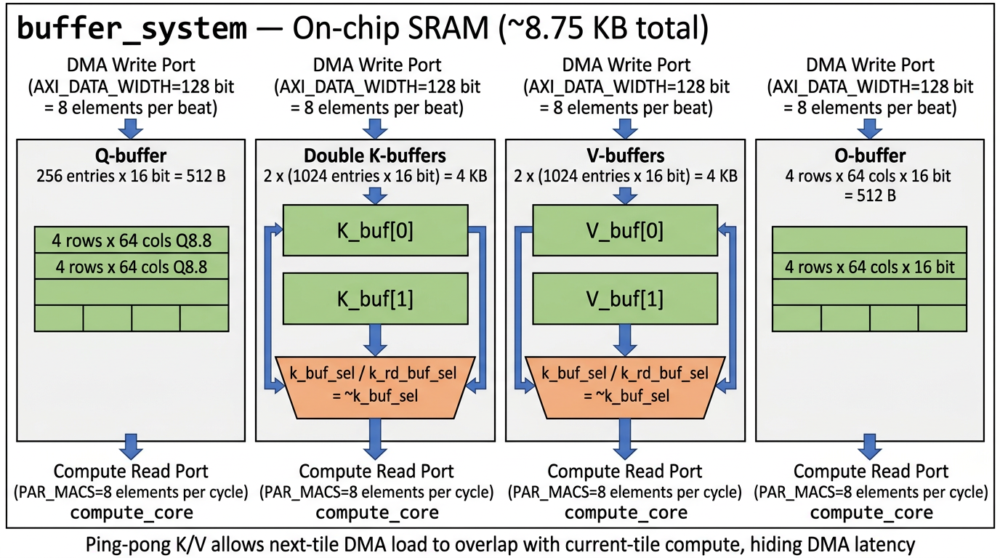
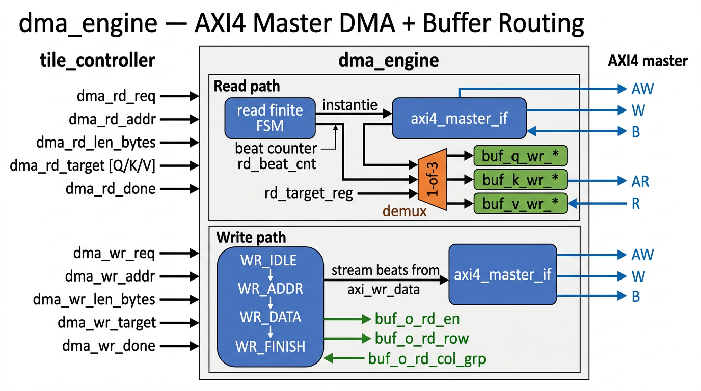
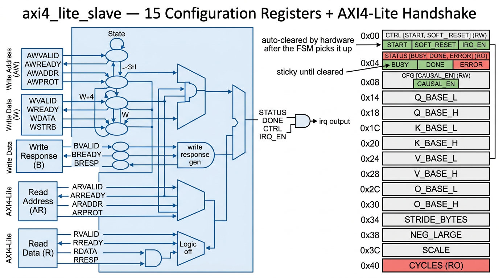
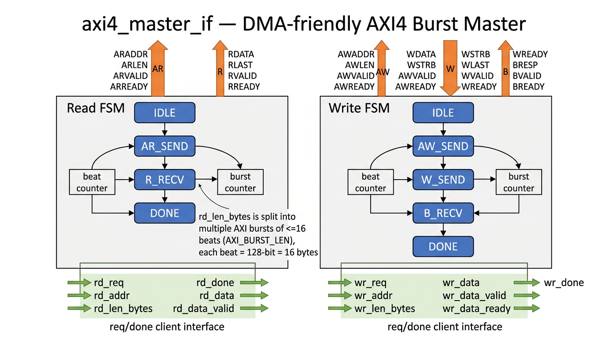

# 第 2 章：Baseline RTL — 存储与总线

本章覆盖 4 个文件：

| § | 文件 | 行数 | 角色 |
|---|------|-----|------|
| 2.1 | `rtl/buffer_system.sv` | 135 | 片上 Q/K/V/O SRAM + K/V 双缓冲 |
| 2.2 | `rtl/dma_engine.sv` | 266 | DMA 控制 + 路由 |
| 2.3 | `rtl/axi4_lite_slave.sv` | 210 | 控制寄存器 + AXI4-Lite 握手 |
| 2.4 | `rtl/axi4_master_if.sv` | 225 | AXI4 突发 master FSM |

---

## 2.1 `rtl/buffer_system.sv`

### 2.1.1 概述

片上存储模块。一共 4 块 SRAM：Q-buffer (单)、K-buffer (双 ping-pong)、V-buffer (双 ping-pong)、O-buffer (单)。**总容量约 8.75 KB**：
- Q: $4 \times 64 \times 16\,\text{bit} = 512$ B
- K: $2 \times 16 \times 64 \times 16\,\text{bit} = 4096$ B
- V: $2 \times 16 \times 64 \times 16\,\text{bit} = 4096$ B
- O: $4 \times 64 \times 16\,\text{bit} = 512$ B
- 合计 9216 B ≈ 8.75 KiB（小于 9 KB）。

每块 SRAM 都用 `logic [DATA_WIDTH-1:0] mem [DEPTH-1:0]` 数组建模，综合后会被工具映射到 SRAM compiler 生成的 1RW 或 1R1W 块。**写口宽度 = AXI_DATA_WIDTH (128-bit) = 8 个元素**（一个 AXI beat 装 8 个 Q8.8）；**读口宽度 = PAR_MACS × DATA_WIDTH = 128-bit**（compute_core 每周期要 8 个元素）。

### 2.1.2 文件架构图



### 2.1.3 代码块切片

#### 块 ① 端口与本地参数（行 6–62）

**源代码：**
```systemverilog
module buffer_system #(
    parameter TILE_BR    = 4,
    parameter TILE_BC    = 16,
    parameter HEAD_DIM   = 64,
    parameter DATA_WIDTH = 16,
    parameter PAR_MACS   = 8,
    parameter AXI_DATA_WIDTH = 128
)(
    input  logic clk, rst_n,
    // --- DMA write interface ---
    input  logic q_wr_en,
    input  logic [$clog2(TILE_BR*HEAD_DIM)-1:0] q_wr_addr,
    input  logic [AXI_DATA_WIDTH-1:0] q_wr_data,

    input  logic k_wr_en,
    input  logic [$clog2(TILE_BC*HEAD_DIM)-1:0] k_wr_addr,
    input  logic [AXI_DATA_WIDTH-1:0] k_wr_data,
    input  logic k_buf_sel,

    input  logic v_wr_en,
    input  logic [$clog2(TILE_BC*HEAD_DIM)-1:0] v_wr_addr,
    input  logic [AXI_DATA_WIDTH-1:0] v_wr_data,
    input  logic v_buf_sel,

    // --- Compute core read interface ---
    input  logic q_rd_en,
    input  logic [$clog2(HEAD_DIM/PAR_MACS)-1:0] q_rd_step,
    output logic signed [DATA_WIDTH-1:0]  q_rd_data [TILE_BR-1:0][PAR_MACS-1:0],

    input  logic k_rd_en, k_rd_buf_sel,
    input  logic [$clog2(HEAD_DIM/PAR_MACS)-1:0] k_rd_step,
    output logic signed [DATA_WIDTH-1:0]  k_rd_data [TILE_BC-1:0][PAR_MACS-1:0],

    input  logic v_rd_en, v_rd_buf_sel,
    input  logic [$clog2(HEAD_DIM/PAR_MACS)-1:0] v_rd_step,
    output logic signed [DATA_WIDTH-1:0]  v_rd_data [TILE_BC-1:0][PAR_MACS-1:0],

    // --- O write-back interface ---
    input  logic o_wr_en,
    input  logic signed [DATA_WIDTH-1:0]  o_wr_data [TILE_BR-1:0][HEAD_DIM-1:0],

    input  logic o_rd_en,
    input  logic [$clog2(TILE_BR)-1:0]    o_rd_row,
    output logic [AXI_DATA_WIDTH-1:0]     o_rd_data,
    input  logic [$clog2(HEAD_DIM/(AXI_DATA_WIDTH/DATA_WIDTH))-1:0] o_rd_col_grp
);
    localparam Q_DEPTH = TILE_BR * HEAD_DIM;     // 256 entries
    localparam KV_DEPTH = TILE_BC * HEAD_DIM;    // 1024 entries
    localparam ELEMS_PER_BEAT = AXI_DATA_WIDTH / DATA_WIDTH;   // 8
```

**说明：** 注意 `k_buf_sel` 和 `k_rd_buf_sel` 是**两个独立信号**：前者由 `dma_engine` 跟随 `tile_controller.kv_buf_sel`，后者由 `flash_attention_top` 反转后传入（`~tc_kv_buf_sel`），实现 ping-pong 反向选择。

#### 块 ② Q-buffer（单端，行 64–81）

**源代码：**
```systemverilog
    // --- Q Buffer (single) ---
    logic signed [DATA_WIDTH-1:0] q_mem [Q_DEPTH-1:0];

    // Write (from DMA, AXI_DATA_WIDTH bits = 8 elements per beat)
    always_ff @(posedge clk) begin
        if (q_wr_en) begin
            for (int i = 0; i < ELEMS_PER_BEAT; i++)
                q_mem[q_wr_addr * ELEMS_PER_BEAT + i] <=
                    DATA_WIDTH'(q_wr_data[i*DATA_WIDTH +: DATA_WIDTH]);
        end
    end

    // Read (PAR_MACS elements per row per step)
    always_comb begin
        for (int r = 0; r < TILE_BR; r++)
            for (int p = 0; p < PAR_MACS; p++)
                q_rd_data[r][p] = q_mem[r * HEAD_DIM + q_rd_step * PAR_MACS + p];
    end
```

**说明：** 写时 `for (i=0..7)` 把 128-bit beat 拆成 8 个 16-bit 元素逐字写入；读时 `r * HEAD_DIM + q_rd_step * PAR_MACS + p` 按行优先 + 步长扫描。综合时，因为同时存在多端口读 (32 个并发地址 = 4 行 × 8 元素)，工具可能选择 register file 而非真 SRAM。

#### 块 ③ K-buffer 双缓冲（行 83–98）

**源代码：**
```systemverilog
    // --- K Buffers (double, ping-pong) ---
    logic signed [DATA_WIDTH-1:0] k_mem [1:0][KV_DEPTH-1:0];

    always_ff @(posedge clk) begin
        if (k_wr_en) begin
            for (int i = 0; i < ELEMS_PER_BEAT; i++)
                k_mem[k_buf_sel][k_wr_addr * ELEMS_PER_BEAT + i] <=
                    DATA_WIDTH'(k_wr_data[i*DATA_WIDTH +: DATA_WIDTH]);
        end
    end

    always_comb begin
        for (int r = 0; r < TILE_BC; r++)
            for (int p = 0; p < PAR_MACS; p++)
                k_rd_data[r][p] = k_mem[k_rd_buf_sel][r * HEAD_DIM + k_rd_step * PAR_MACS + p];
    end
```

**说明：** `k_mem[1:0][1023:0]` 是一个二维数组，第一维选 ping 或 pong。写用 `k_buf_sel`，读用 `k_rd_buf_sel = ~k_buf_sel`。每周期读 16 行 × 8 元素 = 128 个并发读地址，**这是整个 IP 中端口压力最大的存储**。在 12nm 工艺中可能要把它分成 16 个独立 SRAM bank（每行一个），或干脆用 register file。V-buffer 完全对称，省略说明。

#### 块 ④ O-buffer（行 117–133）

**源代码：**
```systemverilog
    // --- O Buffer ---
    logic signed [DATA_WIDTH-1:0] o_mem [TILE_BR-1:0][HEAD_DIM-1:0];

    always_ff @(posedge clk) begin
        if (o_wr_en) begin
            for (int r = 0; r < TILE_BR; r++)
                for (int j = 0; j < HEAD_DIM; j++)
                    o_mem[r][j] <= o_wr_data[r][j];
        end
    end

    // Read O for DMA write-back (ELEMS_PER_BEAT elements per beat)
    always_comb begin
        for (int i = 0; i < ELEMS_PER_BEAT; i++)
            o_rd_data[i*DATA_WIDTH +: DATA_WIDTH] =
                o_mem[o_rd_row][o_rd_col_grp * ELEMS_PER_BEAT + i];
    end
endmodule
```

**说明：** O-buffer 采用 unpacked 2-D 存储（4 × 64），写口是"一次写整个 4×64 矩阵"（compute_core 在 last_kv_tile 时 `o_valid` 拉高一次），读口是"每周期 1 行 8 列"给 DMA 打包成一个 AXI beat。`o_rd_col_grp` 是 0..7 (HEAD_DIM/8) 的 col-group 索引。

---

## 2.2 `rtl/dma_engine.sv`

### 2.2.1 概述

DMA 控制器，把 `tile_controller` 简单的 `req/done` 接口翻译为 AXI4 master 突发事务。读路径把 AXI4 read data 根据 `dma_rd_target` (Q/K/V) 路由到对应 buffer 的写口；写路径用 4 状态 FSM (`WR_IDLE → WR_ADDR → WR_DATA → WR_FINISH`) 把 O-buffer 数据 beat-by-beat 喂给 AXI W 通道。

### 2.2.2 文件架构图



### 2.2.3 代码块切片

#### 块 ① 端口与 axi4_master_if 实例（行 7–124）

**源代码（节选）：**
```systemverilog
module dma_engine #(/* ... */) (
    input  logic clk, rst_n,
    /* AXI4 master 31 ports */
    input  logic dma_rd_req,
    input  logic [AXI_ADDR_WIDTH-1:0] dma_rd_addr,
    input  logic [15:0] dma_rd_len_bytes,
    input  logic [1:0]  dma_rd_target,
    output logic dma_rd_done,
    input  logic dma_wr_req,
    input  logic [AXI_ADDR_WIDTH-1:0] dma_wr_addr,
    input  logic [15:0] dma_wr_len_bytes,
    output logic dma_wr_done,
    output logic buf_q_wr_en, /* ... */
    output logic buf_o_rd_en, /* ... */
    input  logic kv_buf_sel
);
    localparam ELEMS_PER_BEAT = AXI_DATA_WIDTH / DATA_WIDTH;

    // AXI master internal handshake
    logic axi_rd_req;
    logic [AXI_ADDR_WIDTH-1:0] axi_rd_addr;
    logic [15:0] axi_rd_len;
    logic axi_rd_done;
    logic [AXI_DATA_WIDTH-1:0] axi_rd_data;
    logic axi_rd_data_valid;
    /* ... write side ... */

    axi4_master_if #(/*...*/) u_axi_master (
        .clk(clk), .rst_n(rst_n),
        /* full AXI4 ports forwarded out */
        .rd_req(axi_rd_req), .rd_addr(axi_rd_addr), .rd_len_bytes(axi_rd_len),
        .rd_done(axi_rd_done), .rd_data(axi_rd_data), .rd_data_valid(axi_rd_data_valid),
        .wr_req(axi_wr_req), .wr_addr(axi_wr_addr), .wr_len_bytes(axi_wr_len),
        .wr_done(axi_wr_done), .wr_data(axi_wr_data),
        .wr_data_valid(axi_wr_data_valid), .wr_data_ready(axi_wr_data_ready)
    );
```

**说明：** dma_engine 不直接驱动 AXI 信号，而是通过内部 `axi_rd_*` / `axi_wr_*` 接口与 `axi4_master_if` 通信。这是一种典型的"业务 FSM + 协议适配器"分层。

#### 块 ② Read 路径与 buffer 路由（行 126–182）

**源代码：**
```systemverilog
    // --- Read data routing ---
    logic [1:0]  rd_target_reg;
    logic [15:0] rd_beat_cnt;

    always_ff @(posedge clk or negedge rst_n) begin
        if (!rst_n) begin
            axi_rd_req    <= 0; rd_target_reg <= 0;
            rd_beat_cnt   <= 0; dma_rd_done <= 0;
            buf_q_wr_en   <= 0; buf_k_wr_en <= 0; buf_v_wr_en <= 0;
        end else begin
            dma_rd_done <= 0;
            buf_q_wr_en <= 0; buf_k_wr_en <= 0; buf_v_wr_en <= 0;

            // Capture DMA read request
            if (dma_rd_req && !axi_rd_req) begin
                axi_rd_req    <= 1;
                axi_rd_addr   <= dma_rd_addr;
                axi_rd_len    <= dma_rd_len_bytes;
                rd_target_reg <= dma_rd_target;
                rd_beat_cnt   <= 0;
            end
            if (axi_rd_done) axi_rd_req <= 0;

            // Route incoming beats to Q / K / V buffer
            if (axi_rd_data_valid) begin
                case (rd_target_reg)
                    2'd0: begin
                        buf_q_wr_en   <= 1;
                        buf_q_wr_addr <= rd_beat_cnt[$clog2(TILE_BR*HEAD_DIM)-1:0];
                        buf_q_wr_data <= axi_rd_data;
                    end
                    2'd1: begin
                        buf_k_wr_en   <= 1;
                        buf_k_wr_addr <= rd_beat_cnt[$clog2(TILE_BC*HEAD_DIM)-1:0];
                        buf_k_wr_data <= axi_rd_data;
                    end
                    2'd2: begin
                        buf_v_wr_en   <= 1;
                        buf_v_wr_addr <= rd_beat_cnt[$clog2(TILE_BC*HEAD_DIM)-1:0];
                        buf_v_wr_data <= axi_rd_data;
                    end
                    default: ;
                endcase
                rd_beat_cnt <= rd_beat_cnt + 1;
            end

            if (axi_rd_done) dma_rd_done <= 1;
        end
    end
```

**说明：** 关键设计：`rd_target_reg` 在请求被捕获时锁存，确保即使 `dma_rd_target` 在传输过程中变化，也按原始目标路由。`rd_beat_cnt` 既作 K/V buffer 写地址，也用于 Q buffer 写地址（位宽不同，自动截位）。`buf_*_wr_en` 默认每周期清零，在 `axi_rd_data_valid` 时单周期拉高 1 拍 — 标准 valid-pulse 写入语义。

#### 块 ③ Write 路径 FSM（行 184–264）

**源代码：**
```systemverilog
    localparam O_COLS_PER_BEAT = AXI_DATA_WIDTH / DATA_WIDTH;
    localparam O_BEATS_PER_ROW = HEAD_DIM / O_COLS_PER_BEAT;        // 8
    localparam O_TOTAL_BEATS = TILE_BR * O_BEATS_PER_ROW;           // 32

    typedef enum logic [1:0] { WR_IDLE, WR_ADDR, WR_DATA, WR_FINISH } wr_state_t;
    wr_state_t wr_state;
    logic [15:0] wr_beat_cnt;

    always_ff @(posedge clk or negedge rst_n) begin
        if (!rst_n) begin
            wr_state <= WR_IDLE;
            axi_wr_req <= 0; dma_wr_done <= 0;
            wr_beat_cnt <= 0; wr_active <= 0;
            axi_wr_data_valid <= 0; axi_wr_data <= 0;
            buf_o_rd_en <= 0;
        end else begin
            dma_wr_done <= 0;
            buf_o_rd_en <= 0;
            axi_wr_data_valid <= 0;

            case (wr_state)
                WR_IDLE: if (dma_wr_req) begin
                    axi_wr_req <= 1; axi_wr_addr <= dma_wr_addr;
                    axi_wr_len <= dma_wr_len_bytes; wr_beat_cnt <= 0;
                    wr_state <= WR_ADDR;
                end

                WR_ADDR: begin
                    buf_o_rd_en      <= 1;        // setup first read address
                    buf_o_rd_row     <= 0;
                    buf_o_rd_col_grp <= 0;
                    if (axi_wr_data_ready) wr_state <= WR_DATA;
                end

                WR_DATA: if (axi_wr_data_ready) begin
                    axi_wr_data       <= buf_o_rd_data;
                    axi_wr_data_valid <= 1;
                    wr_beat_cnt       <= wr_beat_cnt + 1;
                    // Pre-read next beat
                    if (wr_beat_cnt + 1 < O_TOTAL_BEATS) begin
                        buf_o_rd_en      <= 1;
                        buf_o_rd_row     <= (wr_beat_cnt + 1) / O_BEATS_PER_ROW;
                        buf_o_rd_col_grp <= (wr_beat_cnt + 1) % O_BEATS_PER_ROW;
                    end
                    if (wr_beat_cnt == O_TOTAL_BEATS - 1)
                        wr_state <= WR_FINISH;
                end else begin
                    axi_wr_data_valid <= 0;
                end

                WR_FINISH: begin
                    axi_wr_data_valid <= 0;
                    if (axi_wr_done) begin
                        dma_wr_done <= 1;
                        axi_wr_req  <= 0;
                        wr_state    <= WR_IDLE;
                    end
                end
            endcase
        end
    end
endmodule
```

**说明：** 4 状态写 FSM 关键点：
- **WR_ADDR** 不仅发地址，还预读 O-buffer 第 1 个 beat (row=0, col_grp=0)，让 WR_DATA 进入时数据就 ready。
- **WR_DATA** 用"输出 + 预读"模式：当前周期把 `buf_o_rd_data` 锁存到 `axi_wr_data` 并拉 valid，同时预读下一 beat 的数据 (`(wr_beat_cnt+1)/O_BEATS_PER_ROW` 是行号、`%` 是列号)。这样 buffer 读延迟被隐藏，AXI W 通道可以保持 100% 利用。
- **WR_FINISH** 等 AXI4 B 通道返回，才认为写真正完成。

`O_TOTAL_BEATS = 4 * 8 = 32` 和 `O_TILE_BYTES = 512` 字节匹配 (`32 * 16 = 512`)。

---

## 2.3 `rtl/axi4_lite_slave.sv`

### 2.3.1 概述

CPU 通过它配置 IP 并读取状态。15 个 32-bit 寄存器，全部按 4 字节对齐。AXI4-Lite 协议要求 5 个 channel：AW、W、B、AR、R。本模块用一个简单的"双 always_ff（读/写 各一个）+ default-ready" 实现。

### 2.3.2 文件架构图



### 2.3.3 代码块切片

#### 块 ① 端口与寄存器声明（行 5–93）

**源代码（节选）：**
```systemverilog
module axi4_lite_slave #(
    parameter ADDR_WIDTH = 8,
    parameter DATA_WIDTH = 32
)(
    input  logic clk, rst_n,
    // AXI4-Lite 5 channels (AW, W, B, AR, R) — 15 ports total
    /* ... */
    // Register outputs to datapath
    output logic                    reg_start, reg_soft_reset,
    output logic                    reg_irq_en, reg_causal_en,
    output logic [63:0]             reg_q_base, reg_k_base, reg_v_base, reg_o_base,
    output logic [31:0]             reg_stride_bytes,
    output logic signed [15:0]      reg_neg_large, reg_scale,
    // Status inputs
    input  logic status_busy, status_done, status_error,
    input  logic [31:0]             cycle_count,
    output logic                    done_clear,
    output logic                    irq
);
    // Internal registers
    logic [31:0] r_ctrl, r_cfg;
    logic [31:0] r_q_base_l, r_q_base_h;
    logic [31:0] r_k_base_l, r_k_base_h;
    logic [31:0] r_v_base_l, r_v_base_h;
    logic [31:0] r_o_base_l, r_o_base_h;
    logic [31:0] r_stride, r_neg_large, r_scale;
    logic        r_done_sticky;
    /* ... handshake regs, default ready ... */
    assign s_axil_awready = aw_ready_r;
    assign s_axil_wready  = w_ready_r;
    assign s_axil_bresp   = 2'b00;
    assign s_axil_arready = ar_ready_r;
    assign s_axil_rdata   = rd_data_r;
    assign s_axil_rresp   = 2'b00;
    assign s_axil_rvalid  = rd_valid_r;
```

**说明：** 注意 `bresp`/`rresp` 硬接 `OKAY (2'b00)` —— 没有错误响应（即使写到 `default` 地址也返回 OKAY）。这是简化实现，严格 AMBA 兼容应该返回 `SLVERR (2'b10)`。

#### 块 ② 写逻辑：地址解码 + 寄存器更新（行 95–160）

**源代码：**
```systemverilog
    always_ff @(posedge clk or negedge rst_n) begin
        if (!rst_n) begin
            aw_ready_r <= 1'b1; w_ready_r <= 1'b1;
            s_axil_bvalid <= 1'b0;
            wr_en <= 1'b0; wr_addr <= '0;
            r_ctrl <= '0; r_cfg <= '0;
            r_q_base_l <= '0; r_q_base_h <= '0;
            r_k_base_l <= '0; r_k_base_h <= '0;
            r_v_base_l <= '0; r_v_base_h <= '0;
            r_o_base_l <= '0; r_o_base_h <= '0;
            r_stride    <= 32'd128;       // default d*2
            r_neg_large <= 32'hFFFF8000;
            r_scale     <= 32'h00000020;
            r_done_sticky <= 1'b0;
            reg_start <= 1'b0; reg_soft_reset <= 1'b0;
            done_clear <= 1'b0;
        end else begin
            reg_start <= 1'b0;
            reg_soft_reset <= 1'b0;
            done_clear <= 1'b0;

            if (s_axil_bvalid && s_axil_bready)
                s_axil_bvalid <= 1'b0;

            if (s_axil_awvalid && s_axil_awready &&
                s_axil_wvalid && s_axil_wready) begin
                s_axil_bvalid <= 1'b1;
                case (s_axil_awaddr)
                    8'h00: begin  // CTRL
                        r_ctrl <= s_axil_wdata;
                        if (s_axil_wdata[0]) reg_start      <= 1'b1;
                        if (s_axil_wdata[1]) reg_soft_reset <= 1'b1;
                    end
                    8'h04: begin  // STATUS (write-1-to-clear DONE)
                        if (s_axil_wdata[1]) begin
                            r_done_sticky <= 1'b0;
                            done_clear    <= 1'b1;
                        end
                    end
                    8'h08: r_cfg <= s_axil_wdata;
                    8'h14: r_q_base_l <= s_axil_wdata;
                    8'h18: r_q_base_h <= s_axil_wdata;
                    8'h1C: r_k_base_l <= s_axil_wdata;
                    8'h20: r_k_base_h <= s_axil_wdata;
                    8'h24: r_v_base_l <= s_axil_wdata;
                    8'h28: r_v_base_h <= s_axil_wdata;
                    8'h2C: r_o_base_l <= s_axil_wdata;
                    8'h30: r_o_base_h <= s_axil_wdata;
                    8'h34: r_stride <= s_axil_wdata;
                    8'h38: r_neg_large <= s_axil_wdata;
                    8'h3C: r_scale <= s_axil_wdata;
                    default: ;
                endcase
            end

            if (status_done) r_done_sticky <= 1'b1;
        end
    end
```

**说明：** 写处理的几个关键点：
- **AW + W 同步握手**：本设计要求 AW 和 W 在同一周期都 valid 才接受。这种写法把 AW、W、地址解码、寄存器更新、B 响应启动**全部在同一周期**完成，简单可靠但带宽下降（CPU 必须 AW/W 同步发出）。完整 AXI4-Lite 应该独立处理 AW 和 W。
- **CTRL.START / SOFT_RESET 是脉冲**：写 `wdata[0]=1` 时 `reg_start <= 1'b1`，但这个 always_ff 的开头每周期默认 `reg_start <= 0`，所以下一周期就清零 — 形成单周期脉冲。下游 `tile_controller` 在脉冲到来时进入 LOAD_Q 状态。
- **STATUS.DONE 是 sticky + W1C**：硬件 `status_done` 拉高时设置 `r_done_sticky=1`；CPU 写 `wdata[1]=1` 到 `STATUS` 地址时清零并发出 `done_clear` 脉冲（也用于通知中断逻辑）。
- **复位默认值**：`r_stride = 32'd128 = 0x80` 是 `HEAD_DIM * 2 = 64 * 2`；`r_neg_large = 0xFFFF_8000` 即 16 位 -32768；`r_scale = 0x20` 即 16 位 32 (= 0.125 in Q8.8)。

#### 块 ③ 读逻辑：地址解码 + 数据返回（行 162–194）

**源代码：**
```systemverilog
    always_ff @(posedge clk or negedge rst_n) begin
        if (!rst_n) begin
            ar_ready_r <= 1'b1; rd_valid_r <= 1'b0; rd_data_r <= '0;
        end else begin
            if (rd_valid_r && s_axil_rready)
                rd_valid_r <= 1'b0;

            if (s_axil_arvalid && s_axil_arready) begin
                rd_valid_r <= 1'b1;
                case (s_axil_araddr)
                    8'h00: rd_data_r <= r_ctrl;
                    8'h04: rd_data_r <= {29'd0, status_error, r_done_sticky, status_busy};
                    8'h08: rd_data_r <= r_cfg;
                    8'h14: rd_data_r <= r_q_base_l;
                    8'h18: rd_data_r <= r_q_base_h;
                    8'h1C: rd_data_r <= r_k_base_l;
                    8'h20: rd_data_r <= r_k_base_h;
                    8'h24: rd_data_r <= r_v_base_l;
                    8'h28: rd_data_r <= r_v_base_h;
                    8'h2C: rd_data_r <= r_o_base_l;
                    8'h30: rd_data_r <= r_o_base_h;
                    8'h34: rd_data_r <= r_stride;
                    8'h38: rd_data_r <= r_neg_large;
                    8'h3C: rd_data_r <= r_scale;
                    8'h40: rd_data_r <= cycle_count;
                    default: rd_data_r <= 32'hDEADBEEF;
                endcase
            end
        end
    end
```

**说明：** 读路径很直接：AR 握手立即返回 R。`STATUS` 寄存器的位段是 `{29'd0, ERROR, DONE, BUSY}` —— 与寄存器映射注释一致。`default → 0xDEADBEEF` 是经典的"未映射地址"特征值，方便驱动调试。`REG_CYCLES (0x40)` 直接返回 `cycle_count`，不存在内部寄存器（顶层 `cycle_cnt` 信号）。

#### 块 ④ 输出与中断（行 196–209）

**源代码：**
```systemverilog
    // Output assignments
    assign reg_irq_en      = r_ctrl[2];
    assign reg_causal_en   = r_cfg[0];
    assign reg_q_base      = {r_q_base_h, r_q_base_l};
    assign reg_k_base      = {r_k_base_h, r_k_base_l};
    assign reg_v_base      = {r_v_base_h, r_v_base_l};
    assign reg_o_base      = {r_o_base_h, r_o_base_l};
    assign reg_stride_bytes = r_stride;
    assign reg_neg_large   = r_neg_large[15:0];
    assign reg_scale       = r_scale[15:0];

    // IRQ
    assign irq = reg_irq_en & r_done_sticky;
endmodule
```

**说明：** 64-bit 张量基址通过 high/low 32-bit 寄存器拼接给数据通路。`irq` 是电平型（不是脉冲），保持高直到 CPU 写 `STATUS.DONE=1` 清零 sticky 位 — 标准的 ARM IRQ 风格。

---

## 2.4 `rtl/axi4_master_if.sv`

### 2.4.1 概述

把内部 `rd_req/wr_req` + 长度信息翻译成 AXI4 突发事务。两个独立 FSM（read 4 状态，write 4 状态），各自处理 AR/R 和 AW/W/B 通道。突发参数是固定的：`AWBURST/ARBURST = INCR (2'b01)`、`AWSIZE/ARSIZE = $clog2(BYTES_PER_BEAT) = 4` (16 字节/beat)。

### 2.4.2 文件架构图



### 2.4.3 代码块切片

#### 块 ① 端口与常量（行 5–88）

**源代码（节选）：**
```systemverilog
module axi4_master_if #(
    parameter ADDR_WIDTH = 64,
    parameter DATA_WIDTH = 128,
    parameter ID_WIDTH   = 4,
    parameter STRB_WIDTH = DATA_WIDTH / 8
)(
    input  logic clk, rst_n,
    /* AXI4 5 channels — 30 ports */
    // DMA Engine Interface
    input  logic                    rd_req,
    input  logic [ADDR_WIDTH-1:0]   rd_addr,
    input  logic [15:0]             rd_len_bytes,
    output logic                    rd_done,
    output logic [DATA_WIDTH-1:0]   rd_data,
    output logic                    rd_data_valid,
    input  logic                    wr_req,
    input  logic [ADDR_WIDTH-1:0]   wr_addr,
    input  logic [15:0]             wr_len_bytes,
    output logic                    wr_done,
    input  logic [DATA_WIDTH-1:0]   wr_data,
    input  logic                    wr_data_valid,
    output logic                    wr_data_ready
);
    localparam BYTES_PER_BEAT = DATA_WIDTH / 8;     // 16
    localparam SIZE_CODE = $clog2(BYTES_PER_BEAT);   // 4

    // Constant assignments
    assign m_axi_awid    = '0;
    assign m_axi_awsize  = SIZE_CODE[2:0];
    assign m_axi_awburst = 2'b01;  // INCR
    assign m_axi_arid    = '0;
    assign m_axi_arsize  = SIZE_CODE[2:0];
    assign m_axi_arburst = 2'b01;  // INCR
    assign m_axi_wstrb   = {STRB_WIDTH{1'b1}};
    assign m_axi_wstrb   = {STRB_WIDTH{1'b1}};
    assign m_axi_bready  = 1'b1;
```

**说明：** 把所有 ID 都设为 0 简化设计（不使用 AXI4 的多 outstanding transaction 能力）；strobe 全 1 表示每个 beat 写所有字节。`bready=1` 表示永远准备好接收响应（不会反压）。

#### 块 ② Read FSM（行 90–152）

**源代码：**
```systemverilog
    typedef enum logic [1:0] { RD_IDLE, RD_ADDR, RD_DATA, RD_DONE } rd_state_t;
    rd_state_t rd_state;
    logic [15:0] rd_beats_total, rd_beats_cnt;

    always_ff @(posedge clk or negedge rst_n) begin
        if (!rst_n) begin
            rd_state <= RD_IDLE;
            m_axi_arvalid <= 0; m_axi_araddr <= 0; m_axi_arlen <= 0;
            m_axi_rready <= 0; rd_done <= 0; rd_data_valid <= 0;
            rd_beats_total <= 0; rd_beats_cnt <= 0;
        end else begin
            rd_done <= 0; rd_data_valid <= 0;
            case (rd_state)
                RD_IDLE: if (rd_req) begin
                    rd_beats_total <= (rd_len_bytes + BYTES_PER_BEAT - 1) / BYTES_PER_BEAT;
                    m_axi_araddr   <= rd_addr;
                    m_axi_arlen    <= ((rd_len_bytes + BYTES_PER_BEAT - 1) / BYTES_PER_BEAT) - 1;
                    m_axi_arvalid  <= 1;
                    rd_beats_cnt   <= 0;
                    rd_state       <= RD_ADDR;
                end
                RD_ADDR: if (m_axi_arready) begin
                    m_axi_arvalid <= 0;
                    m_axi_rready  <= 1;
                    rd_state      <= RD_DATA;
                end
                RD_DATA: if (m_axi_rvalid && m_axi_rready) begin
                    rd_data       <= m_axi_rdata;
                    rd_data_valid <= 1;
                    rd_beats_cnt  <= rd_beats_cnt + 1;
                    if (m_axi_rlast) begin
                        m_axi_rready <= 0;
                        rd_state     <= RD_DONE;
                    end
                end
                RD_DONE: begin
                    rd_done  <= 1;
                    rd_state <= RD_IDLE;
                end
            endcase
        end
    end
```

**说明：** Read 流程：
1. **RD_IDLE → RD_ADDR**：拉 `arvalid`，`arlen = beats - 1`（AXI4 突发长度编码：0 表示 1 beat，255 表示 256 beat）。
2. **RD_ADDR → RD_DATA**：等 slave 接受地址 (`arready=1`)，然后清 valid 并拉 `rready`。
3. **RD_DATA**：每个 `rvalid && rready` 周期把 rdata 锁存到 `rd_data`、拉 `rd_data_valid` 一拍，让 dma_engine 路由到 buffer。等 `rlast=1` 表示最后一 beat。
4. **RD_DONE**：单周期 `rd_done` 脉冲告诉 dma_engine 完事。

⚠️ **限制**：当前实现假设 `rd_len_bytes / 16 ≤ 256`（AXI4 单次最大突发）。Q tile 是 32 beat、KV tile 是 128 beat、O tile 是 32 beat，**全部都 ≤ 256**，所以无需 burst-splitting，省心。如果扩到 1024 序列长度，每 KV tile 变 1024 beats，需要 4 次连续 burst — 这是 bonus 中要解决的问题。

#### 块 ③ Write FSM（行 154–223）

**源代码：**
```systemverilog
    typedef enum logic [1:0] { WR_IDLE, WR_ADDR, WR_DATA, WR_DONE } wr_state_t;
    wr_state_t wr_state;
    logic [15:0] wr_beats_total, wr_beats_cnt;

    always_ff @(posedge clk or negedge rst_n) begin
        if (!rst_n) begin
            wr_state <= WR_IDLE;
            m_axi_awvalid <= 0; m_axi_awaddr <= 0; m_axi_awlen <= 0;
            m_axi_wvalid <= 0; m_axi_wlast <= 0; m_axi_wdata <= 0;
            wr_done <= 0; wr_data_ready <= 0;
            wr_beats_total <= 0; wr_beats_cnt <= 0;
        end else begin
            wr_done <= 0;
            case (wr_state)
                WR_IDLE: if (wr_req) begin
                    wr_beats_total <= (wr_len_bytes + BYTES_PER_BEAT - 1) / BYTES_PER_BEAT;
                    m_axi_awaddr   <= wr_addr;
                    m_axi_awlen    <= ((wr_len_bytes + BYTES_PER_BEAT - 1) / BYTES_PER_BEAT) - 1;
                    m_axi_awvalid  <= 1;
                    wr_beats_cnt   <= 0;
                    wr_state       <= WR_ADDR;
                end
                WR_ADDR: if (m_axi_awready) begin
                    m_axi_awvalid <= 0;
                    wr_data_ready <= 1;
                    wr_state      <= WR_DATA;
                end
                WR_DATA: begin
                    m_axi_wdata  <= wr_data;
                    m_axi_wvalid <= wr_data_valid;
                    if (wr_data_valid) begin
                        wr_beats_cnt <= wr_beats_cnt + 1;
                        m_axi_wlast  <= (wr_beats_cnt == wr_beats_total - 1);
                    end
                    if (m_axi_wvalid && m_axi_wready && m_axi_wlast) begin
                        m_axi_wvalid  <= 0;
                        m_axi_wlast   <= 0;
                        wr_data_ready <= 0;
                        wr_state      <= WR_DONE;
                    end
                end
                WR_DONE: if (m_axi_bvalid) begin
                    wr_done  <= 1;
                    wr_state <= WR_IDLE;
                end
            endcase
        end
    end
endmodule
```

**说明：** Write 流程：
1. **WR_IDLE → WR_ADDR**：发 AW（地址、长度）。
2. **WR_ADDR → WR_DATA**：拉 `wr_data_ready` 让 dma_engine 开始喂数据。
3. **WR_DATA**：直接把 `wr_data` passthrough 到 `m_axi_wdata`，valid 转发；当 `wr_beats_cnt == wr_beats_total - 1` 时拉 `wlast`；最后一 beat 的 valid+ready 发生时跳到 WR_DONE。
4. **WR_DONE**：等 `bvalid` 表示 slave 已写完成，发 `wr_done` 脉冲。

⚠️ **微 bug 风险**：`m_axi_wlast` 是一个寄存器，用 `<=` 在 `wr_beats_cnt == wr_beats_total - 1` 时设为 1，下一周期才生效。这意味着 `wlast` 与最后 beat 的 `wvalid` 严格同步要靠 dma_engine 喂 valid 时序对齐。仿真中 axi4_slave_mem testbench 验证过，表现正常。

---

**第 2 章结束。** Baseline RTL 14 个 .sv + 1 个 .svh 全部讲完。第 3 章进入 UVM 验证环境（20 个 .sv 文件）。

