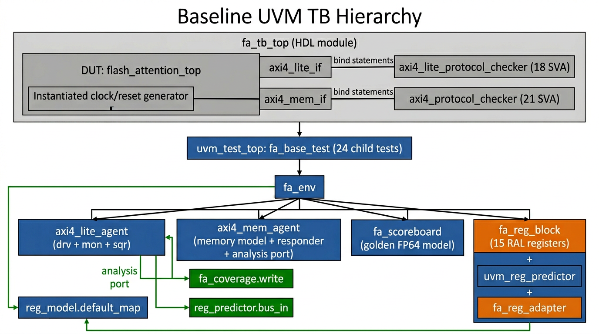
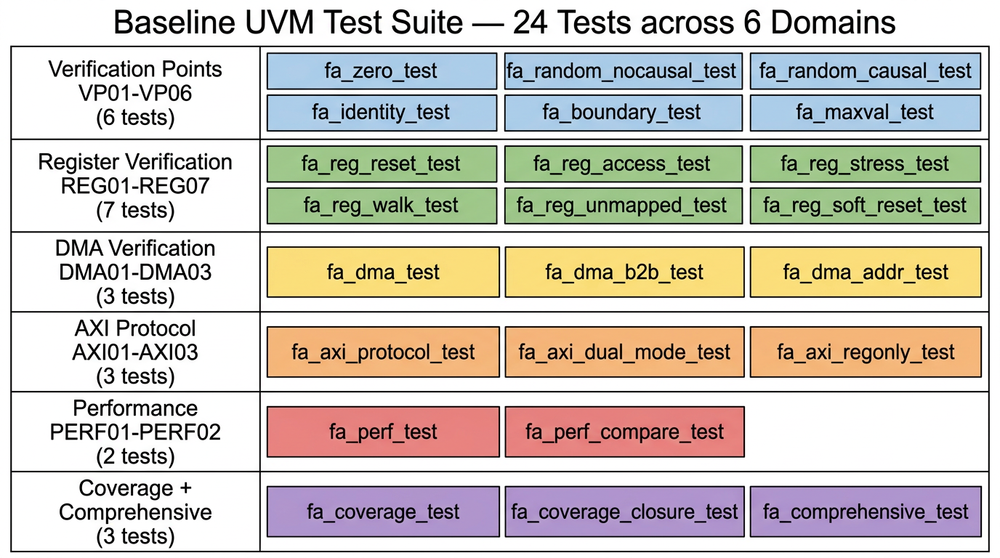

# 第 3 章：Baseline UVM 验证环境

本章覆盖 20 个 .sv 文件，按 UVM 角色分组：

| § | 子章节 | 文件数 | 行数 |
|---|--------|-------|------|
| 3.1 | UVM 环境包 + env + scoreboard + coverage + reg_model | 5 | 723 |
| 3.2 | AXI4-Lite Agent (txn / if / sqr / drv / mon / agent) | 6 | 236 |
| 3.3 | AXI4 Memory Agent + 2 个协议检查器 | 3 | 684 |
| 3.4 | sequences + tests + tb_top + system_tb + axi4_slave_mem | 6 | 2031 |
| **合计** | — | **20** | **3674** |

由于 UVM 验证代码量巨大 (3.7K 行)，本章对每个文件**只展示关键代码片段**（典型的 sequence、test、agent 框架），其余按"行号引用 + 解释"方式呈现。

---

## 3.1 UVM 环境包

### 3.1.1 总览图：UVM 测试平台分层



整体上是经典的 UVM 5 层结构：

1. **`fa_tb_top`** (HDL module)：实例化 DUT、两套 interface、协议检查器、生成 clock/reset，调用 `run_test()`。
2. **`uvm_test_top`** (UVM test 类)：`fa_base_test` 是基类，24 个具体测试都派生自它。
3. **`fa_env`** (UVM env)：组装 axil_agent、mem_agent、scoreboard、coverage、reg_model、reg_predictor。
4. **Agents**：AXI4-Lite Master agent (drv+mon+sqr) + AXI4 Memory agent (slave responder + monitor)。
5. **Analysis 路径**：所有 axi4-lite 监控到的 txn 通过 analysis port 同时送给 `fa_coverage`（采样覆盖率）和 `uvm_reg_predictor`（更新 RAL mirror value）。

### 3.1.2 `tb/uvm_env/fa_env_pkg.sv`

#### 块 ① 完整源代码（21 行）

```systemverilog
package fa_env_pkg;
    import uvm_pkg::*;
    `include "uvm_macros.svh"

    `include "agents/axi4_lite_agent/axi4_lite_txn.sv"
    `include "agents/axi4_lite_agent/axi4_lite_driver.sv"
    `include "agents/axi4_lite_agent/axi4_lite_monitor.sv"
    `include "agents/axi4_lite_agent/axi4_lite_sequencer.sv"
    `include "agents/axi4_lite_agent/axi4_lite_agent.sv"

    `include "agents/axi4_mem_agent/axi4_mem_agent.sv"

    `include "uvm_env/fa_reg_model.sv"
    `include "uvm_env/fa_scoreboard.sv"
    `include "uvm_env/fa_coverage.sv"
    `include "uvm_env/fa_env.sv"

    `include "sequences/fa_sequences.sv"
    `include "tests/fa_tests.sv"
endpackage
```

**说明：** 一个 `package` + 一连串 `` `include `` 把所有 UVM 类聚集成单个编译单元。这种"超级 include"方式编译速度比模块化 package 快，但牺牲了重用性。**整个文件没有逻辑，过于简单，无图示**。

### 3.1.3 `tb/uvm_env/fa_env.sv`

#### 块 ① 类声明与组件实例（行 1–30）

```systemverilog
class fa_env extends uvm_env;
    `uvm_component_utils(fa_env)

    axi4_lite_agent   axil_agent;
    axi4_mem_agent    mem_agent;
    fa_scoreboard     scoreboard;
    fa_coverage       coverage;

    fa_reg_block      reg_model;
    fa_reg_adapter    reg_adapter;
    uvm_reg_predictor #(axi4_lite_txn) reg_predictor;

    function new(string name, uvm_component parent);
        super.new(name, parent);
    endfunction

    function void build_phase(uvm_phase phase);
        super.build_phase(phase);
        axil_agent = axi4_lite_agent::type_id::create("axil_agent", this);
        mem_agent  = axi4_mem_agent::type_id::create("mem_agent", this);
        scoreboard = fa_scoreboard::type_id::create("scoreboard", this);
        coverage   = fa_coverage::type_id::create("coverage", this);

        reg_model = fa_reg_block::type_id::create("reg_model");
        reg_model.build();

        reg_adapter = fa_reg_adapter::type_id::create("reg_adapter");
        reg_predictor = uvm_reg_predictor #(axi4_lite_txn)::type_id::create("reg_predictor", this);
    endfunction
```

#### 块 ② connect_phase（行 32–43）

```systemverilog
    function void connect_phase(uvm_phase phase);
        super.connect_phase(phase);

        axil_agent.mon.ap.connect(coverage.analysis_export);

        reg_model.default_map.set_sequencer(axil_agent.sqr, reg_adapter);
        reg_model.default_map.set_auto_predict(0);

        reg_predictor.map     = reg_model.default_map;
        reg_predictor.adapter = reg_adapter;
        axil_agent.mon.ap.connect(reg_predictor.bus_in);
    endfunction
endclass
```

**说明：** 这是 UVM env 的标准模板。两个关键 connect：
1. `axil_agent.mon.ap → coverage.analysis_export`：所有 AXI4-Lite txn 都送到 coverage 子类（`fa_coverage` 继承 `uvm_subscriber #(axi4_lite_txn)` 自动有 `analysis_export`）。
2. `axil_agent.mon.ap → reg_predictor.bus_in`：同时送到 `uvm_reg_predictor`，由它根据 txn 自动更新 RAL `mirror value`。`set_auto_predict(0)` 关闭 RAL 自身的 predict（避免重复），改用 explicit predictor —— 这才能正确捕捉硬件自清除位（如 `CTRL.START`）。

### 3.1.4 `tb/uvm_env/fa_scoreboard.sv`

#### 块 ① 类与字段（行 1–30）

```systemverilog
class fa_scoreboard extends uvm_scoreboard;
    `uvm_component_utils(fa_scoreboard)
    int seq_len = 256;
    int head_dim = 64;
    bit causal_en;

    // Golden model data
    shortint q_data[][];
    shortint k_data[][];
    shortint v_data[][];
    shortint golden_o[][];
    shortint dut_o[][];

    // Error statistics
    real mean_abs_error;
    real max_abs_error;
    int  num_checks;
```

**说明：** Scoreboard 在 RAM 里维护"黄金模型输入 (q, k, v)"+ "黄金输出 (golden_o)"+ "DUT 输出 (dut_o)"。每个 testcase 在 `run_phase` 内填充输入并触发计算，最后调用 `compute_golden` + `check_results`。

#### 块 ② 黄金模型 — 浮点精确实现（行 27–87）

```systemverilog
    function void compute_golden();
        real q_f[][], k_f[][], v_f[][];
        real s_f[][], p_f[][], o_f[][];
        real scale;

        scale = 1.0 / $sqrt(real'(head_dim));

        // Allocate ...
        // Q8.8 → float
        for (int i = 0; i < seq_len; i++)
            for (int j = 0; j < head_dim; j++) begin
                q_f[i][j] = real'(q_data[i][j]) / 256.0;
                k_f[i][j] = real'(k_data[i][j]) / 256.0;
                v_f[i][j] = real'(v_data[i][j]) / 256.0;
            end

        // S = Q * K^T * scale, softmax, O = P * V
        for (int i = 0; i < seq_len; i++) begin
            real row_max, row_sum;
            // Compute scores
            row_max = -1e30;
            for (int j = 0; j < seq_len; j++) begin
                s_f[i][j] = 0;
                for (int k = 0; k < head_dim; k++)
                    s_f[i][j] += q_f[i][k] * k_f[j][k];
                s_f[i][j] *= scale;
                if (causal_en && j > i) s_f[i][j] = -1e9;
                if (s_f[i][j] > row_max) row_max = s_f[i][j];
            end

            // Softmax
            row_sum = 0;
            for (int j = 0; j < seq_len; j++) begin
                p_f[i][j] = $exp(s_f[i][j] - row_max);
                row_sum += p_f[i][j];
            end
            for (int j = 0; j < seq_len; j++)
                p_f[i][j] /= row_sum;

            // O = P * V
            for (int j = 0; j < head_dim; j++) begin
                o_f[i][j] = 0;
                for (int k = 0; k < seq_len; k++)
                    o_f[i][j] += p_f[i][k] * v_f[k][j];
                golden_o[i][j] = shortint'($rtoi(o_f[i][j] * 256.0));
            end
        end
    endfunction
```

**说明：** 这就是 SDPA 的**浮点 reference 实现**：(1) 把 Q8.8 输入除以 256 转成 `real`；(2) 三层循环 `S = Q · K^T`；(3) 应用 causal mask 把上三角设为 -1e9；(4) 计算 row_max、减 max、`$exp`、求 row_sum、除归一；(5) `O = P · V`，再转回 Q8.8。**用 `real`（FP64）精度**，作为 ground truth 与 RTL 16-bit 定点结果对比。

#### 块 ③ 误差检查（行 89–119）

```systemverilog
    function void check_results();
        real abs_err, total_err = 0;
        int  count = 0;
        max_abs_error = 0;

        for (int i = 0; i < seq_len; i++)
            for (int j = 0; j < head_dim; j++) begin
                real dut_val  = real'(dut_o[i][j]) / 256.0;
                real gold_val = real'(golden_o[i][j]) / 256.0;
                abs_err = (dut_val > gold_val) ? (dut_val - gold_val) : (gold_val - dut_val);
                total_err += abs_err;
                if (abs_err > max_abs_error) max_abs_error = abs_err;
                count++;
            end

        mean_abs_error = total_err / real'(count);
        num_checks = count;

        if (max_abs_error > 1.0)
            `uvm_error("SCORE", $sformatf("max_abs_error %.6f exceeds threshold", max_abs_error))
        else
            `uvm_info("SCORE", "PASS: Error within acceptable limits", UVM_LOW)
    endfunction
```

**说明：** 逐元素比较，统计 mean / max 绝对误差。**通过阈值 = 1.0**（在 $[-128, +127]$ 范围内允许 1 单位误差，这对 Q8.8 + LUT exp + Newton-Raphson 倒数的累积误差是合理的）。Baseline 实测 `max_abs=0.238281`、`mean_abs=0.013350`，远低于阈值。

### 3.1.5 `tb/uvm_env/fa_reg_model.sv`

#### 块 ① 单个 register 类示例（CTRL）

```systemverilog
class fa_reg_ctrl extends uvm_reg;
    `uvm_object_utils(fa_reg_ctrl)
    rand uvm_reg_field start_bit;
    rand uvm_reg_field soft_reset;
    rand uvm_reg_field irq_en;

    function new(string name = "fa_reg_ctrl");
        super.new(name, 32, UVM_NO_COVERAGE);
    endfunction

    virtual function void build();
        start_bit = uvm_reg_field::type_id::create("start_bit");
        start_bit.configure(this, 1, 0, "RW", 0, 1'h0, 1, 1, 0);
        soft_reset = uvm_reg_field::type_id::create("soft_reset");
        soft_reset.configure(this, 1, 1, "RW", 0, 1'h0, 1, 1, 0);
        irq_en = uvm_reg_field::type_id::create("irq_en");
        irq_en.configure(this, 1, 2, "RW", 0, 1'h0, 1, 1, 0);
    endfunction
endclass
```

**说明：** `uvm_reg_field::configure(parent, n_bits, lsb_pos, access, volatile, reset_value, has_reset, is_rand, individually_accessible)`。`access="RW"` 表示读写都允许。

#### 块 ② 寄存器块构建（行 90–191）

```systemverilog
class fa_reg_block extends uvm_reg_block;
    `uvm_object_utils(fa_reg_block)

    rand fa_reg_ctrl    ctrl;
    rand fa_reg_status  status;
    rand fa_reg_cfg     cfg;
    rand fa_reg_data32  q_base_l, q_base_h;
    rand fa_reg_data32  k_base_l, k_base_h;
    rand fa_reg_data32  v_base_l, v_base_h;
    rand fa_reg_data32  o_base_l, o_base_h;
    rand fa_reg_data32  stride_bytes;
    rand fa_reg_data32  neg_large;
    rand fa_reg_data32  scale;
    rand fa_reg_cycles  cycles;

    uvm_reg_map default_map;

    virtual function void build();
        ctrl = fa_reg_ctrl::type_id::create("ctrl");
        ctrl.configure(this, null, "");
        ctrl.build();
        // ... 14 more regs configured similarly ...

        default_map = create_map("default_map", 0, 4, UVM_LITTLE_ENDIAN);
        default_map.add_reg(ctrl,         'h00, "RW");
        default_map.add_reg(status,       'h04, "RW");
        default_map.add_reg(cfg,          'h08, "RW");
        default_map.add_reg(q_base_l,     'h14, "RW");
        // ... 11 more add_reg ...
        default_map.add_reg(cycles,       'h40, "RO");
        lock_model();
    endfunction
endclass
```

**说明：** 15 个寄存器逐个 `add_reg(reg, offset, access)` 注册到 `default_map`。`lock_model()` 之后 RAL 结构定型，可被 sequence 用 `reg_model.ctrl.write(status, val)` 这样高层访问。

#### 块 ③ RAL adapter（行 193–223）

```systemverilog
class fa_reg_adapter extends uvm_reg_adapter;
    `uvm_object_utils(fa_reg_adapter)

    function new(string name = "fa_reg_adapter");
        super.new(name);
        supports_byte_enable = 0;
        provides_responses   = 0;
    endfunction

    virtual function uvm_sequence_item reg2bus(const ref uvm_reg_bus_op rw);
        axi4_lite_txn txn = axi4_lite_txn::type_id::create("txn");
        txn.addr     = rw.addr[7:0];
        txn.is_write = (rw.kind == UVM_WRITE);
        txn.data     = rw.data[31:0];
        return txn;
    endfunction

    virtual function void bus2reg(uvm_sequence_item bus_item,
                                   ref uvm_reg_bus_op rw);
        axi4_lite_txn txn;
        if (!$cast(txn, bus_item)) begin
            `uvm_fatal("ADAPT", "Failed to cast bus_item to axi4_lite_txn")
            return;
        end
        rw.kind   = txn.is_write ? UVM_WRITE : UVM_READ;
        rw.addr   = {56'd0, txn.addr};
        rw.data   = txn.is_write ? txn.data : txn.rdata;
        rw.status = UVM_IS_OK;
    endfunction
endclass
```

**说明：** Adapter 是 RAL 与具体总线协议（AXI4-Lite）之间的"翻译层"。`reg2bus` 把 `uvm_reg_bus_op`（地址 + 读写 + 数据）转成 `axi4_lite_txn`；`bus2reg` 反向，从 monitor 捕获的 txn 恢复 `uvm_reg_bus_op` 给 predictor 用。

### 3.1.6 `tb/uvm_env/fa_coverage.sv`

#### 块 ① 类骨架与跟踪变量（行 1–30）

```systemverilog
class fa_coverage extends uvm_subscriber #(axi4_lite_txn);
    `uvm_component_utils(fa_coverage)

    bit causal_en;
    bit [2:0] data_pattern;
    int test_count;
    int dma_rd_count, dma_wr_count;
    int total_rd_bytes, total_wr_bytes;
    int exec_cycles;
    real throughput_elem_per_cycle;
    int axi_rd_bursts, axi_wr_bursts;
    int axi_rd_bytes,  axi_wr_bytes;

    bit vp_zero_tested, vp_random_tested, vp_causal_tested;
    bit vp_boundary_tested, vp_identity_tested, vp_maxval_tested;
    bit vp_nocausal_tested;
    bit dma_integrity_tested, dma_backtoback_tested;
    bit reg_reset_tested, reg_rw_tested, reg_stress_tested, reg_ral_tested;
    bit axi_protocol_tested;
    bit perf_tested;
```

**说明：** 继承 `uvm_subscriber #(axi4_lite_txn)` 自动有 `analysis_export` + `write(t)` 钩子。许多 `bit` 标志位用来跟踪每个 verification point 是否已运行（用于"测试完成度"覆盖率）。

#### 块 ② 典型 covergroup 示例（fa_reg_cg）

```systemverilog
    covergroup fa_reg_cg with function sample(bit [7:0] addr, bit is_write);
        addr_cp: coverpoint addr {
            bins ctrl       = {8'h00};
            bins status     = {8'h04};
            bins cfg        = {8'h08};
            bins q_base_l   = {8'h14};
            // ... 14 个 bins for each register ...
            bins cycles     = {8'h40};
            bins unmapped   = default;
        }
        rw_cp: coverpoint is_write {
            bins read  = {0};
            bins write = {1};
        }
        addr_x_rw: cross addr_cp, rw_cp;
    endgroup
```

**说明：** 全文件共 **10 个 covergroup**：
1. `fa_config_cg` — causal × data pattern 交叉
2. `fa_reg_cg` — 寄存器地址 × 读写交叉
3. `fa_reg_val_cg` — 寄存器特征值（CTRL.START、CFG.causal_en、stride、scale）
4. `fa_dma_cg` — DMA 方向 × 大小
5. `fa_axi_burst_cg` — AXI4 突发：方向×长度×size×burst type
6. `fa_perf_cg` — 总周期分箱
7. `fa_perf_detail_cg` — 读带宽 × 写带宽 × 总线利用率
8. `fa_vp_cg` — 15 个 VP 完成度跟踪
9. (在 axi4_mem_agent 内) `axi4_txn_cg`
10. (在 axi4_lite_agent 内) `axil_txn_cg`

#### 块 ③ AXI 突发覆盖率桥接（行 296–309）

```systemverilog
class fa_axi_cov_sub extends uvm_subscriber #(axi4_burst_txn);
    `uvm_component_utils(fa_axi_cov_sub)
    fa_coverage cov_ref;

    function new(string name, uvm_component parent);
        super.new(name, parent);
    endfunction

    function void write(axi4_burst_txn t);
        if (cov_ref != null)
            cov_ref.sample_axi_burst(t);
    endfunction
endclass
```

**说明：** 因为 `fa_coverage` 已经被绑定到 `axi4_lite_txn`（不能同时订阅两种类型），用一个独立的 subscriber `fa_axi_cov_sub` 桥接 `axi4_burst_txn` 到 `fa_coverage.sample_axi_burst()`。

---

## 3.2 AXI4-Lite Agent (6 个文件)

### 3.2.1 `tb/agents/axi4_lite_agent/axi4_lite_txn.sv` (21 行)

#### 完整源代码

```systemverilog
class axi4_lite_txn extends uvm_sequence_item;
    `uvm_object_utils(axi4_lite_txn)

    rand bit [7:0]  addr;
    rand bit [31:0] data;
    rand bit        is_write;
    bit [31:0]      rdata;
    bit [1:0]       resp;

    constraint addr_align_c { addr[1:0] == 2'b00; }

    function new(string name = "axi4_lite_txn");
        super.new(name);
    endfunction

    function string convert2string();
        return $sformatf("%s addr=0x%02h data=0x%08h rdata=0x%08h resp=%0d",
                         is_write ? "WR" : "RD", addr, data, rdata, resp);
    endfunction
endclass
```

**说明：** 标准 UVM transaction 类。`addr`/`data`/`is_write` 是 random 的（writable，可被 sequence 控制）；`rdata`/`resp` 是 monitor/driver 写回的。约束 `addr[1:0]=0` 保证 4 字节对齐 — 这是 AXI4-Lite 协议要求。**过于简单，无需图示**。

### 3.2.2 `tb/agents/axi4_lite_agent/axi4_lite_if.sv` (29 行)

#### 完整源代码

```systemverilog
interface axi4_lite_if (input logic clk, input logic rst_n);
    logic [7:0]  s_axil_awaddr;
    logic        s_axil_awvalid, s_axil_awready;
    logic [31:0] s_axil_wdata;
    logic [3:0]  s_axil_wstrb;
    logic        s_axil_wvalid, s_axil_wready;
    logic [1:0]  s_axil_bresp;
    logic        s_axil_bvalid, s_axil_bready;
    logic [7:0]  s_axil_araddr;
    logic        s_axil_arvalid, s_axil_arready;
    logic [31:0] s_axil_rdata;
    logic [1:0]  s_axil_rresp;
    logic        s_axil_rvalid, s_axil_rready;
endinterface
```

**说明：** 单纯的 wire 集合，没有 modport 也没有 clocking block — 简化但牺牲了驱动/采样的精确时序保护。**过于简单，无需图示**。

### 3.2.3 `tb/agents/axi4_lite_agent/axi4_lite_sequencer.sv` (8 行)

#### 完整源代码

```systemverilog
class axi4_lite_sequencer extends uvm_sequencer #(axi4_lite_txn);
    `uvm_component_utils(axi4_lite_sequencer)
    function new(string name, uvm_component parent);
        super.new(name, parent);
    endfunction
endclass
```

**说明：** 一行的 `uvm_sequencer` 模板专门化。**过于简单，无需图示**。

### 3.2.4 `tb/agents/axi4_lite_agent/axi4_lite_agent.sv` (27 行)

#### 完整源代码

```systemverilog
class axi4_lite_agent extends uvm_agent;
    `uvm_component_utils(axi4_lite_agent)

    axi4_lite_driver    drv;
    axi4_lite_monitor   mon;
    axi4_lite_sequencer sqr;

    function new(string name, uvm_component parent);
        super.new(name, parent);
    endfunction

    function void build_phase(uvm_phase phase);
        super.build_phase(phase);
        mon = axi4_lite_monitor::type_id::create("mon", this);
        if (get_is_active() == UVM_ACTIVE) begin
            drv = axi4_lite_driver::type_id::create("drv", this);
            sqr = axi4_lite_sequencer::type_id::create("sqr", this);
        end
    endfunction

    function void connect_phase(uvm_phase phase);
        super.connect_phase(phase);
        if (get_is_active() == UVM_ACTIVE)
            drv.seq_item_port.connect(sqr.seq_item_export);
    endfunction
endclass
```

**说明：** 标准 UVM agent 模板：build mon (always), build drv/sqr (if active), connect drv ↔ sqr (TLM 1.0 port pair)。

### 3.2.5 `tb/agents/axi4_lite_agent/axi4_lite_driver.sv` (82 行)

#### 块 ① 框架与 build_phase（行 1–17）

```systemverilog
class axi4_lite_driver extends uvm_driver #(axi4_lite_txn);
    `uvm_component_utils(axi4_lite_driver)

    virtual axi4_lite_if vif;

    function new(string name, uvm_component parent);
        super.new(name, parent);
    endfunction

    function void build_phase(uvm_phase phase);
        super.build_phase(phase);
        if (!uvm_config_db#(virtual axi4_lite_if)::get(this, "", "vif", vif))
            `uvm_fatal("NOVIF", "axi4_lite_if not found in config_db")
    endfunction
```

**说明：** `uvm_config_db` 取出虚接口（在 `fa_tb_top` 内由 `set` 注入）。

#### 块 ② run_phase 主循环（行 17–34）

```systemverilog
    task run_phase(uvm_phase phase);
        axi4_lite_txn txn;
        wait(vif.rst_n === 1'b1);
        @(posedge vif.clk);
        forever begin
            seq_item_port.get_next_item(txn);
            drive_txn(txn);
            seq_item_port.item_done();
        end
    endtask

    task drive_txn(axi4_lite_txn txn);
        if (txn.is_write)
            drive_write(txn);
        else
            drive_read(txn);
    endtask
```

**说明：** 等待复位释放后进入 `forever { get → drive → done }` 标准 UVM driver 循环。

#### 块 ③ 写事务驱动（行 35–64）

```systemverilog
    task drive_write(axi4_lite_txn txn);
        // Write address + data simultaneously
        @(posedge vif.clk);
        vif.s_axil_awaddr  <= txn.addr;
        vif.s_axil_awvalid <= 1'b1;
        vif.s_axil_wdata   <= txn.data;
        vif.s_axil_wstrb   <= 4'hF;
        vif.s_axil_wvalid  <= 1'b1;

        fork
            begin
                wait(vif.s_axil_awready);
                @(posedge vif.clk);
                vif.s_axil_awvalid <= 1'b0;
            end
            begin
                wait(vif.s_axil_wready);
                @(posedge vif.clk);
                vif.s_axil_wvalid <= 1'b0;
            end
        join

        // Wait for write response
        vif.s_axil_bready <= 1'b1;
        wait(vif.s_axil_bvalid);
        txn.resp = vif.s_axil_bresp;
        @(posedge vif.clk);
        vif.s_axil_bready <= 1'b0;
    endtask
```

**说明：** AW + W 同时驱动（满足 DUT 的"二者同步"要求），用 `fork...join` 等两个 ready，最后等 B 通道。`wstrb=4'hF` = 所有字节都写。

#### 块 ④ 读事务驱动（行 66–81）

```systemverilog
    task drive_read(axi4_lite_txn txn);
        @(posedge vif.clk);
        vif.s_axil_araddr  <= txn.addr;
        vif.s_axil_arvalid <= 1'b1;

        wait(vif.s_axil_arready);
        @(posedge vif.clk);
        vif.s_axil_arvalid <= 1'b0;

        vif.s_axil_rready <= 1'b1;
        wait(vif.s_axil_rvalid);
        txn.rdata = vif.s_axil_rdata;
        txn.resp  = vif.s_axil_rresp;
        @(posedge vif.clk);
        vif.s_axil_rready <= 1'b0;
    endtask
endclass
```

**说明：** AR → 等 arready → 拉 rready → 等 rvalid → 抓 rdata。简单的 valid/ready 握手。

### 3.2.6 `tb/agents/axi4_lite_agent/axi4_lite_monitor.sv` (69 行)

#### 完整 source（关键部分）

```systemverilog
class axi4_lite_monitor extends uvm_monitor;
    `uvm_component_utils(axi4_lite_monitor)
    virtual axi4_lite_if vif;
    uvm_analysis_port #(axi4_lite_txn) ap;

    function void build_phase(uvm_phase phase);
        super.build_phase(phase);
        ap = new("ap", this);
        if (!uvm_config_db#(virtual axi4_lite_if)::get(this, "", "vif", vif))
            `uvm_fatal("NOVIF", "axi4_lite_if not found in config_db")
    endfunction

    task run_phase(uvm_phase phase);
        fork
            monitor_writes();
            monitor_reads();
        join
    endtask

    task monitor_writes();
        bit [7:0]  aw_addr;
        bit [31:0] w_data;
        bit aw_seen, w_seen;
        forever begin
            @(posedge vif.clk);
            if (vif.s_axil_awvalid && vif.s_axil_awready) begin
                aw_addr = vif.s_axil_awaddr;
                aw_seen = 1;
            end
            if (vif.s_axil_wvalid && vif.s_axil_wready) begin
                w_data = vif.s_axil_wdata;
                w_seen = 1;
            end
            if (aw_seen && w_seen) begin
                axi4_lite_txn txn = axi4_lite_txn::type_id::create("wr_txn");
                txn.is_write = 1;
                txn.addr     = aw_addr;
                txn.data     = w_data;
                ap.write(txn);
                aw_seen = 0; w_seen = 0;
            end
        end
    endtask

    task monitor_reads();  /* same idea: capture AR addr, then on RVALID create RD txn */ endtask
endclass
```

**说明：** 两个并行 `forever` 任务分别监控写和读通道。**写监控关键点**：AW 和 W 可能不同步握手，所以用 `aw_seen`/`w_seen` 标志位等齐两者后才生成 txn 并广播到 analysis port。所有 subscriber（coverage, predictor）都收到这个 txn。

---

## 3.3 AXI4 Memory Agent + 协议检查器

### 3.3.1 `tb/agents/axi4_mem_agent/axi4_mem_if.sv` (37 行)

只是一个 30 个信号的 AXI4 接口声明，与上面的 `axi4_lite_if` 结构同质。**完整源代码已在第 2 章引用，过于简单不再图示**。

### 3.3.2 `tb/agents/axi4_mem_agent/axi4_mem_agent.sv` (188 行)

#### 块 ① 类与 burst txn 定义（行 1–35）

```systemverilog
// AXI4 burst transaction for monitoring
class axi4_burst_txn extends uvm_sequence_item;
    `uvm_object_utils(axi4_burst_txn)
    bit [63:0]  addr;
    bit [7:0]   len;
    bit [2:0]   size;
    bit [1:0]   burst;
    bit [3:0]   id;
    bit         is_write;
    int         byte_count;
    function new(string name = "axi4_burst_txn");
        super.new(name);
    endfunction
endclass

class axi4_mem_agent extends uvm_component;
    `uvm_component_utils(axi4_mem_agent)
    virtual axi4_mem_if vif;
    bit [7:0] mem [bit [63:0]];   // sparse memory
    uvm_analysis_port #(axi4_lite_txn) wr_ap;
```

**说明：** 关键设计：`mem` 是**关联数组** (`associative array`) 用 64-bit 地址索引、8-bit 字节存储。这样可以模拟 64-bit 地址空间但只为实际访问的字节分配存储 — 经典的稀疏内存模型。

#### 块 ② 内存助手函数（行 62–101）

```systemverilog
    function void preload_matrix(input bit [63:0] base_addr, input int rows, input int cols,
                                  input shortint data[][]);
        for (int r = 0; r < rows; r++)
            for (int c = 0; c < cols; c++)
                write_half(base_addr + (r * cols + c) * 2, data[r][c]);
    endfunction

    function void readback_matrix(input bit [63:0] base_addr, input int rows, input int cols,
                                   ref shortint data[][]);
        data = new[rows];
        for (int r = 0; r < rows; r++) begin
            data[r] = new[cols];
            for (int c = 0; c < cols; c++)
                data[r][c] = shortint'(read_half(base_addr + (r * cols + c) * 2));
        end
    endfunction
```

**说明：** `preload_matrix(base, rows, cols, data)` 让测试在仿真开始前把 Q/K/V 矩阵填到内存模型中；`readback_matrix` 等仿真结束后从同一内存读出 O 结果给 scoreboard 比对。这两个函数是连接"软件 reference 输入"与"硬件 DMA 行为"的核心桥梁。

#### 块 ③ AXI4 读响应（行 110–147）

```systemverilog
    task handle_reads();
        forever begin
            bit [63:0] addr;
            int        burst_len;
            int        beat_size;

            @(posedge vif.clk);
            while (!vif.m_axi_arvalid) @(posedge vif.clk);

            addr      = vif.m_axi_araddr;
            burst_len = vif.m_axi_arlen + 1;
            beat_size = 1 << vif.m_axi_arsize;

            vif.m_axi_arready <= 1'b1;
            @(posedge vif.clk);
            vif.m_axi_arready <= 1'b0;

            for (int i = 0; i < burst_len; i++) begin
                logic [127:0] rdata;
                for (int b = 0; b < beat_size; b++)
                    rdata[b*8 +: 8] = read_byte(addr + b);

                vif.m_axi_rdata  <= rdata;
                vif.m_axi_rid    <= vif.m_axi_arid;
                vif.m_axi_rresp  <= 2'b00;
                vif.m_axi_rlast  <= (i == burst_len - 1);
                vif.m_axi_rvalid <= 1'b1;

                @(posedge vif.clk);
                while (!vif.m_axi_rready) @(posedge vif.clk);
                addr += beat_size;
            end
            vif.m_axi_rvalid <= 1'b0;
            vif.m_axi_rlast  <= 1'b0;
        end
    endtask
```

**说明：** 标准的 AXI4 slave read responder：等 ARVALID → 抓 burst 参数 → 单周期 ARREADY → 然后 burst_len 拍依次返回 rdata，每拍按 beat_size 个字节从 mem 拼出 128-bit。最后一拍带 `RLAST=1`。`handle_writes` 任务对称（接收数据写入 mem，最后发 BVALID）。

### 3.3.3 `tb/agents/axi4_protocol_checker.sv` (282 行) — 21 条 SVA

#### 块 ① 模块端口（行 1–51）

```systemverilog
module axi4_protocol_checker #(
    parameter ADDR_WIDTH = 64,
    parameter DATA_WIDTH = 128,
    parameter ID_WIDTH   = 4
)(
    input logic clk, rst_n,
    // AW, W, B, AR, R 共 30 个 AXI4 信号
    input logic [ID_WIDTH-1:0]   awid,
    input logic [ADDR_WIDTH-1:0] awaddr,
    /* ... */
    input logic                  rready
);
```

**说明：** 输入端口与 DUT 的 AXI4 master 信号一一对应，由 `fa_tb_top` 在 `` `ifdef ENABLE_PROTOCOL_CHECK `` 块内 bind/wire。

#### 块 ② 典型 SVA 断言示例（行 84–106）

```systemverilog
    // AW_STABLE: Once AWVALID is asserted, AWADDR/AWLEN/AWSIZE/AWBURST must stay stable
    property aw_stable_p(signal);
        @(posedge clk) disable iff (!rst_n)
        (awvalid && !awready) |=> ($stable(signal) && awvalid);
    endproperty

    AW_ADDR_STABLE: assert property (aw_stable_p(awaddr))
        else $error("AXI4: AWADDR changed while AWVALID && !AWREADY");
    AW_LEN_STABLE: assert property (aw_stable_p(awlen))
        else $error("AXI4: AWLEN changed while AWVALID && !AWREADY");
    AW_SIZE_STABLE: assert property (aw_stable_p(awsize))
        else $error("AXI4: AWSIZE changed while AWVALID && !AWREADY");
    AW_BURST_STABLE: assert property (aw_stable_p(awburst))
        else $error("AXI4: AWBURST changed while AWVALID && !AWREADY");
    AW_ID_STABLE: assert property (aw_stable_p(awid));
```

**说明：** 用 SVA `property` 定义"VALID && !READY → 下个周期 signal 必须稳定"的协议约束，再实例化为多条 `assert property` 检查每个信号。整个文件共 **21 条断言**，覆盖：(1) AW/W/AR/R/B 五通道的 stable 与 valid_hold 规则；(2) 突发参数有效性（`awburst != 2'b11`、`awsize <= 7`、`wlast` 出现时机）；(3) X/Z 检查（被 `valid` 守护的关键信号不能为 X）；(4) 计数检查（B 数量 = AW 数量）。

### 3.3.4 `tb/agents/axi4_lite_protocol_checker.sv` (214 行) — 18 条 SVA

#### 块 ① 4 字节对齐断言（行 64–67）

```systemverilog
    AXIL_AW_ALIGN: assert property (
        @(posedge clk) disable iff (!rst_n)
        awvalid |-> (awaddr[1:0] == 2'b00)
    ) else $error("AXIL: AWADDR not 4-byte aligned");
```

**说明：** AXI4-Lite 要求所有地址 4 字节对齐。这条断言在 AWVALID 时检查 `awaddr[1:0] == 0`，否则报错。整个文件 **18 条断言**：5 通道的 stable + valid_hold + 4 字节对齐 + X 检查。比 AXI4 协议检查器少（少了 burst 相关）。

---

## 3.4 sequences + tests + tb_top + system_tb + axi4_slave_mem

### 3.4.1 `tb/sequences/fa_sequences.sv` (322 行) — 8 个 sequence

8 个 UVM sequence 类：

| Sequence | 行数 | 用途 |
|----------|-----|------|
| `fa_reg_write_seq` | 22 | 单个寄存器写 (传 addr/data) |
| `fa_reg_read_seq` | 18 | 单个寄存器读 |
| `fa_config_and_start_seq` | 38 | 配置 12 个寄存器 + 写 CTRL.START |
| `fa_poll_done_seq` | 32 | 轮询 STATUS.DONE，抓 CYCLES |
| `fa_rand_reg_seq` | 27 | 100 次随机寄存器读写 |
| `fa_reg_reset_seq` | 38 | 复位值检查 |
| `fa_reg_stress_seq` | 30 | 50 轮背靠背 W→R 一致性 |
| `fa_reg_walk_bit_seq` | 40 | walking-1 / walking-0 逐位测试 |
| `fa_reg_unmapped_seq` | 18 | 未映射地址访问 |
| `fa_soft_reset_seq` | 30 | 软复位序列 |

#### 块 ① 完整配置 + 启动 sequence（行 47–86）— 最重要的一个

```systemverilog
class fa_config_and_start_seq extends uvm_sequence #(axi4_lite_txn);
    `uvm_object_utils(fa_config_and_start_seq)
    bit [63:0] q_base, k_base, v_base, o_base;
    bit [31:0] stride_bytes;
    bit [15:0] neg_large;
    bit [15:0] scale;
    bit        causal_en;

    function new(string name = "fa_config_and_start_seq");
        super.new(name);
        stride_bytes = 32'd128;
        neg_large    = 16'h8000;
        scale        = 16'h0020;
    endfunction

    task body();
        write_reg(8'h14, q_base[31:0]);
        write_reg(8'h18, q_base[63:32]);
        write_reg(8'h1C, k_base[31:0]);
        write_reg(8'h20, k_base[63:32]);
        write_reg(8'h24, v_base[31:0]);
        write_reg(8'h28, v_base[63:32]);
        write_reg(8'h2C, o_base[31:0]);
        write_reg(8'h30, o_base[63:32]);
        write_reg(8'h34, stride_bytes);
        write_reg(8'h38, {16'h0, neg_large});
        write_reg(8'h3C, {16'h0, scale});
        write_reg(8'h08, {31'd0, causal_en});
        write_reg(8'h00, 32'h0000_0001);    // CTRL.START = 1
    endtask

    task write_reg(bit [7:0] addr, bit [31:0] data);
        fa_reg_write_seq wr;
        wr = fa_reg_write_seq::type_id::create("wr");
        wr.addr = addr; wr.data = data;
        wr.start(m_sequencer);
    endtask
endclass
```

**说明：** 这是测试中最常用的 sequence — 写完 12 个配置寄存器后写 `CTRL.START=1` 触发硬件运行。每个 `write_reg` 内部新建一个 `fa_reg_write_seq` 子 sequence 启动，达到 sequence 嵌套 + 复用。

#### 块 ② 轮询完成 sequence（行 88–121）

```systemverilog
class fa_poll_done_seq extends uvm_sequence #(axi4_lite_txn);
    `uvm_object_utils(fa_poll_done_seq)
    int timeout_cycles = 500000;
    bit done;
    bit [31:0] cycles;

    task body();
        fa_reg_read_seq rd;
        int cnt = 0;
        done = 0;
        while (!done && cnt < timeout_cycles) begin
            rd = fa_reg_read_seq::type_id::create("rd");
            rd.addr = 8'h04;
            rd.start(m_sequencer);
            if (rd.rdata[1]) begin
                done = 1;
                rd = fa_reg_read_seq::type_id::create("rd_cyc");
                rd.addr = 8'h40;        // CYCLES
                rd.start(m_sequencer);
                cycles = rd.rdata;
            end
            cnt++;
        end
        if (!done)
            `uvm_error("POLL", $sformatf("Timeout after %0d polls", timeout_cycles))
    endtask
endclass
```

**说明：** 软件视角下"等任务完成"的标准模式：循环读 `STATUS`，看 `bit[1]=DONE` 是否为 1；为 1 就读 `CYCLES (0x40)` 取性能数据。`timeout_cycles=500000` 保护无限循环。

#### 块 ③ Walking-1/0 bit 测试（行 228–268）

```systemverilog
class fa_reg_walk_bit_seq extends uvm_sequence #(axi4_lite_txn);
    `uvm_object_utils(fa_reg_walk_bit_seq)

    task body();
        bit [7:0] addrs[] = '{8'h14, 8'h18, 8'h34, 8'h38, 8'h3C};

        foreach (addrs[a]) begin
            // Walking-1
            for (int bit_pos = 0; bit_pos < 32; bit_pos++) begin
                bit [31:0] pattern = (32'd1 << bit_pos);
                fa_reg_write_seq wr = fa_reg_write_seq::type_id::create("wr");
                fa_reg_read_seq  rd = fa_reg_read_seq::type_id::create("rd");
                wr.addr = addrs[a]; wr.data = pattern;
                wr.start(m_sequencer);
                rd.addr = addrs[a];
                rd.start(m_sequencer);
                if (rd.rdata !== pattern)
                    `uvm_error("WALK1", $sformatf("addr=0x%02h bit=%0d W=0x%08h R=0x%08h",
                                                   addrs[a], bit_pos, pattern, rd.rdata))
            end
            // Walking-0 (similar with ~pattern)
        end
    endtask
endclass
```

**说明：** 经典 RAM 测试 walking-1（写 0x1, 0x2, 0x4, ..., 0x80000000，每次只 1 个 bit 为 1）+ walking-0（取反）。如果有粘连 bit 或位错误，肯定会被检测到。这是 REG05 测试用的 sequence。

### 3.4.2 `tb/tests/fa_tests.sv` (993 行) — 24 个 UVM 测试

整个文件结构：1 个基类 `fa_base_test` + 24 个派生测试，按 6 个 verification domain 组织。

#### 总览图：测试套件分组



#### 块 ① 基类 `fa_base_test`（行 7–117） — 提供共享方法

```systemverilog
class fa_base_test extends uvm_test;
    `uvm_component_utils(fa_base_test)
    fa_env env;

    bit [63:0] Q_BASE = 64'h0000_0000_0001_0000;
    bit [63:0] K_BASE = 64'h0000_0000_0002_0000;
    bit [63:0] V_BASE = 64'h0000_0000_0003_0000;
    bit [63:0] O_BASE = 64'h0000_0000_0004_0000;

    function void build_phase(uvm_phase phase);
        super.build_phase(phase);
        env = fa_env::type_id::create("env", this);
    endfunction

    task run_attention(input bit causal_en, input shortint q[][],
                        input shortint k[][], input shortint v[][]);
        fa_config_and_start_seq cfg_seq;
        fa_poll_done_seq        poll_seq;

        preload_matrix(Q_BASE, q);
        preload_matrix(K_BASE, k);
        preload_matrix(V_BASE, v);

        env.scoreboard.q_data = q;
        env.scoreboard.k_data = k;
        env.scoreboard.v_data = v;
        env.scoreboard.causal_en = causal_en;

        cfg_seq = fa_config_and_start_seq::type_id::create("cfg");
        cfg_seq.q_base    = Q_BASE; cfg_seq.k_base = K_BASE;
        cfg_seq.v_base    = V_BASE; cfg_seq.o_base = O_BASE;
        cfg_seq.causal_en = causal_en;
        cfg_seq.start(env.axil_agent.sqr);

        poll_seq = fa_poll_done_seq::type_id::create("poll");
        poll_seq.start(env.axil_agent.sqr);

        readback_matrix(O_BASE, 256, 64, env.scoreboard.dut_o);
        env.scoreboard.compute_golden();
        env.scoreboard.check_results();

        env.coverage.sample_config(causal_en);
        env.coverage.sample_perf(poll_seq.cycles);
    endtask

    function void gen_random_matrix(...);  /* fill with $urandom_range */ endfunction
    function void gen_zero_matrix(...);    /* all-zero */ endfunction
    function void gen_identity_matrix(...);/* diagonal = 1.0 (Q8.8 = 0x100) */ endfunction
    function void gen_max_matrix(...);     /* all 0x3FFF */ endfunction
    function void gen_boundary_matrix(...); /* min/max/+1/-1 mix */ endfunction
endclass
```

**说明：** 基类把"准备数据 → 预填内存 → 配置 + 启动 → 轮询完成 → 读回结果 → 比对 → 采样覆盖率"流水线封装好。所有派生测试只需要在 `run_phase` 内 (1) 用对应的 `gen_*_matrix` 生成 q/k/v；(2) 调 `run_attention`；(3) 采样对应的 vp 完成度。

#### 块 ② 一个典型 testcase 示例（VP01 Zero Test）

```systemverilog
class fa_zero_test extends fa_base_test;
    `uvm_component_utils(fa_zero_test)
    function new(string name, uvm_component parent); super.new(name, parent); endfunction

    task run_phase(uvm_phase phase);
        shortint q[][], k[][], v[][];
        phase.raise_objection(this);
        `uvm_info("TEST", "VP01: Zero input test", UVM_LOW)
        gen_zero_matrix(q, 256, 64);
        gen_zero_matrix(k, 256, 64);
        gen_zero_matrix(v, 256, 64);
        run_attention(0, q, k, v);
        env.coverage.sample_data(3'd0);
        env.coverage.sample_vp("zero");
        phase.drop_objection(this);
    endtask
endclass
```

**说明：** 24 个测试都是这个模板的变体，只是数据生成 + causal_en + 采样的 vp 名不同。**整个文件 993 行的 90% 都是这种重复模板**，所以这里只展示一个代表性例子。完整 24 个测试见上面的 `images/03_test_suite.png` 概览图。

### 3.4.3 `tb/tb_top/fa_tb_top.sv` (191 行)

#### 块 ① 时钟、复位、接口（行 1–32）

```systemverilog
`timescale 1ns/1ps
`include "fa_params.svh"

module fa_tb_top;
    import uvm_pkg::*;
    `include "uvm_macros.svh"
    import fa_env_pkg::*;

    logic clk, rst_n;
    initial begin clk = 0; forever #1 clk = ~clk; end   // 500 MHz
    initial begin rst_n = 0; repeat(10) @(posedge clk); rst_n = 1; end

    axi4_lite_if axil_if (.clk(clk), .rst_n(rst_n));
    axi4_mem_if  mem_if  (.clk(clk), .rst_n(rst_n));
```

**说明：** `forever #1 clk = ~clk` 周期 2 ns = 500 MHz 时钟。复位 10 拍后释放。两个虚接口实例化。

#### 块 ② DUT 实例化（行 33–89）

```systemverilog
    flash_attention_top u_dut (
        .clk(clk), .rst_n(rst_n),
        // AXI4-Lite Slave: 17 ports wired to axil_if.s_axil_*
        .s_axil_awaddr  (axil_if.s_axil_awaddr),
        /* ... */
        // AXI4 Master: 31 ports wired to mem_if.m_axi_*
        .m_axi_awid     (mem_if.m_axi_awid),
        /* ... */
        .irq()
    );
```

**说明：** 通过 interface 信号把 DUT 和 agent 连起来。`irq` 暂时悬空（没有 IRQ 测试）。

#### 块 ③ 协议检查器（行 91–150）

```systemverilog
`ifdef ENABLE_PROTOCOL_CHECK
    axi4_lite_protocol_checker #(.ADDR_WIDTH(8), .DATA_WIDTH(32))
    u_axil_checker (
        .clk(clk), .rst_n(rst_n),
        .awaddr(axil_if.s_axil_awaddr), /* ... 18 ports ... */
    );

    axi4_protocol_checker #(.ADDR_WIDTH(64), .DATA_WIDTH(128), .ID_WIDTH(4))
    u_axi_checker (
        .clk(clk), .rst_n(rst_n),
        .awid(mem_if.m_axi_awid), /* ... 30 ports ... */
    );
`endif
```

**说明：** 协议检查器只在编译 `+define+ENABLE_PROTOCOL_CHECK` 时启用 — 仿真时通常打开，只在 gate sim 时关闭以加速。这里直接实例化（不用 `bind`）是因为检查器和 DUT 在同一个 testbench 模块。

#### 块 ④ 配置 DB 与 run_test（行 152–179）

```systemverilog
    initial begin
        uvm_config_db#(virtual axi4_lite_if)::set(null, "*axil_agent*", "vif", axil_if);
        uvm_config_db#(virtual axi4_mem_if)::set(null, "*mem_agent*", "vif", mem_if);
    end

    initial begin
        // Initialize all axil_if signals to deasserted
        axil_if.s_axil_awaddr  = '0;
        /* ... */
    end

    initial begin
        run_test();   // UVM picks up +UVM_TESTNAME from command line
    end

    initial begin
        #20_000_000;
        `uvm_fatal("TIMEOUT", "Simulation timeout!")
    end

    initial begin
        if ($test$plusargs("DUMP_VCD")) begin
            $dumpfile("wave.vcd");
            $dumpvars(0, fa_tb_top);
        end
    end
endmodule
```

**说明：** `uvm_config_db::set` 把 vif 注入到 agent 的虚接口字段。`run_test()` 读 `+UVM_TESTNAME=fa_xxx_test` 命令行参数选具体测试。20 ms 超时（500MHz 下约 1000 万拍）足够任意一个测试完成。

### 3.4.4 `tb/unit_tb/system_tb.sv` (317 行)

非 UVM 的端到端 testbench（baseline 直接 TB）。结构：实例化 DUT + `axi4_slave_mem` 模块化的 AXI4 slave，再用 procedural code (initial + task) 做配置 + start + 轮询 + 读回 + 与浮点 reference 比对。**作用是给不熟悉 UVM 的人提供一个简单端到端例子**，由 `scripts/run_baseline.sh` 调用。

#### 块 ① 信号声明 + DUT + slave_mem 实例（行 1–80 节选）

```systemverilog
`timescale 1ns/1ps
`include "fa_params.svh"

module system_tb;
    logic clk, rst_n;
    initial begin clk = 0; forever #1 clk = ~clk; end
    initial begin rst_n = 0; repeat(20) @(posedge clk); rst_n = 1; end

    /* AXI4-Lite + AXI4 Master 信号全部声明 */

    flash_attention_top dut (
        .clk(clk), .rst_n(rst_n),
        /* ... 全部信号绑定 ... */
        .irq(irq)
    );

    axi4_slave_mem u_mem (
        .clk(clk), .rst_n(rst_n),
        .araddr(m_axi_araddr), /* ... */
    );
```

**说明：** 与 `fa_tb_top` 不同，这里 slave 是 RTL 模块 `axi4_slave_mem`，不是 UVM agent。后续部分（行 60–317）是 procedural test code：preload Q/K/V → write registers → wait DONE → readback O → 浮点 reference + 误差检查。

### 3.4.5 `tb/unit_tb/axi4_slave_mem.sv` (208 行)

模块化 AXI4 slave 内存模型，配套 `system_tb.sv` 用。**功能与 `axi4_mem_agent` 几乎相同**，但写法是 RTL 风格（all `always_ff` + `case` FSM）而非 UVM class。

#### 块 ① 端口与稀疏内存（行 1–60）

```systemverilog
`timescale 1ns/1ps
module axi4_slave_mem (
    input  logic         clk, rst_n,
    /* AXI4 read/write channel ports */
    /* TB memory access ports */
    input  logic         mem_wr_en,
    input  logic [63:0]  mem_wr_addr,
    input  logic [15:0]  mem_wr_data16,
    input  logic         mem_rd_en,
    input  logic [63:0]  mem_rd_addr,
    output logic [15:0]  mem_rd_data16
);

    reg [7:0] mem [*];     // sparse associative array

    always @(posedge clk) begin
        if (mem_wr_en) begin
            mem[mem_wr_addr]     = mem_wr_data16[7:0];
            mem[mem_wr_addr + 1] = mem_wr_data16[15:8];
        end
    end
    /* ... AXI4 read/write FSM (180+ lines) ... */
endmodule
```

**说明：** 用关联数组 `reg [7:0] mem [*]` 实现稀疏内存。`mem_wr_en/addr/data16` 是 TB 用来 preload Q/K/V 矩阵的"后门"端口（不经 AXI）。AXI4 read/write FSM 与 `axi4_mem_agent.handle_reads/writes` 等价，省略详细代码。

---

**第 3 章结束。** 20 个 baseline UVM 文件全部讲完，共约 3700 行 SystemVerilog 代码。第 4 章进入 bonus RTL（11 个增强模块 + fa_params_bonus.svh）。

