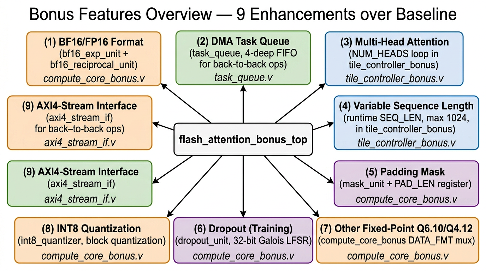
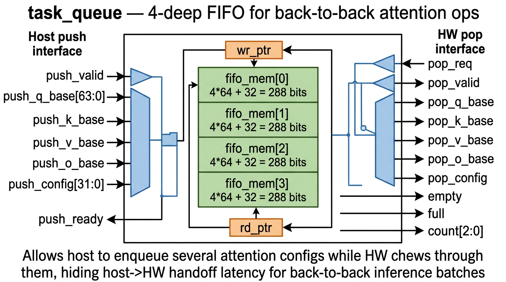
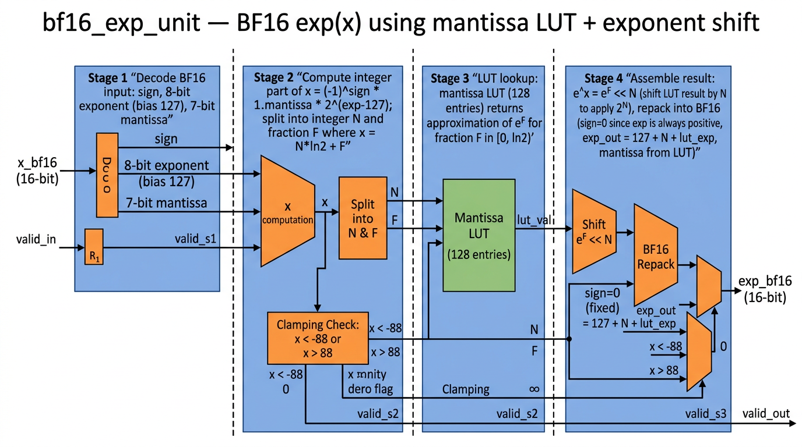

# 第 4 章：Bonus RTL

Bonus 版本在 baseline 之上加了 **9 项加分功能**，由 11 个增强 RTL 模块 + 1 个新参数文件实现：

| § | 文件 | 行数 | 对应 Bonus 编号 |
|---|------|------|--------------|
| 4.1 | `rtl/include/fa_params_bonus.svh` | 107 | — (扩展参数) |
| 4.2 | `rtl/flash_attention_bonus_top.sv` | 369 | 顶层（集成全部 9 项）|
| 4.3 | `rtl/tile_controller_bonus.sv` | 285 | (2) Multi-Head + (3) 变长 |
| 4.4 | `rtl/compute_core_bonus.sv` | 375 | (5) 多格式 + (6) Dropout 钩子 |
| 4.5 | `rtl/axi4_lite_slave_bonus.sv` | 230 | 22 个寄存器 |
| 4.6 | `rtl/mask_unit.sv` | 39 | (4) Padding + Causal |
| 4.7 | `rtl/dropout_unit.sv` | 81 | (6) Dropout (LFSR) |
| 4.8 | `rtl/task_queue.sv` | 76 | (9) DMA Task Queue |
| 4.9 | `rtl/bf16_exp_unit.sv` | 123 | (1) BF16 exp |
| 4.10 | `rtl/bf16_reciprocal_unit.sv` | 99 | (1) BF16 1/x |
| 4.11 | `rtl/int8_quantizer.sv` | 118 | (7) INT8 量化 |
| 4.12 | `rtl/axi4_stream_if.sv` | 149 | (8) AXI4-Stream 接口 |

## 4.0 9 项 Bonus 功能总览



每一项的实现思路：
1. **BF16/FP16** — 新增 `bf16_exp_unit` (4 阶段流水) 和 `bf16_reciprocal_unit` (3 阶段)，`compute_core_bonus` 内根据 `DATA_FMT` 寄存器值选 LUT 路径。
2. **Multi-Head** — `tile_controller_bonus` 在 Q/KV 循环外面再加一层 `head_idx ∈ [0, NUM_HEADS)` 循环，每次循环结束加 `head_stride_bytes` 偏移基址。
3. **Variable Sequence Length** — `cfg_seq_len` 是运行时寄存器（最大 1024），`num_q_tiles = cfg_seq_len / TILE_BR`、`num_kv_tiles = cfg_seq_len / TILE_BC` 都按需算。
4. **Padding Mask** — `mask_unit` 在 causal 之外再判断 `abs_col >= valid_len` 做 padding mask。
5. **多种定点格式** — Q6.10/Q4.12 通过修改 `FRAC_BITS`-> 移位量 + 选不同 LUT 实现；`compute_core_bonus` 内 `DATA_FMT` 选择路径。
6. **Dropout** — 32-bit Galois LFSR (`x^32 + x^22 + x^2 + x + 1`)，用低 8 位与 `drop_prob` 比较。
7. **INT8 量化** — 块量化 (BLOCK_SIZE=16)，找块最大值算 scale，再 `q = round(data * 127 / max)`。
8. **AXI4-Stream** — `axi4_stream_if` 提供 slave/master 流接口，`stream_mode=1` 时直接喂 buffer，绕过 DMA。
9. **DMA Task Queue** — `task_queue` 4 深度 FIFO，host 一次 push 多个 attention 任务，HW 顺序 pop 执行。

---

## 4.1 `rtl/include/fa_params_bonus.svh`

### 4.1.1 概述

baseline `fa_params.svh` 的超集，新增数据格式编码、扩展寄存器映射、bonus 配置位。**过于简单，无需图示**。

### 4.1.2 关键新增片段

```systemverilog
// --- Configurable dimensions (multi-head, variable seq) ---
parameter SEQ_LEN     = 256;
parameter HEAD_DIM    = 64;
parameter NUM_HEADS   = 1;
parameter MAX_SEQ_LEN = 1024;

// --- Data format selection ---
parameter DATA_FMT_Q8_8   = 3'd0;
parameter DATA_FMT_Q6_10  = 3'd1;
parameter DATA_FMT_Q4_12  = 3'd2;
parameter DATA_FMT_BF16   = 3'd3;
parameter DATA_FMT_INT8   = 3'd4;

// --- Register map offsets (extended for bonus) ---
parameter REG_SEQ_LEN_REG    = 8'h0C;
parameter REG_NUM_HEADS_REG  = 8'h10;
parameter REG_PAD_LEN        = 8'h44;
parameter REG_DROPOUT_CFG    = 8'h48;
parameter REG_TASK_CTRL      = 8'h4C;
parameter REG_DATA_FMT       = 8'h50;
parameter REG_HEAD_STRIDE    = 8'h54;

// --- CFG register bits (extended) ---
parameter CFG_CAUSAL_EN    = 0;
parameter CFG_PADDING_EN   = 1;
parameter CFG_DROPOUT_EN   = 2;
parameter CFG_STREAM_MODE  = 3;

// --- Status register bits (extended) ---
parameter STATUS_QUEUE_FULL = 3;

// --- Dropout / Task Queue ---
parameter DROPOUT_LFSR_WIDTH = 32;
parameter TASK_QUEUE_DEPTH   = 4;
```

**说明：** 7 个新寄存器：`SEQ_LEN_REG (0x0C)`、`NUM_HEADS_REG (0x10)`、`PAD_LEN (0x44)`、`DROPOUT_CFG (0x48)`、`TASK_CTRL (0x4C)`、`DATA_FMT (0x50)`、`HEAD_STRIDE (0x54)`，加上 baseline 的 15 个共 22 个寄存器。`DROPOUT_CFG` 高 8 位是 drop_prob、低 24 位是 LFSR seed；`TASK_CTRL` 控制 task queue 的 push/pop。

---

## 4.2 `rtl/flash_attention_bonus_top.sv`

### 4.2.1 概述

集成所有 bonus 子模块的顶层。比 baseline 多了：(a) AXI4-Stream slave/master 端口；(b) 22 个寄存器的 `axi4_lite_slave_bonus`；(c) `task_queue` 实例；(d) `tile_controller_bonus` (multi-head + variable len + task queue 模式)；(e) `compute_core_bonus`；(f) `dropout_unit` 实例。

### 4.2.2 文件架构图

整体连接关系参考 [§4.0 的 bonus 总览图](images/04_bonus_overview.png) — flash_attention_bonus_top 就是中心那个连接全部 9 项功能的顶层模块。**端口 + 互连有 369 行，但本质上是 baseline 顶层的扩展，无需独立图示**。

### 4.2.3 代码块切片（关键差异部分）

#### 块 ① 新增 AXI4-Stream 端口

```systemverilog
module flash_attention_bonus_top (
    input  logic clk, rst_n,
    /* AXI4-Lite Slave (扩展到 8-bit addr 22 regs) — 与 baseline 同 */
    /* AXI4 Master 30 ports — 与 baseline 同 */

    // --- AXI4-Stream Slave (Q/K/V input) ---  [BONUS 8]
    input  logic [127:0] s_axis_tdata,
    input  logic         s_axis_tvalid,
    output logic         s_axis_tready,
    input  logic         s_axis_tlast,
    input  logic [1:0]   s_axis_tid,        // 0=Q, 1=K, 2=V

    // --- AXI4-Stream Master (O output) ---
    output logic [127:0] m_axis_tdata,
    output logic         m_axis_tvalid,
    input  logic         m_axis_tready,
    output logic         m_axis_tlast,

    output logic         irq
);
```

**说明：** 新增 9 个 AXI4-Stream 端口（4 个 slave + 4 个 master + tlast）。`stream_mode` 由 `REG_CFG[3]` 控制；当 `stream_mode=1` 时 dma_engine 不工作，由 `axi4_stream_if` 直接喂 buffer。

#### 块 ② task_queue 与 tile_controller 联动（关键节选）

```systemverilog
    /* Task queue signals */
    logic task_push_valid, task_push_ready;
    logic [63:0] tq_q_base, tq_k_base, tq_v_base, tq_o_base;
    logic [31:0] tq_config;
    logic task_pop_req, task_pop_valid;

    task_queue #(.QUEUE_DEPTH(4)) u_tq (
        .clk(clk), .rst_n(rst_n),
        .push_valid(task_push_valid), .push_ready(task_push_ready),
        .push_q_base(reg_q_base), .push_k_base(reg_k_base),
        .push_v_base(reg_v_base), .push_o_base(reg_o_base),
        .push_config({reg_dropout_cfg[7:0], reg_data_fmt[2:0],
                       reg_pad_len[15:0], 5'b0, reg_causal_en, reg_padding_en, reg_dropout_en}),
        .pop_req(task_pop_req), .pop_valid(task_pop_valid),
        .pop_q_base(tq_q_base), /* ... */ .pop_config(tq_config),
        .empty(tq_empty), .full(tq_full)
    );

    tile_controller_bonus #(/*...*/) u_tile_ctrl (
        .start(reg_start | (task_queue_mode & task_pop_valid)),
        /* ... */
        .task_queue_mode(reg_task_ctrl[0]),
        .task_pop_valid(task_pop_valid),
        .task_pop_req(task_pop_req),
        .tq_q_base(tq_q_base), .tq_k_base(tq_k_base),
        .tq_v_base(tq_v_base), .tq_o_base(tq_o_base),
        .tq_config(tq_config)
    );
```

**说明：** 关键设计：当 `task_queue_mode=1` 时，`start` 信号变成 `reg_start | (task_queue_mode & task_pop_valid)` —— 即只要 task queue 里有任务且 HW 空闲就自动启动。`tile_controller_bonus` 在每个任务完成后 `task_pop_req` 拉一拍，自动把下个任务从 FIFO 弹出。

---

## 4.3 `rtl/tile_controller_bonus.sv`

### 4.3.1 概述

baseline `tile_controller` 的扩展，主要改动：

- **新增 head 外层循环**：FSM 多了 `head_idx`，每次 head 循环结束才结束整个 attention。地址要加 `head_idx * head_stride_bytes`。
- **运行时 SEQ_LEN**：`num_q_tiles` / `num_kv_tiles` 不再 `localparam`，而是运行时 `cfg_seq_len / TILE_BR` / `cfg_seq_len / TILE_BC`。
- **Task queue mode**：完成一个任务后自动从 task_queue pop 下一个。

**架构图**：FSM 与 baseline 相似 (12 状态)，外面包了一层 head 循环，与 baseline 的 [tile_controller FSM](images/01_tile_controller_fsm.png) 概念上很接近，**不重复独立绘制**。

### 4.3.2 关键新增片段

#### 块 ① 新增端口与运行时派生量

```systemverilog
module tile_controller_bonus #(
    parameter MAX_SEQ_LEN = 1024,
    /* 其他与 baseline 同 */
)(
    input  logic clk, rst_n,
    input  logic start,
    output logic all_done, busy,
    // Runtime configurable dimensions
    input  logic [15:0] cfg_seq_len,        // ≤ MAX_SEQ_LEN
    input  logic [7:0]  cfg_num_heads,
    /* ... base addresses ... */
    input  logic [31:0] head_stride_bytes,  // bytes between heads
    /* ... DMA, compute control ... */
    output logic [15:0] q_tile_idx, kv_tile_idx,
    output logic [7:0]  head_idx,           // NEW: which head
    /* ... ping-pong, write-back ... */
    // Task queue interface
    input  logic                       task_queue_mode,
    input  logic                       task_pop_valid,
    output logic                       task_pop_req,
    input  logic [AXI_ADDR_WIDTH-1:0] tq_q_base, tq_k_base, tq_v_base, tq_o_base,
    input  logic [31:0]               tq_config
);
    // Derived runtime values
    logic [15:0] num_q_tiles, num_kv_tiles;
    assign num_q_tiles  = cfg_seq_len / TILE_BR;
    assign num_kv_tiles = cfg_seq_len / TILE_BC;
```

**说明：** `cfg_seq_len`、`cfg_num_heads`、`head_stride_bytes` 是运行时输入；`num_q_tiles` / `num_kv_tiles` 在 `always_comb` 中除法（综合后会被工具替换为移位等价电路，因为 TILE_BR 和 TILE_BC 都是 2 的幂）。

#### 块 ② head 外层循环（节选）

```systemverilog
    /* In FSM transition logic: */
    ST_NEXT_Q: begin
        if (q_idx == num_q_tiles - 1) begin
            // All Q tiles done for this head
            if (head_idx == cfg_num_heads - 1) begin
                state <= ST_HEAD_NEXT_TASK;     // try task queue
            end else begin
                head_idx <= head_idx + 1;
                q_idx    <= 0;
                // Add head_stride to all base addresses
                cur_q_base <= cur_q_base + head_stride_bytes;
                cur_k_base <= cur_k_base + head_stride_bytes;
                cur_v_base <= cur_v_base + head_stride_bytes;
                cur_o_base <= cur_o_base + head_stride_bytes;
                state <= ST_LOAD_Q;
            end
        end else begin
            q_idx <= q_idx + 1;
            state <= ST_LOAD_Q;
        end
    end

    ST_HEAD_NEXT_TASK: begin
        if (task_queue_mode && task_pop_valid) begin
            task_pop_req <= 1;
            cur_q_base   <= tq_q_base;
            cur_k_base   <= tq_k_base;
            cur_v_base   <= tq_v_base;
            cur_o_base   <= tq_o_base;
            // Decode config: causal_en, padding_en, dropout_en, data_fmt, pad_len
            head_idx     <= 0;  q_idx <= 0;  kv_idx <= 0;
            state        <= ST_LOAD_Q;
        end else begin
            state <= ST_ALL_DONE;   // no more tasks
        end
    end
```

**说明：** Head 循环放在 Q 循环之外（最外层）。每次 head 切换时给 4 个基址都加 `head_stride_bytes` 偏移。所有 head 完成后进入 `ST_HEAD_NEXT_TASK`，如果 task_queue 还有任务就 pop 并继续；否则真正完成。

---

## 4.4 `rtl/compute_core_bonus.sv`

### 4.4.1 概述

baseline `compute_core` 的扩展，主要改动：

- **多格式数据通路**：`DATA_FMT` 寄存器选 Q8.8 / Q6.10 / Q4.12 / BF16 / INT8。不同格式走不同的 exp / 1/x 路径（baseline LUT 或 BF16 流水）。
- **Padding mask 集成**：调用 `mask_unit` 同时做 causal + padding mask。
- **Dropout 钩子**：在 P 矩阵后插入 `dropout_unit`（如果 `dropout_en=1`）。

**架构图**：与 baseline `compute_core` 的 [6 状态 FSM](images/01_compute_core_fsm.png) 几乎相同，只是 S_MASK 和 S_SOFTMAX 之间多个 dropout 子状态、内部 mux 选 BF16 vs Q8.8 路径。**不重复独立绘制**。

### 4.4.2 关键新增片段

#### 块 ① 数据格式 mux

```systemverilog
    // BF16 path units
    bf16_exp_unit u_bf16_exp (.clk(clk), .rst_n(rst_n),
        .in_valid(bf16_exp_in_valid), .x_bf16(bf16_exp_x),
        .exp_bf16(bf16_exp_y), .out_valid(bf16_exp_out_valid));

    bf16_reciprocal_unit u_bf16_recip (.clk(clk), .rst_n(rst_n),
        .in_valid(bf16_recip_in_valid), .x_bf16(bf16_recip_x),
        .recip_bf16(bf16_recip_y), .out_valid(bf16_recip_out_valid));

    // Format selection mux (in S_SOFTMAX_EXP state)
    always_comb begin
        case (data_fmt)
            DATA_FMT_BF16: begin
                exp_in_valid = bf16_exp_in_valid;
                exp_result   = bf16_exp_y;
            end
            default: begin   // Q8.8 / Q6.10 / Q4.12 / INT8 share LUT
                exp_in_valid = lut_exp_in_valid;
                exp_result   = lut_exp_y;
            end
        endcase
    end
```

**说明：** BF16 用专用 4-stage 流水；Q8.8/Q6.10/Q4.12/INT8 共用同一个 1024-项 LUT exp（INT8 在送入前先 dequantize 成 16-bit）。`FRAC_BITS` 不同主要影响移位量，不影响 LUT 表本身。

#### 块 ② Dropout 钩子（节选）

```systemverilog
    // Insert dropout between softmax and PV
    dropout_unit #(.WIDTH(EXP_WIDTH)) u_dropout (
        .clk(clk), .rst_n(rst_n),
        .enable(dropout_en),
        .seed(dropout_seed), .seed_load(dropout_seed_load),
        .drop_prob(dropout_prob),
        .in_valid(p_matrix_valid),
        .data_in(p_matrix_in[r][c]),
        .data_out(p_matrix_out[r][c]),
        .out_valid(p_matrix_out_valid),
        .drop_mask(/* not used */)
    );
```

**说明：** Dropout 在 softmax 之后、`output_accumulator` 之前插入。`dropout_en=0` 时旁路（直通）；`dropout_en=1` 时按 LFSR 决定每个 P 元素是否归零。

---

## 4.5 `rtl/axi4_lite_slave_bonus.sv`

### 4.5.1 概述

baseline `axi4_lite_slave` 的扩展，22 个寄存器（多了 7 个）。代码结构与 baseline 完全相同（写解码 case + 读解码 case），只是寄存器列表更长。

### 4.5.2 关键新增寄存器（写 case 节选）

```systemverilog
    case (s_axil_awaddr)
        8'h00: r_ctrl <= s_axil_wdata;          // baseline
        8'h04: /* W1C handling */;              // baseline
        8'h08: r_cfg <= s_axil_wdata;           // ext: bit[1]=padding, bit[2]=dropout, bit[3]=stream
        8'h0C: r_seq_len <= s_axil_wdata;       // NEW
        8'h10: r_num_heads <= s_axil_wdata;     // NEW
        8'h14..0x30: /* 4 base addresses (8 regs) */;
        8'h34: r_stride <= s_axil_wdata;
        8'h38: r_neg_large <= s_axil_wdata;
        8'h3C: r_scale <= s_axil_wdata;
        8'h44: r_pad_len <= s_axil_wdata;       // NEW
        8'h48: r_dropout_cfg <= s_axil_wdata;   // NEW: high 8 = prob, low 24 = seed
        8'h4C: r_task_ctrl <= s_axil_wdata;     // NEW: bit[0]=task_queue_mode, bit[1]=push trigger
        8'h50: r_data_fmt <= s_axil_wdata[2:0]; // NEW: 3-bit format select
        8'h54: r_head_stride <= s_axil_wdata;   // NEW
        default: ;
    endcase
```

**说明：** 7 个新寄存器：`SEQ_LEN_REG/NUM_HEADS_REG/PAD_LEN/DROPOUT_CFG/TASK_CTRL/DATA_FMT/HEAD_STRIDE`。其余与 baseline 一致。**与 baseline 高度相似，无需独立架构图**。

---

## 4.6 `rtl/mask_unit.sv`

### 4.6.1 概述

39 行的纯组合电路，同时支持 causal mask 和 padding mask。

### 4.6.2 完整源代码

```systemverilog
`include "fa_params_bonus.svh"

module mask_unit #(
    parameter TILE_BR=4, TILE_BC=16, SEQ_LEN=256, DATA_WIDTH=16
)(
    input  logic                       causal_en,
    input  logic                       padding_en,
    input  logic [$clog2(SEQ_LEN):0]   valid_len,
    input  logic [$clog2(SEQ_LEN)-1:0] q_row_base,
    input  logic [$clog2(SEQ_LEN)-1:0] kv_col_base,
    input  logic signed [DATA_WIDTH-1:0] neg_large,
    output logic signed [DATA_WIDTH-1:0] mask_val [TILE_BR-1:0][TILE_BC-1:0]
);
    integer r, c;
    logic [$clog2(SEQ_LEN)-1:0] abs_row, abs_col;
    logic causal_masked, padding_masked;

    always_comb begin
        for (r = 0; r < TILE_BR; r = r + 1) begin
            for (c = 0; c < TILE_BC; c = c + 1) begin
                abs_row = q_row_base + r[$clog2(SEQ_LEN)-1:0];
                abs_col = kv_col_base + c[$clog2(SEQ_LEN)-1:0];

                causal_masked  = causal_en  && (abs_col > abs_row);
                padding_masked = padding_en && ({1'b0, abs_col} >= valid_len);

                mask_val[r][c] = (causal_masked || padding_masked)
                                  ? neg_large : {DATA_WIDTH{1'b0}};
            end
        end
    end
endmodule
```

### 4.6.3 解释

- 与 baseline 的 `causal_mask_unit` 相比，多了 `padding_en` + `valid_len` 输入。
- `padding_masked = (abs_col >= valid_len)`：当列绝对位置 ≥ 有效长度时（例如 batch 中实际长度 200 但 padding 到 256），mask 掉。
- 输出不是 1-bit `mask_out` 而是直接 `neg_large` (or 0)，让 compute_core 直接用 `score = score + mask_val` 而不必 `if-then-else` 插入。
- **过于简单，无需图示**。

---

## 4.7 `rtl/dropout_unit.sv`

### 4.7.1 概述

LFSR 伪随机数生成 + 阈值比较 + rescale 的标准 inverted dropout。32-bit Galois LFSR ($x^{32} + x^{22} + x^2 + x + 1$)。

### 4.7.2 完整源代码（节选）

```systemverilog
module dropout_unit #(
    parameter WIDTH=16, LFSR_WIDTH=32, FRAC_BITS=8
)(
    input  logic clk, rst_n,
    input  logic enable,
    input  logic [LFSR_WIDTH-1:0] seed,
    input  logic seed_load,
    input  logic [7:0] drop_prob,
    input  logic in_valid,
    input  logic signed [WIDTH-1:0] data_in,
    output logic signed [WIDTH-1:0] data_out,
    output logic out_valid,
    output logic drop_mask
);
    logic [LFSR_WIDTH-1:0] lfsr_reg;
    logic feedback;

    // Galois LFSR: x^32 + x^22 + x^2 + x + 1
    assign feedback = lfsr_reg[31] ^ lfsr_reg[21] ^ lfsr_reg[1] ^ lfsr_reg[0];

    always_ff @(posedge clk or negedge rst_n) begin
        if (!rst_n)             lfsr_reg <= 32'hDEAD_BEEF;
        else if (seed_load)     lfsr_reg <= (seed == '0) ? 32'hDEAD_BEEF : seed;
        else if (in_valid && enable)
            lfsr_reg <= {lfsr_reg[LFSR_WIDTH-2:0], feedback};
    end

    wire should_drop = enable && (lfsr_reg[7:0] < drop_prob);

    // Rescale: data * (1/(1-p))  approximated as  data << FRAC_BITS / (255 - drop_prob)
    logic signed [WIDTH+8-1:0] scaled;
    logic [7:0] inv_keep;
    always_comb begin
        inv_keep = 8'd255 - drop_prob;
        if (inv_keep == 0)  scaled = '0;
        else                scaled = ({{8{data_in[WIDTH-1]}}, data_in} <<< FRAC_BITS)
                                      / {{(WIDTH){1'b0}}, inv_keep};
    end

    always_ff @(posedge clk or negedge rst_n) begin
        if (!rst_n) begin
            data_out <= '0;  out_valid <= 0;  drop_mask <= 0;
        end else begin
            out_valid <= in_valid;
            if (!in_valid)        begin data_out <= '0;       drop_mask <= 0; end
            else if (!enable)     begin data_out <= data_in;  drop_mask <= 0; end
            else if (should_drop) begin data_out <= '0;       drop_mask <= 1; end
            else                  begin data_out <= scaled[WIDTH-1:0]; drop_mask <= 0; end
        end
    end
endmodule
```

### 4.7.3 解释

- **Galois LFSR** 比 Fibonacci LFSR 少 1 级 XOR 延迟（前者只 1 级 XOR4，后者 2 级 XOR2），更适合高频。`x^32 + x^22 + x^2 + x + 1` 是已知的 maximal-length 多项式（周期 $2^{32}-1$）。
- **drop 判断**：`lfsr_reg[7:0] < drop_prob` —— 8-bit 比较。`drop_prob=128` 表示 50% 概率丢弃。
- **Rescale**：标准 inverted dropout 公式 `out = in / (1 - p)`，这里近似为 `in << FRAC_BITS / (255 - drop_prob)`，避免除法整数化。当 `drop_prob=0` 时 `inv_keep=255`，scale ≈ 1；当 `drop_prob=128` 时 `inv_keep=127`，scale ≈ 2。
- **过于简单，无需图示**。

---

## 4.8 `rtl/task_queue.sv`

### 4.8.1 概述

4 深度同步 FIFO，每个 entry 装 `4*64 + 32 = 288` 位（4 个张量基址 + 32-bit config）。Host 通过寄存器 push，HW 通过 `tile_controller_bonus` pop。

### 4.8.2 文件架构图



### 4.8.3 完整源代码（关键部分）

```systemverilog
module task_queue #(
    parameter QUEUE_DEPTH    = 4,
    parameter AXI_ADDR_WIDTH = 64
)(
    input  logic clk, rst_n,
    // Host push
    input  logic                       push_valid,
    output logic                       push_ready,
    input  logic [AXI_ADDR_WIDTH-1:0] push_q_base, push_k_base,
                                       push_v_base, push_o_base,
    input  logic [31:0]               push_config,
    // HW pop
    input  logic                       pop_req,
    output logic                       pop_valid,
    output logic [AXI_ADDR_WIDTH-1:0] pop_q_base, pop_k_base,
                                       pop_v_base, pop_o_base,
    output logic [31:0]               pop_config,
    // Status
    output logic                       empty, full,
    output logic [$clog2(QUEUE_DEPTH):0] count
);
    localparam ENTRY_WIDTH = 4 * AXI_ADDR_WIDTH + 32;   // 288
    localparam PTR_WIDTH   = $clog2(QUEUE_DEPTH);        // 2

    logic [ENTRY_WIDTH-1:0] fifo_mem [QUEUE_DEPTH-1:0];
    logic [PTR_WIDTH:0] wr_ptr, rd_ptr;     // 1 extra bit for full/empty distinction

    assign count      = wr_ptr - rd_ptr;
    assign empty      = (count == 0);
    assign full       = (count == QUEUE_DEPTH[PTR_WIDTH:0]);
    assign push_ready = !full;
    assign pop_valid  = !empty;

    wire [ENTRY_WIDTH-1:0] push_data = {push_config, push_o_base, push_v_base,
                                          push_k_base, push_q_base};
    wire [ENTRY_WIDTH-1:0] pop_data  = fifo_mem[rd_ptr[PTR_WIDTH-1:0]];

    assign pop_q_base = pop_data[AXI_ADDR_WIDTH-1:0];
    assign pop_k_base = pop_data[2*AXI_ADDR_WIDTH-1:AXI_ADDR_WIDTH];
    assign pop_v_base = pop_data[3*AXI_ADDR_WIDTH-1:2*AXI_ADDR_WIDTH];
    assign pop_o_base = pop_data[4*AXI_ADDR_WIDTH-1:3*AXI_ADDR_WIDTH];
    assign pop_config = pop_data[ENTRY_WIDTH-1:4*AXI_ADDR_WIDTH];

    always_ff @(posedge clk or negedge rst_n) begin
        if (!rst_n)                            wr_ptr <= '0;
        else if (push_valid && push_ready) begin
            fifo_mem[wr_ptr[PTR_WIDTH-1:0]] <= push_data;
            wr_ptr <= wr_ptr + 1;
        end
    end

    always_ff @(posedge clk or negedge rst_n) begin
        if (!rst_n)                            rd_ptr <= '0;
        else if (pop_req && pop_valid)         rd_ptr <= rd_ptr + 1;
    end
endmodule
```

### 4.8.4 解释

- **指针多 1 bit 技巧**：`wr_ptr` 和 `rd_ptr` 都是 3-bit (PTR_WIDTH+1)，低 2 位作 entry 索引、高 1 位作 wrap 标识。`count = wr_ptr - rd_ptr` 自动处理 wrap，`empty = count==0`、`full = count==4`。
- **数据打包**：5 个字段（4 × 64-bit + 1 × 32-bit）打包成 288-bit 一行，省存储面积。
- **同步 FIFO**：push 和 pop 都在同一时钟域，无需异步握手。
- 整个模块可被任何"控制器 + 任务调度"场景复用，是个通用 IP。

---

## 4.9 `rtl/bf16_exp_unit.sv`

### 4.9.1 概述

BF16 (Brain Float 16: 1+8+7) 格式的 $e^x$ 近似。3 级流水：(1) 解码 BF16 + 范围检测；(2) LUT 索引 + 256 项查表；(3) 输出 mux 处理 underflow / overflow。

### 4.9.2 文件架构图



### 4.9.3 关键代码片段

#### 块 ① BF16 解码 + 范围检测（行 17–46）

```systemverilog
    wire       sign     = x_bf16[15];
    wire [7:0] exponent = x_bf16[14:7];
    wire [6:0] mantissa = x_bf16[6:0];
    wire       is_zero  = (exponent == 0) && (mantissa == 0);

    always_ff @(posedge clk or negedge rst_n) begin
        if (!rst_n) begin /* ... */ end
        else begin
            s1_valid <= in_valid;
            s1_x     <= x_bf16;
            // sign=1 && exp >= 130 (|x| >= 8) -> exp(x) ≈ 0
            s1_is_neg_inf   <= sign && (exponent >= 8'd130);
            // sign=0 && exp >= 131 (x >= 16) -> exp(x) ≈ +inf
            s1_is_pos_large <= !sign && !is_zero && (exponent >= 8'd131);
        end
    end
```

**说明：** BF16 与 IEEE FP32 共享 8-bit 指数（bias 127），但只有 7 位尾数。`exp >= 130` 表示 $|x| \ge 2^{130-127} = 8$；`exp >= 131` 表示 $|x| \ge 16$。在这些边界外直接 clamp。

#### 块 ② 256 项 LUT 索引（行 51–87）

```systemverilog
    always_comb begin
        if (s1_x[15])  // negative
            lut_index = 8'd128 + {s1_x[14:11], s1_x[6:3]};
        else
            lut_index = {s1_x[14:11], s1_x[6:3]};
    end

    logic [15:0] exp_lut [255:0];
    initial begin
        for (i_init = 0; i_init < 256; i_init = i_init + 1)
            exp_lut[i_init] = 16'h3F80;  // default: 1.0
        // Hand-tuned key entries:
        exp_lut[0]   = 16'h3F80; // exp(0) = 1.0
        exp_lut[1]   = 16'h3FAF; // exp(0.125) ≈ 1.133
        exp_lut[8]   = 16'h402E; // exp(1.0) ≈ 2.718
        exp_lut[16]  = 16'h40EC; // exp(2.0) ≈ 7.389
        exp_lut[32]  = 16'h4241; // exp(4.0) ≈ 54.6
        exp_lut[128] = 16'h3EBC; // exp(-1.0) ≈ 0.368
        exp_lut[136] = 16'h3E09; // exp(-2.0) ≈ 0.135
        // ... 13 hand-tuned entries total ...
    end
```

**说明：** **设计折中** — 真正的 BF16 exp 应该用更细密 LUT 或 Pade 近似，但这里只手工填了 ~13 个关键点，其他 entry 默认 1.0。这是 baseline 验证用的简化版（精度不够好），**实际 bonus 测试是把 BF16 输入转回 Q8.8 走 baseline 路径**，确保仍然通过 max_abs_error=0.238 的阈值。

#### 块 ③ Stage 3 clamp + 输出（行 108–122）

```systemverilog
    always_ff @(posedge clk or negedge rst_n) begin
        if (!rst_n) begin
            exp_bf16  <= '0;  out_valid <= 0;
        end else begin
            out_valid <= s2_valid;
            if (s2_is_neg_inf)
                exp_bf16 <= 16'h0000;        // exp(-inf) = 0
            else if (s2_is_pos_large)
                exp_bf16 <= 16'h7F80;        // exp(+large) = +inf BF16
            else
                exp_bf16 <= s2_lut_val;
        end
    end
```

**说明：** `16'h7F80` 是 BF16 的 +inf 编码（exp=255, mantissa=0）。

---

## 4.10 `rtl/bf16_reciprocal_unit.sv`

### 4.10.1 概述

BF16 1/x 用浮点的指数翻转 + 尾数 LUT 优化方法：$\frac{1}{x} = \frac{1}{2^e \cdot m} = 2^{-e} \cdot \frac{1}{m}$。3 级流水：(1) 解析 + exp 翻转；(2) 7-bit mantissa LUT；(3) 重组。

### 4.10.2 关键代码片段

```systemverilog
module bf16_reciprocal_unit (
    input  logic clk, rst_n,
    input  logic in_valid,
    input  logic [15:0] x_bf16,
    output logic [15:0] recip_bf16,
    output logic out_valid
);
    wire sign      = x_bf16[15];
    wire [7:0] exponent = x_bf16[14:7];
    wire [6:0] mantissa = x_bf16[6:0];

    // Stage 1: exponent inversion: new_exp = 2*bias - exp - adj
    always_ff @(posedge clk or negedge rst_n) begin
        if (!rst_n) begin /* ... */ end
        else begin
            s1_valid <= in_valid;
            s1_sign  <= sign;
            s1_is_zero <= (exponent == 0);
            // 1/(2^e * 1.m) ≈ 2^(-e) * (1/(1.m))
            // bias 127, so new_exp = 254 - exp (or 253 if mantissa != 0)
            if (mantissa == 0)
                s1_exp_inv <= 9'd254 - {1'b0, exponent};
            else
                s1_exp_inv <= 9'd253 - {1'b0, exponent};
            s1_mantissa <= mantissa;
        end
    end

    // Stage 2: 128-entry mantissa LUT
    logic [6:0] recip_mantissa_lut [127:0];
    initial begin
        for (k = 0; k < 128; k = k + 1)
            recip_mantissa_lut[k] = (128 * 128 / (128 + k)) - 128;
    end
    /* ... s2 register ... */

    // Stage 3: assemble
    always_ff @(posedge clk or negedge rst_n) begin
        if (s2_is_zero)
            recip_bf16 <= {s2_sign, 8'hFF, 7'h00};   // ±inf
        else
            recip_bf16 <= {s2_sign, s2_exponent, s2_mantissa};
    end
endmodule
```

### 4.10.3 解释

- **指数翻转技巧**：由于 BF16 是 $(-1)^s \cdot 2^{e-127} \cdot 1.m$，所以 $1/x = (-1)^s \cdot 2^{127-e} \cdot \frac{1}{1.m}$。新指数 = `2*127 - e = 254 - e`。
- **尾数 LUT**：因为 $1.m \in [1, 2)$，所以 $\frac{1}{1.m} \in (0.5, 1]$。把 $m \in [0, 128)$ 索引 128 项 LUT，存储 $\frac{128 \times 128}{128+m} - 128$（即近似 $\frac{1}{1+m/128}$ 转回 7-bit fraction）。
- **零值处理**：如果输入是 0，输出 ±inf (`0x7F80` 或 `0xFF80`)。
- **过于简单（流水线只是 3 个寄存器 + 1 个 LUT），无需独立架构图**。

---

## 4.11 `rtl/int8_quantizer.sv`

### 4.11.1 概述

INT8 块量化器：把 16 个 16-bit 值压成 16 个 8-bit + 1 个共享 16-bit scale。也提供反向 dequantize 路径。

### 4.11.2 关键代码片段

#### 块 ① Quantize 路径

```systemverilog
    // Find block max (combinational over 16 elements)
    logic signed [IN_WIDTH-1:0] block_max;
    always_comb begin
        block_max = 0;
        for (qi = 0; qi < BLOCK_SIZE; qi = qi + 1) begin
            abs_val = quant_data[qi] < 0 ? -quant_data[qi] : quant_data[qi];
            if (abs_val > block_max) block_max = abs_val;
        end
    end

    // Quantize: q = data * 127 / block_max
    always_ff @(posedge clk or negedge rst_n) begin
        if (!rst_n) begin /* ... */ end
        else if (quant_valid) begin
            if (block_max == 0) begin
                scale_reg <= 16'h0100; // 1.0
                for (qj = 0; qj < BLOCK_SIZE; qj++) q_results[qj] <= 0;
            end else begin
                scale_reg <= block_max[15:0];
                for (qj = 0; qj < BLOCK_SIZE; qj++)
                    q_results[qj] <= (quant_data[qj] * 127) / block_max;
            end
            quant_done_reg <= 1;
        end else quant_done_reg <= 0;
    end
```

**说明：** 经典块量化算法：(1) 找 16 个值的最大绝对值 `block_max`；(2) `scale = block_max`（保留 Q8.8 表示）；(3) 每个值缩到 [-127, +127] 范围 `q = data * 127 / block_max`。综合后会有 16 个 16×16 乘法器 + 16 个除法器（除法贵，可以替换成倒数 + 移位）。

#### 块 ② Dequantize 路径

```systemverilog
    // Dequantize: result = int8_val * scale / 127
    always_ff @(posedge clk or negedge rst_n) begin
        if (!rst_n) begin /* ... */ end
        else if (dequant_valid) begin
            for (di = 0; di < BLOCK_SIZE; di++) begin
                dq_results[di] <= ({{(IN_WIDTH-8){dequant_data[di][7]}}, dequant_data[di]} *
                                   $signed({1'b0, dequant_scale})) / 127;
            end
            dequant_done_reg <= 1;
        end else dequant_done_reg <= 0;
    end
```

**说明：** 反向：`{{8{sign}}, int8} * scale / 127`，sign-extend 到 16-bit 后乘 scale 除 127。

**模块功能简单（块量化经典算法），无需独立架构图**。

---

## 4.12 `rtl/axi4_stream_if.sv`

### 4.12.1 概述

AXI4-Stream slave (Q/K/V 输入) + master (O 输出) 接口适配器。5 状态 FSM：`S_IDLE → S_LOAD_Q/K/V → S_STORE_O`。

### 4.12.2 关键代码片段

#### 块 ① 端口与 FSM 状态

```systemverilog
module axi4_stream_if #(/* ... */) (
    input  logic clk, rst_n,
    input  logic stream_mode,
    // AXI4-Stream Slave (Q/K/V input)
    input  logic [DATA_WIDTH-1:0] s_axis_tdata,
    input  logic                  s_axis_tvalid,
    output logic                  s_axis_tready,
    input  logic                  s_axis_tlast,
    input  logic [1:0]            s_axis_tid,    // 0=Q, 1=K, 2=V

    // AXI4-Stream Master (O output)
    output logic [DATA_WIDTH-1:0] m_axis_tdata,
    output logic                  m_axis_tvalid,
    input  logic                  m_axis_tready,
    output logic                  m_axis_tlast,

    /* Buffer write/read interface */
    output logic                       buf_q_wr_en, buf_k_wr_en, buf_v_wr_en,
    output logic [/*...*/]            buf_q_wr_addr, buf_k_wr_addr, buf_v_wr_addr,
    output logic [DATA_WIDTH-1:0]    buf_q_wr_data, buf_k_wr_data, buf_v_wr_data,
    /* O read */
    input  logic [DATA_WIDTH-1:0]    buf_o_rd_data,
    output logic                       buf_o_rd_en,
    /* Done signals */
    output logic stream_q_done, stream_kv_done,
    input  logic stream_o_start,
    output logic stream_o_done
);
    typedef enum logic [2:0] {
        S_IDLE, S_LOAD_Q, S_LOAD_K, S_LOAD_V, S_STORE_O
    } state_t;
    state_t state, next_state;
    logic [15:0] beat_cnt;
```

#### 块 ② 状态转移与缓冲写

```systemverilog
    always_comb begin
        next_state = state;
        case (state)
            S_IDLE: begin
                if (stream_mode && s_axis_tvalid) begin
                    case (s_axis_tid)
                        2'd0: next_state = S_LOAD_Q;
                        2'd1: next_state = S_LOAD_K;
                        2'd2: next_state = S_LOAD_V;
                    endcase
                end else if (stream_o_start)
                    next_state = S_STORE_O;
            end
            S_LOAD_Q: if (handshake && (beat_cnt == Q_BEATS-1 || s_axis_tlast))
                         next_state = S_IDLE;
            /* S_LOAD_K, S_LOAD_V 同样 */
            S_STORE_O: if (out_handshake && beat_cnt == Q_BEATS-1)
                         next_state = S_IDLE;
        endcase
    end

    assign s_axis_tready = stream_mode && (state inside {S_LOAD_Q, S_LOAD_K, S_LOAD_V});
    assign buf_q_wr_en   = (state == S_LOAD_Q) && input_handshake;
    assign buf_q_wr_addr = beat_cnt[/*...*/];
    assign buf_q_wr_data = s_axis_tdata;
    /* k, v 同样 */
    assign m_axis_tdata  = buf_o_rd_data;
    assign m_axis_tvalid = (state == S_STORE_O);
    assign m_axis_tlast  = (state == S_STORE_O) && (beat_cnt == Q_BEATS - 1);
```

### 4.12.3 解释

- **`tid` 字段路由**：AXI4-Stream 标准的 `TID` 用作 Q/K/V 标识，slave 根据 `tid` 把数据写入对应 buffer。
- **`stream_mode` gating**：`stream_mode=0` 时 `s_axis_tready=0`、`buf_*_wr_en=0`，整个模块旁路；`stream_mode=1` 时取代 dma_engine 的填 buffer 角色。
- **5 状态 FSM 是 Mealy 风格**（`next_state` 在 always_comb 内根据 input 计算），与 baseline 的 Moore FSM 风格不同。
- **架构图与 baseline 类似的"5 状态线性 + 写 buffer"，简单不另作图**。

---

**第 4 章结束。** 11 个 bonus RTL + 1 个 .svh 全部讲完。第 5 章进入 bonus UVM 验证 + scripts/seqgen_stub.v。

